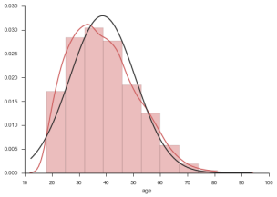
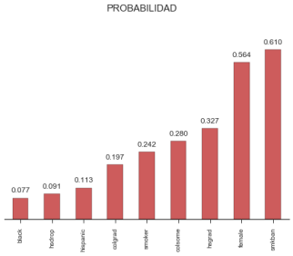

# Caso 2.2.
Influencia de la prohibición de fumar en el trabajo sobre los fumadores en EE.UU.
En este ejercicio se va a estudiar el efecto que tiene sobre el hábito de fumar, el hecho de que las empresas prohíban fumar en el puesto de trabajo. Utilizaremos los datos contenidos en el fichero Smoking.xls que tiene datos de corte transversal de una muestra de 10.000 trabajadores de EE.UU desde 1991 a 1993. El conjunto de datos contiene información sobre si las personas estaban o no estaban sujetas a una prohibición de fumar en el trabajo, si las personas fumaban, y otras características individuales. Las variables y su descripción es la siguiente:

Definiciones de las variables

|Variable| Definición|
|-:|:-|
|__smoker__ |=1 si el sujeto fuma, =0 si no fuma|
|__smkban__ |=1 si no se puede fumar en el trabajo, =0 en otro caso|
|__age__|edad del sujeto en años|
|__hsdrop__ |=1 si abandonó sus estudios, =0 en otro caso|
|__hsgrad__ |=1 si tiene estudios de secundaria, =0 en otro caso|
|__colsome__ |=1 si tiene educación de bachillerato, =0 en otro caso|
|__colgrad__ |=1 si tiene licenciatura universitaria, =0 en otro caso|
|__black__ |=1 si es negro, =0 en otro caso|
|__hispanic__ |=1 si es hispano =0 en otro caso|
|__female__ |=1 si es mujer, =0 en otro caso|

_Nota: El indicador binario de educación indica el máximo grado alcanzado en los estudios, estas variables son excluyentes, por ejemplo, una persona que tenga un título de doctorado universitario tendrá valores 0 en las variables hsdrop, hsgrad, colsome, y colgrad._

# a) 
Para conocer un poco las __características de los datos__:

- Primero haremos un estudio de la __distribución de frecuencias__ de las variables y el __histograma__ de la variable __age (edad)__. 
- Después __estimaremos__ un __modelo de Probabilidad Lineal__ entre la variable __smoker y smkban__ y partir del mismo calcularemos: 
    - (i) La probabilidad de __fumar para todos__ los trabajadores, 
    - (ii) La probabilidad de __fumar para__ los trabajadores __afectados por la prohibición__ de fumar en el trabajo, - 
    - (iii) La probabilidad de __fumar para__ los trabajadores que pueden fumar en su __puesto de trabajo__.

Asimismo, a partir de la estimación anterior

¿cuál es la diferencia en la probabilidad de fumar entre los trabajadores afectados por la prohibición de fumar en el trabajo y los que no están afectados por dicha prohibición? 

¿Es estadísticamente significativa esa diferencia?

<table border="1" class="dataframe">  <thead>    <tr style="text-align: right;">      <th></th>      <th>smoker</th>      <th>smkban</th>      <th>age</th>      <th>hsdrop</th>      <th>hsgrad</th>      <th>colsome</th>      <th>colgrad</th>      <th>black</th>      <th>hispanic</th>      <th>female</th>    </tr>  </thead>  <tbody>    <tr>      <th>0</th>      <td>1</td>      <td>1</td>      <td>41</td>      <td>0</td>      <td>1</td>      <td>0</td>      <td>0</td>      <td>0</td>      <td>0</td>      <td>1</td>    </tr>    <tr>      <th>1</th>      <td>1</td>      <td>1</td>      <td>44</td>      <td>0</td>      <td>0</td>      <td>1</td>      <td>0</td>      <td>0</td>      <td>0</td>      <td>1</td>    </tr>    <tr>      <th>2</th>      <td>0</td>      <td>0</td>      <td>19</td>      <td>0</td>      <td>0</td>      <td>1</td>      <td>0</td>      <td>0</td>      <td>0</td>      <td>1</td>    </tr>    <tr>      <th>3</th>      <td>1</td>      <td>0</td>      <td>29</td>      <td>0</td>      <td>1</td>      <td>0</td>      <td>0</td>      <td>0</td>      <td>0</td>      <td>1</td>    </tr>    <tr>      <th>4</th>      <td>0</td>      <td>1</td>      <td>28</td>      <td>0</td>      <td>0</td>      <td>1</td>      <td>0</td>      <td>0</td>      <td>0</td>      <td>1</td>    </tr>  </tbody></table>

<table border="1" class="dataframe">  <thead>    <tr style="text-align: right;">      <th></th>      <th>count</th>      <th>mean</th>      <th>std</th>      <th>min</th>      <th>25%</th>      <th>50%</th>      <th>75%</th>      <th>max</th>    </tr>  </thead>  <tbody>    <tr>      <th>smoker</th>      <td>10000</td>      <td>0.2423</td>      <td>0.428496</td>      <td>0</td>      <td>0</td>      <td>0</td>      <td>0</td>      <td>1</td>    </tr>    <tr>      <th>smkban</th>      <td>10000</td>      <td>0.6098</td>      <td>0.487819</td>      <td>0</td>      <td>0</td>      <td>1</td>      <td>1</td>      <td>1</td>    </tr>    <tr>      <th>age</th>      <td>10000</td>      <td>38.6932</td>      <td>12.113783</td>      <td>18</td>      <td>29</td>      <td>37</td>      <td>47</td>      <td>88</td>    </tr>    <tr>      <th>hsdrop</th>      <td>10000</td>      <td>0.0912</td>      <td>0.287908</td>      <td>0</td>      <td>0</td>      <td>0</td>      <td>0</td>      <td>1</td>    </tr>    <tr>      <th>hsgrad</th>      <td>10000</td>      <td>0.3266</td>      <td>0.468993</td>      <td>0</td>      <td>0</td>      <td>0</td>      <td>1</td>      <td>1</td>    </tr>    <tr>      <th>colsome</th>      <td>10000</td>      <td>0.2802</td>      <td>0.449119</td>      <td>0</td>      <td>0</td>      <td>0</td>      <td>1</td>      <td>1</td>    </tr>    <tr>      <th>colgrad</th>      <td>10000</td>      <td>0.1972</td>      <td>0.397905</td>      <td>0</td>      <td>0</td>      <td>0</td>      <td>0</td>      <td>1</td>    </tr>    <tr>      <th>black</th>      <td>10000</td>      <td>0.0769</td>      <td>0.266446</td>      <td>0</td>      <td>0</td>      <td>0</td>      <td>0</td>      <td>1</td>    </tr>    <tr>      <th>hispanic</th>      <td>10000</td>      <td>0.1134</td>      <td>0.317097</td>      <td>0</td>      <td>0</td>      <td>0</td>      <td>0</td>      <td>1</td>    </tr>    <tr>      <th>female</th>      <td>10000</td>      <td>0.5637</td>      <td>0.495951</td>      <td>0</td>      <td>0</td>      <td>1</td>      <td>1</td>      <td>1</td>    </tr>  </tbody></table>

    $P_{0.25} = 29.000$ $P_{0.50} = 37.000$ $P_{0.75} = 47.000$ Moda = 34.000

## HISTOGRAMA

El histograma nos informan de la distrubución que sigue la variable edad. Se puede ver que se aproxima muy bien a una distribución normal. Presente una asimetría hacia la izquierda. El valor mas frecuente es 34 años, el 25% de los individuos no superan los 29 años, el 50% de los individuos tienen más de 37 años, y el 25% de los individuos que más años tienen superan los 47 años de edad.

## DISTRIBUCIÓN DE FRECUENCIAS

El gráfico muestra la probabilidad de que cada variable sea 1 independientemente del resto.

                                OLS Regression Results                            
    ==============================================================================
    Dep. Variable:                 smoker   R-squared:                       0.008
    Model:                            OLS   Adj. R-squared:                  0.008
    Method:                 Least Squares   F-statistic:                     75.06
    Date:                Tue, 05 Jan 2016   Prob (F-statistic):           5.27e-18
    Time:                        11:00:50   Log-Likelihood:                -5675.0
    No. Observations:               10000   AIC:                         1.135e+04
    Df Residuals:                    9998   BIC:                         1.137e+04
    Df Model:                           1                                         
    Covariance Type:                  HC1                                         
    ==============================================================================
                     coef    std err          t      P>|t|      [0.025      0.975]
    ------------------------------------------------------------------------------
    Intercept      0.2896      0.007     39.879      0.000       0.275       0.304
    smkban        -0.0776      0.009     -8.664      0.000      -0.095      -0.060
    ==============================================================================
    Omnibus:                     1765.260   Durbin-Watson:                   1.851
    Prob(Omnibus):                  0.000   Jarque-Bera (JB):             2479.745
    Skew:                           1.189   Prob(JB):                         0.00
    Kurtosis:                       2.458   Cond. No.                         2.96
    ==============================================================================
    
    Warnings:
    [1] Standard Errors are heteroscedasticity robust (HC1)

<table class="simpletable"><tr>      <td></td>         <th>coef</th>     <th>std err</th>      <th>t</th>      <th>P>|t|</th>  <th>[0.025</th>    <th>0.975]</th>  </tr><tr>  <th>Intercept</th> <td>    0.2896</td> <td>    0.007</td> <td>   39.879</td> <td> 0.000</td> <td>    0.275</td> <td>    0.304</td></tr><tr>  <th>smkban</th>    <td>   -0.0776</td> <td>    0.009</td> <td>   -8.664</td> <td> 0.000</td> <td>   -0.095</td> <td>   -0.060</td></tr></table>

En este caso el término independiente es la probabilidad de la variable endógena y el parámetro que acompaña a la exógena es el incremento de probabilidad cuando dicha variable toma el valor 1.

Por tanto la probabilidad de fumar para todos los inviduos es de 0.29.
La probabilidad de fumar para individuos que tienen prohibido fumar en el puesto de trabajo se reduce en 0.078.

Ambos parámetros significativos.

### (i) La probabilidad de __fumar para todos__ los trabajadores: $\hat{\beta}_0$

    [ 0.29   0.007]

### (ii) La probabilidad de __fumar para__ los trabajadores __afectados por la prohibición__ de fumar en el trabajo: $\hat{\beta}_0 + \hat{\beta}_1$

    [ 0.212  0.009]

### (iii) La probabilidad de __fumar para__ los trabajadores que pueden fumar en su __puesto de trabajo__: $1- \hat{\beta}_1$

    [ 1.078  0.009]

### ¿cuál es la diferencia en la probabilidad de fumar entre los trabajadores afectados por la prohibición de fumar en el trabajo y los que no están afectados por dicha prohibición?

Dicha diferencia viene dada por el parámetro estimado $\hat{\beta}_1$

    -0.078

### ¿Es estadísticamente significativa esa diferencia?

La significancia nos la proporciona el t-ratio y el pvalue.

    0.000

# b) 
En segundo lugar, vamos a __estimar__ un Modelo de __Probabilidad Lineal__ entre la variable __smoker__ y las explicativas siguientes: __smkban, age, age2, hsdrop, hsgrad, colsome, colgrad, black, hispanic y female__. 

                                OLS Regression Results                            
    ==============================================================================
    Dep. Variable:                 smoker   R-squared:                       0.057
    Model:                            OLS   Adj. R-squared:                  0.056
    Method:                 Least Squares   F-statistic:                     68.75
    Date:                Tue, 05 Jan 2016   Prob (F-statistic):          1.92e-136
    Time:                        11:00:50   Log-Likelihood:                -5420.7
    No. Observations:               10000   AIC:                         1.086e+04
    Df Residuals:                    9989   BIC:                         1.094e+04
    Df Model:                          10                                         
    Covariance Type:                  HC1                                         
    ====================================================================================
                           coef    std err          t      P>|t|      [0.025      0.975]
    ------------------------------------------------------------------------------------
    Intercept           -0.0141      0.041     -0.341      0.733      -0.095       0.067
    smkban              -0.0472      0.009     -5.269      0.000      -0.065      -0.030
    age                  0.0097      0.002      5.104      0.000       0.006       0.013
    np.power(age, 2)    -0.0001   2.19e-05     -6.017      0.000      -0.000   -8.89e-05
    hsdrop               0.3227      0.019     16.559      0.000       0.285       0.361
    hsgrad               0.2327      0.013     18.483      0.000       0.208       0.257
    colsome              0.1643      0.013     13.014      0.000       0.140       0.189
    colgrad              0.0448      0.012      3.720      0.000       0.021       0.068
    black               -0.0276      0.016     -1.714      0.086      -0.059       0.004
    hispanic            -0.1048      0.014     -7.500      0.000      -0.132      -0.077
    female              -0.0333      0.009     -3.881      0.000      -0.050      -0.016
    ==============================================================================
    Omnibus:                     1557.853   Durbin-Watson:                   1.875
    Prob(Omnibus):                  0.000   Jarque-Bera (JB):             2100.981
    Skew:                           1.093   Prob(JB):                         0.00
    Kurtosis:                       2.486   Cond. No.                     2.11e+04
    ==============================================================================
    
    Warnings:
    [1] Standard Errors are heteroscedasticity robust (HC1)
    [2] The condition number is large, 2.11e+04. This might indicate that there are
    strong multicollinearity or other numerical problems.

<table class="simpletable"><tr>          <td></td>            <th>coef</th>     <th>std err</th>      <th>t</th>      <th>P>|t|</th>  <th>[0.025</th>    <th>0.975]</th>  </tr><tr>  <th>Intercept</th>        <td>   -0.0141</td> <td>    0.041</td> <td>   -0.341</td> <td> 0.733</td> <td>   -0.095</td> <td>    0.067</td></tr><tr>  <th>smkban</th>           <td>   -0.0472</td> <td>    0.009</td> <td>   -5.269</td> <td> 0.000</td> <td>   -0.065</td> <td>   -0.030</td></tr><tr>  <th>age</th>              <td>    0.0097</td> <td>    0.002</td> <td>    5.104</td> <td> 0.000</td> <td>    0.006</td> <td>    0.013</td></tr><tr>  <th>np.power(age, 2)</th> <td>   -0.0001</td> <td> 2.19e-05</td> <td>   -6.017</td> <td> 0.000</td> <td>   -0.000</td> <td>-8.89e-05</td></tr><tr>  <th>hsdrop</th>           <td>    0.3227</td> <td>    0.019</td> <td>   16.559</td> <td> 0.000</td> <td>    0.285</td> <td>    0.361</td></tr><tr>  <th>hsgrad</th>           <td>    0.2327</td> <td>    0.013</td> <td>   18.483</td> <td> 0.000</td> <td>    0.208</td> <td>    0.257</td></tr><tr>  <th>colsome</th>          <td>    0.1643</td> <td>    0.013</td> <td>   13.014</td> <td> 0.000</td> <td>    0.140</td> <td>    0.189</td></tr><tr>  <th>colgrad</th>          <td>    0.0448</td> <td>    0.012</td> <td>    3.720</td> <td> 0.000</td> <td>    0.021</td> <td>    0.068</td></tr><tr>  <th>black</th>            <td>   -0.0276</td> <td>    0.016</td> <td>   -1.714</td> <td> 0.086</td> <td>   -0.059</td> <td>    0.004</td></tr><tr>  <th>hispanic</th>         <td>   -0.1048</td> <td>    0.014</td> <td>   -7.500</td> <td> 0.000</td> <td>   -0.132</td> <td>   -0.077</td></tr><tr>  <th>female</th>           <td>   -0.0333</td> <td>    0.009</td> <td>   -3.881</td> <td> 0.000</td> <td>   -0.050</td> <td>   -0.016</td></tr></table>

    smoker       0
    smkban       0
    age         33
    hsdrop       0
    hsgrad       0
    colsome      1
    colgrad      0
    black        0
    hispanic     0
    female       1
    Name: 10, dtype: int64

    array([ 0.293])

## ¿Qué tipo de __preguntas__ pueden formularse con esta nueva __especificación__? 
Formular tres preguntas y tratar de responderlas a partir del modelo estimado.

Pueden formularse dos tipos de preguntas una es por el efecto marginal de una variable o por el efecto total para el que hay que definir el estado de todas las variables involucradas.

### ¿Cúal es la probabilidad de fumar para una mujer de 33 años, con bachillerato, que no tiene prohibido fumar en el trabajo, no es hispana y no es negra?: 

$$P\{\text{smoker}=1\ |\ \text{age}=33, \text{female} = 1, \text{colsome} = 1\} = \hat{\beta}_0 + \hat{\beta}_2  · \text{age}+ \hat{\beta}_3 · \text{age}^2 +\hat{\beta}_6 + \hat{\beta}_{10}$$

    array([-0.014,  0.319, -0.144,  0.164, -0.033])

    0.292

    [ 0.293]

    La __probabilidad__ de fumar para esta mujer blanca de 33 años, es de 29.27%

### ¿Cúal es la probabilidad de fumar para una mujer de 32 años, con bachillerato, que no tiene prohibido fumar en el trabajo, no es hispana, no es negra?: 

    La __probabilidad__ de fumar para esta mujer blanca de 33 años, es de 29.15%

### ¿Cúal es la diferencia en la probabilidad de fumar entre esas mujeres? 

    La diferencia en la __probabilidad__ de fumar en estas mujeres (efecto marginal de la edad) es de 0.11%.
    Esto significa que el efecto marginal de la edad es de 0.11%.

### Además, podemos preguntarnos si la __probabilidad de fumar depende__ o no del nivel de __educación__, para ello podemos hacer un contraste de significatividad conjunta de las variables educativas. ¿La probabilidad de fumar aumenta o disminuye con el nivel educativo?

    ### F Test
    $H_0$: Parámetros( hsdrop = hsgrad = colsome = colgrad = 0 )
    
    F: 140.090 (1.0846809960258138e-116)

No podemos aceptar la hipótesis nula de significatividad conjunta. Hay evidencia por tanto para pensar que la probabilidad de fumar es independiente del nivel educativo.

### ¿Cuál sería la __probabilidad de que fumara un niño de 1 año__, independientemente del resto de variables consideradas? 

$$P\{y=1|\text{age}=1\} = \hat{\beta}_0 + \hat{\beta}_2·\text{age} + \hat{\beta}_3 · \text{age}^2$$

    La probabilidad de fumar para un niño de 1 año es -0.46%, lo cual no tiene sentido dado que no existen probabilidades negativas.

Sin embargo la edad esta fuera del rango estimado en las variables por lo que no es correcta la estimación.

# c)
Estimar un modelo __Probit y otro Logit__ con las variables del apartado a), __comentar las diferencias__ observadas con la estimación del Modelo de Probabilidad Lineal. 

Calcular en cada caso la __probabilidad de fumar según si los trabajadores tienen prohibido fumar en el trabajo.__

_Notar que cuando Gretl estima un modelo Probit, en la ventana de resultados aparece una columna que llama z, ese valor que pone Gretl es el equivalente al t-ratio habitual y no debe confundirse con el “valor-z” de la distribución Normal acumulada, que es el que hay que calcular para obtener la probabilidad de que ocurra el suceso de la variable endógena._

    'smoker ~ smkban'

    Optimization terminated successfully.
             Current function value: 0.549867
             Iterations 5

### PROBIT

                              Probit Regression Results                           
    ==============================================================================
    Dep. Variable:                 smoker   No. Observations:                10000
    Model:                         Probit   Df Residuals:                     9998
    Method:                           MLE   Df Model:                            1
    Date:                Tue, 05 Jan 2016   Pseudo R-squ.:                0.006953
    Time:                        11:00:50   Log-Likelihood:                -5498.7
    converged:                       True   LL-Null:                       -5537.2
                                            LLR p-value:                 1.711e-18
    ==============================================================================
                     coef    std err          z      P>|z|      [0.025      0.975]
    ------------------------------------------------------------------------------
    Intercept     -0.5546      0.021    -26.126      0.000      -0.596      -0.513
    smkban        -0.2448      0.028     -8.784      0.000      -0.299      -0.190
    ==============================================================================

    0.212

### LOGIT

    Optimization terminated successfully.
             Current function value: 0.549867
             Iterations 5
                               Logit Regression Results                           
    ==============================================================================
    Dep. Variable:                 smoker   No. Observations:                10000
    Model:                          Logit   Df Residuals:                     9998
    Method:                           MLE   Df Model:                            1
    Date:                Tue, 05 Jan 2016   Pseudo R-squ.:                0.006953
    Time:                        11:00:50   Log-Likelihood:                -5498.7
    converged:                       True   LL-Null:                       -5537.2
                                            LLR p-value:                 1.711e-18
    ==============================================================================
                     coef    std err          z      P>|z|      [0.025      0.975]
    ------------------------------------------------------------------------------
    Intercept     -0.8974      0.035    -25.425      0.000      -0.967      -0.828
    smkban        -0.4153      0.047     -8.801      0.000      -0.508      -0.323
    ==============================================================================

    ## PREDICCIÓN
    ||MLP|LOGIT|PROBIT|
    |:--:|:--:|:--:|:--:|
    |__P{y=1 / smkban=1}__|0.21204|0.21204|0.21204|
    |__P{y=1 / smkban=0}__|0.28960|0.28960|0.28960|
    Los tres modelos predicen la misma probabilidad para los mismos escenarios dada la misma relación.

    ### RESÚMEN DE LOS MODELOS
    |PARAMETROS|LOGIT|PROBIT|MLP|
    |:--:|:--:|:--:|:--:|
    |$\hat{\beta}_0$|-0.897|-0.555|0.290|
    |$\hat{\beta}_1$|-0.415|-0.245|-0.078|
    |$sbic$|11015.754|11015.754|11368.460|
    

# d) 
Usando un modelo Probit, responder a las 3 mismas preguntas que os formulasteis en el apartado b) y calcular también la probabilidad de que fume un niño de 1 año, independientemente del resto de variables consideradas y ver cómo cambia la respuesta usando el modelo Probit.

    Optimization terminated successfully.
             Current function value: 0.523587
             Iterations 6

                              Probit Regression Results                           
    ==============================================================================
    Dep. Variable:                 smoker   No. Observations:                10000
    Model:                         Probit   Df Residuals:                     9989
    Method:                           MLE   Df Model:                           10
    Date:                Tue, 05 Jan 2016   Pseudo R-squ.:                 0.05441
    Time:                        11:00:50   Log-Likelihood:                -5235.9
    converged:                       True   LL-Null:                       -5537.2
                                            LLR p-value:                4.891e-123
    ====================================================================================
                           coef    std err          z      P>|z|      [0.025      0.975]
    ------------------------------------------------------------------------------------
    Intercept           -1.7349      0.153    -11.370      0.000      -2.034      -1.436
    smkban              -0.1586      0.029     -5.471      0.000      -0.215      -0.102
    age                  0.0345      0.007      4.976      0.000       0.021       0.048
    np.power(age, 2)    -0.0005   8.28e-05     -5.645      0.000      -0.001      -0.000
    hsdrop               1.1416      0.072     15.846      0.000       1.000       1.283
    hsgrad               0.8827      0.060     14.766      0.000       0.766       1.000
    colsome              0.6771      0.061     11.112      0.000       0.558       0.797
    colgrad              0.2347      0.065      3.607      0.000       0.107       0.362
    black               -0.0843      0.053     -1.601      0.109      -0.187       0.019
    hispanic            -0.3383      0.048     -7.084      0.000      -0.432      -0.245
    female              -0.1117      0.029     -3.877      0.000      -0.168      -0.055
    ====================================================================================

           Probit Marginal Effects       
    =====================================
    Dep. Variable:                 smoker
    Method:                          dydx
    At:                           overall
    ===============================================================================
                          dy/dx    std err          z      P>|z| [95.0% Conf. Int.]
    -------------------------------------------------------------------------------
    smkban              -0.0468      0.009     -5.493      0.000             -0.064
    age                  0.0102      0.002      4.990      0.000              0.006
    np.power(age, 2)    -0.0001   2.44e-05     -5.666      0.000             -0.000
    hsdrop               0.3370      0.021     16.302      0.000              0.296
    hsgrad               0.2606      0.017     15.108      0.000              0.227
    colsome              0.1999      0.018     11.244      0.000              0.165
    colgrad              0.0693      0.019      3.611      0.000              0.032
    black               -0.0249      0.016     -1.601      0.109             -0.055
    hispanic            -0.0999      0.014     -7.124      0.000             -0.127
    female              -0.0330      0.008     -3.884      0.000             -0.050
    ===============================================================================

    |Parametros|MLP (B)| Probit (D)|
    |:--:|:--:|:--:|
    |$\hat{\beta}_{0}$ | -0.014 |-0.154|
    |$\hat{\beta}_{1}$ | -0.047 |-0.011|
    |$\hat{\beta}_{2}$ | 0.010 |0.003|
    |$\hat{\beta}_{3}$ | -0.000 |-0.000|
    |$\hat{\beta}_{4}$ | 0.323 |0.382|
    |$\hat{\beta}_{5}$ | 0.233 |0.245|
    |$\hat{\beta}_{6}$ | 0.164 |0.154|
    |$\hat{\beta}_{7}$ | 0.045 |0.030|
    |$\hat{\beta}_{8}$ | -0.028 |-0.006|
    |$\hat{\beta}_{9}$ | -0.105 |-0.016|
    |$\hat{\beta}_{10}$ | -0.033 |-0.008|
    

    smoker       0
    smkban       0
    age         33
    hsdrop       0
    hsgrad       0
    colsome      1
    colgrad      0
    black        0
    hispanic     0
    female       1
    Name: 10, dtype: int64

### ¿Cúal es la probabilidad de fumar para una mujer de 33 años, con bachillerato, que no tiene prohibido fumar en el trabajo, no es hispana, no es negra?: 

$$P\{\text{smoker}=1\ |\ \text{age}=33, \text{female} = 1, , \text{colsome} = 1\} = F(\hat{\beta}_0 + \hat{\beta}_2  · \text{age}+ \hat{\beta}_3 · \text{age}^2 +\hat{\beta}_6 + \hat{\beta}_{10})$$

    0.294662589107

    La __probabilidad__ de fumar para esta mujer blanca de 33 años, es de 29.47%

### ¿Cúal es la probabilidad de fumar para una mujer de 32 años, con bachillerato, que no tiene prohibido fumar en el trabajo, no es hispana, no es negra?: 

    [ 0.293]

    La __probabilidad__ de fumar para esta mujer blanca de 32 años, es de 29.32%

### ¿Cúal es la diferencia en la probabilidad de fumar entre esas mujeres? ¿y que interpretación tiene?

    [ 0.001]

Es el efecto marginal de la edad para una mujer con esas carácterísticas.

    La diferencia en la __probabilidad__ de fumar en estas mujeres (efecto marginal de la edad) es de 0.14%.
    Esto significa que el efecto marginal de la edad es de 0.14%.

### Además, podemos preguntarnos si la __probabilidad de fumar depende__ o no del nivel de __educación__, para ello podemos hacer un contraste de significatividad conjunta de las variables educativas. ¿La probabilidad de fumar aumenta o disminuye con el nivel educativo?

    <F test: F=array([[ 116.226]]), p=4.732213059208521e-97, df_denom=9989, df_num=4>

    ### F Test
    $H_0$: $\beta_4 = \beta_5 = \beta_6 = \beta_7 = 0$
    
    F: 116.226 (4.732213059208521e-97)

No se acepta la hipótesis nula, las variables educativas no son significativas conjuntamente. Por tanto la probabilidad de fumar es independiente del nivel educativo.

### ¿Cuál sería la __probabilidad de que fumara un niño de 1 año__, independientemente del resto de variables consideradas? 

$$P\{y=1|\text{age}=1\} = F(\hat{\beta}_0 + \hat{\beta}_2·\text{age} + \hat{\beta}_3 · \text{age}^2)$$

    0.044

    La probabilidad de fumar para un niño de 1 año es 4.45%, se puede ver como el modelo probit nos proporciona un resultado cuyo valor tiene sentido con la realidad y la teoría.
