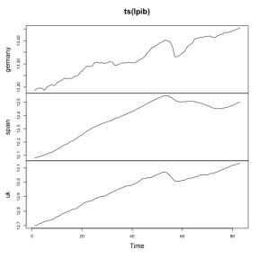
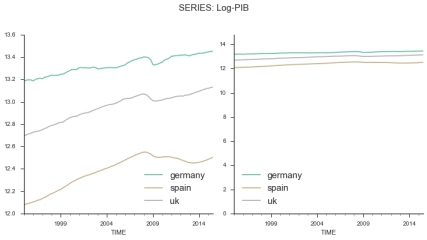
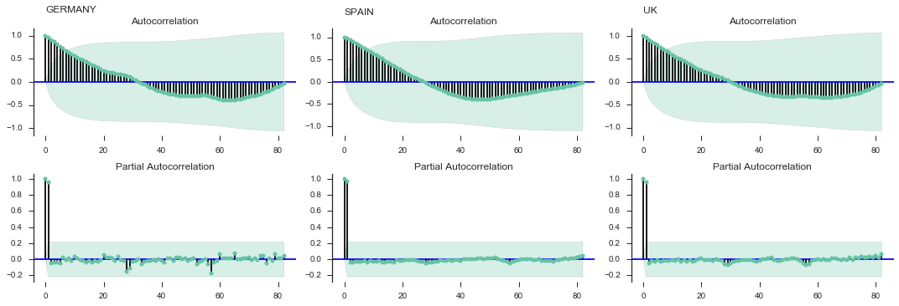
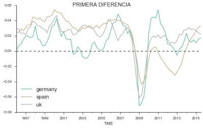
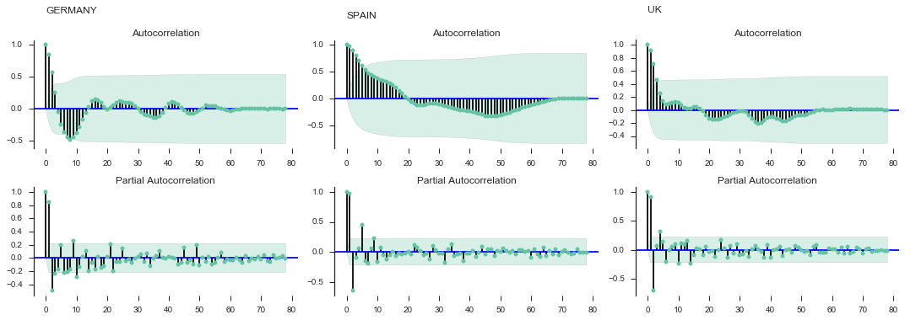
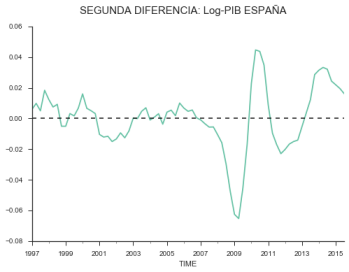
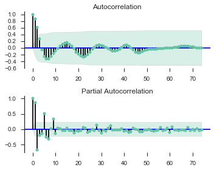
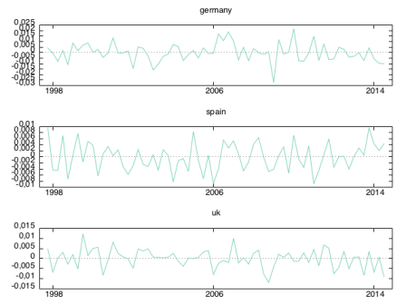
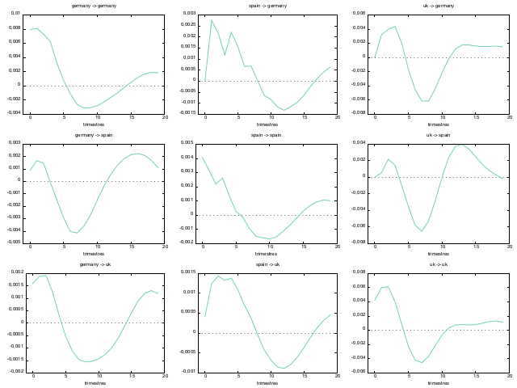

```python
from IPython.display import HTML

HTML('''<script>
code_show=true; 
function code_toggle() {
 if (code_show){
 $('div.input').hide();
 } else {
 $('div.input').show();
 }
 code_show = !code_show
} 
$( document ).ready(code_toggle);
</script>
<form action="javascript:code_toggle()"><input type="submit" value="Click here to toggle on/off the raw code."></form>''')
```


<script>
code_show=true; 
function code_toggle() {
 if (code_show){
 $('div.input').hide();
 } else {
 $('div.input').show();
 }
 code_show = !code_show
} 
$( document ).ready(code_toggle);
</script>
<form action="javascript:code_toggle()"><input type="submit" value="Click here to toggle on/off the raw code."></form>


```python
import warnings
warnings.filterwarnings('ignore')
```


```python
%matplotlib inline
```


```python
%precision 3
```


    '%.3f'


```python
%load_ext rpy2.ipython
```


```python
from scipy.stats import chi2, norm
```


```python
import statsmodels.stats.diagnostic as smsdia
import statsmodels.stats.outliers_influence as oi
from statsmodels.formula.api import ols
from statsmodels.graphics.tsaplots import plot_acf, plot_pacf
import statsmodels.api as sm
import statsmodels.stats as sms
from statsmodels.tsa.api import VARMAX, VAR
from statsmodels.tsa.stattools import adfuller
```


```python
import pandas as pd
import numpy as np
import seaborn as sns
import matplotlib.pyplot as plt
```


```python
sns.set(style='ticks', palette='Set2')
```


# Caso 2.3

_Estudio de las __relaciones__ entre los __PIB__ de varios países entre sí. Identificación de países dominantes y países seguidores._

_En este ejercicio se trata de estimar un __modelo multiecuacional__ en el que se analizan las relaciones entre el __crecimiento del PIB__ de tres países cualquiera extraídos de alguna base de datos (Ministerio de Economía, Banco de España, INE, etc.). _

_Una vez tengamos los datos __(preferiblemente trimestrales)__ del PIB a __precios constantes__, tendremos que calcular la __tasa de crecimiento anual__ para cada país y luego estimaremos un __modelo VAR sin restricciones__, Se trata de ver si algún país de los seleccionados actúa como líder y si el resto de países actúan como seguidores._

[⬆Caso2.3](#Caso-2.3-PRESENTAR)	[⬆a](#a)		[⬆b](#b)		[⬆c](#c)		

## DATOS
- Nombre: Chain GDP (millons euros)
- Fuente: EUROSTAT
- Enlace: http://ec.europa.eu/eurostat/web/national-accounts/data/database


```python
data = pd.read_csv('eu_gdp_q.csv', index_col=0, parse_dates=True)
```


```python
for i,e in enumerate(data.GEO.unique()):
    print(i,e)
```

    0 European Union (28 countries)
    1 European Union (15 countries)
    2 Euro area (EA11-2000, EA12-2006, EA13-2007, EA15-2008, EA16-2010, EA17-2013, EA18-2014, EA19)
    3 Euro area (19 countries)
    4 Euro area (18 countries)
    5 Euro area (12 countries)
    6 Belgium
    7 Bulgaria
    8 Czech Republic
    9 Denmark
    10 Germany (until 1990 former territory of the FRG)
    11 Estonia
    12 Ireland
    13 Greece
    14 Spain
    15 France
    16 Croatia
    17 Italy
    18 Cyprus
    19 Latvia
    20 Lithuania
    21 Luxembourg
    22 Hungary
    23 Malta
    24 Netherlands
    25 Austria
    26 Poland
    27 Portugal
    28 Romania
    29 Slovenia
    30 Slovakia
    31 Finland
    32 Sweden
    33 United Kingdom
    34 Iceland
    35 Norway
    36 Switzerland
    37 Former Yugoslav Republic of Macedonia, the
    38 Albania
    39 Serbia


```python
index_paises = [10, 14, 33]
```


```python
paises = data.GEO.unique()[index_paises]
```


```python
d = dict()
for p in paises:
    d[p] = data[data.GEO == p].Value
```


```python
pib = pd.DataFrame.from_dict(d)
```


```python
pib.columns = ['germany', 'spain', 'uk']
```

# VALORES PERDIDOS


```python
pib.replace(to_replace=':', value=np.nan, inplace=True)
```


```python
pib.head()
```


<div>
<table border="1" class="dataframe">
  <thead>
    <tr style="text-align: right;">
      <th></th>
      <th>germany</th>
      <th>spain</th>
      <th>uk</th>
    </tr>
    <tr>
      <th>TIME</th>
      <th></th>
      <th></th>
      <th></th>
    </tr>
  </thead>
  <tbody>
    <tr>
      <th>1975-01-01</th>
      <td>NaN</td>
      <td>NaN</td>
      <td>206 522.0</td>
    </tr>
    <tr>
      <th>1975-04-01</th>
      <td>NaN</td>
      <td>NaN</td>
      <td>202 980.6</td>
    </tr>
    <tr>
      <th>1975-07-01</th>
      <td>NaN</td>
      <td>NaN</td>
      <td>202 336.9</td>
    </tr>
    <tr>
      <th>1975-10-01</th>
      <td>NaN</td>
      <td>NaN</td>
      <td>204 823.2</td>
    </tr>
    <tr>
      <th>1976-01-01</th>
      <td>NaN</td>
      <td>NaN</td>
      <td>208 175.8</td>
    </tr>
  </tbody>
</table>
</div>


```python
pib = pib.dropna()
pib = pib.applymap(lambda x: x.replace(' ', ''))
pib = pib.astype('float')
pib.head()
```


<div>
<table border="1" class="dataframe">
  <thead>
    <tr style="text-align: right;">
      <th></th>
      <th>germany</th>
      <th>spain</th>
      <th>uk</th>
    </tr>
    <tr>
      <th>TIME</th>
      <th></th>
      <th></th>
      <th></th>
    </tr>
  </thead>
  <tbody>
    <tr>
      <th>1995-01-01</th>
      <td>532282.4</td>
      <td>175965</td>
      <td>327356.5</td>
    </tr>
    <tr>
      <th>1995-04-01</th>
      <td>536668.6</td>
      <td>177181</td>
      <td>328610.3</td>
    </tr>
    <tr>
      <th>1995-07-01</th>
      <td>538410.2</td>
      <td>178027</td>
      <td>332094.4</td>
    </tr>
    <tr>
      <th>1995-10-01</th>
      <td>538152.2</td>
      <td>179278</td>
      <td>333514.5</td>
    </tr>
    <tr>
      <th>1996-01-01</th>
      <td>533089.0</td>
      <td>180436</td>
      <td>337196.3</td>
    </tr>
  </tbody>
</table>
</div>


```python
pib.tail()
```


<div>
<table border="1" class="dataframe">
  <thead>
    <tr style="text-align: right;">
      <th></th>
      <th>germany</th>
      <th>spain</th>
      <th>uk</th>
    </tr>
    <tr>
      <th>TIME</th>
      <th></th>
      <th></th>
      <th></th>
    </tr>
  </thead>
  <tbody>
    <tr>
      <th>2014-07-01</th>
      <td>684570.6</td>
      <td>260281</td>
      <td>493645.2</td>
    </tr>
    <tr>
      <th>2014-10-01</th>
      <td>688763.3</td>
      <td>262050</td>
      <td>497349.5</td>
    </tr>
    <tr>
      <th>2015-01-01</th>
      <td>691149.9</td>
      <td>264331</td>
      <td>499176.3</td>
    </tr>
    <tr>
      <th>2015-04-01</th>
      <td>694181.5</td>
      <td>266942</td>
      <td>502436.8</td>
    </tr>
    <tr>
      <th>2015-07-01</th>
      <td>696374.6</td>
      <td>269039</td>
      <td>504777.1</td>
    </tr>
  </tbody>
</table>
</div>


```python
print('__Número de Observaciones %s__' % len(pib))
```

    __Número de Observaciones 83__


```python
lpib = np.log(pib).copy()
```

# ANÁLISIS UNIVARIANTE


```python
%%R -i lpib
library(forecast)
plot(ts(lpib))
```





## Número de diferenciaciones para I(0)

- KPSS
- ADF
- PP (Phillips-Perron)

### Alemania


```python
%%R

print(ndiffs(lpib$germany, test = 'kpss', m=4))
print(ndiffs(lpib$germany, test = 'adf', m=4))
print(ndiffs(lpib$germany, test = 'pp', m=4))
```


    [1] 1
    [1] 0
    [1] 1


### España


```python
%%R

print(ndiffs(lpib$spain, test = 'kpss', m=4))
print(ndiffs(lpib$spain, test = 'adf', m=4))
print(ndiffs(lpib$spain, test = 'pp', m=4))
```


    [1] 2
    [1] 2
    [1] 2


### Inglaterra


```python
%%R

print(ndiffs(lpib$uk, test = 'kpss', m=4))
print(ndiffs(lpib$uk, test = 'adf', m=4))
print(ndiffs(lpib$uk, test = 'pp', m=4))
```


    [1] 1
    [1] 2
    [1] 1


## TENDENCIA


```python
kws_sp = {'subplots':False, 'layout':(3,1), 'figsize':(10,5), 'cmap':'Set2'}
titles = [c.upper() for c in pib.columns]
fig, axs = plt.subplots(1,2)

g = lpib.plot(**kws_sp, ax=axs[0])
axs[0].legend(loc=0, fontsize=15)
plt.ylim(0,max(lpib.max())*1.1)

g = lpib.plot(**kws_sp, ax=axs[1])
axs[1].legend(loc=0, fontsize=15)

sns.despine()
plt.suptitle('SERIES: Log-PIB', fontsize=15, y=1.1)
plt.tight_layout()
```





- No estacionarias.
- Tendencia determinista.
- Posible presencia de tendencia estocástica.
- Posible presencia de ruptura estructural.

Del gráfico podemos ver que las series __no son estacionarias__, puesto que tienen tendencia __determinista__ y probablemente __ruptura estructural__ en 2008 (comprobar con el test de chow).

La series sabemos que tienen tedencia dado que lo unico que hemos hecho es una transformación monótona creciente al aplicar logaritmos. Si tiene tendencia determinista una transformación de este tipo también la tendrá.

Sin embargo faltaría comprobar si las series tienen tendencia estocástica, mediante el correlograma y el contraste de Dickey-Fuller.


```python
fig, axs = plt.subplots(2,3)
for i, pais in enumerate(lpib.columns):
    plot_acf(lpib[pais], axs[0][i])
    plot_pacf(lpib[pais], axs[1][i])
    axs[0][i].text(x=0,y=1.5,s=pais.upper(), fontsize=12)

fig.set_figheight(5)
fig.set_figwidth(15)
sns.despine(bottom=True)
plt.tight_layout()
```





El correlograma de la serie nos da pistas sobre la tendencia estocástica, vemos que hay un aplanamiento de la función de autocorrelación propio de las series con tendencia estocástica pero lo comprabamos con la prueba de reíz unitaria.


```python
txt = '## CONTRASTE DICKEY FULLER\n'
txt += '### SERIE: Log-PIB CON CONSTANTE Y TENDENCIA\n'
txt += '$H_0$: $y_{it} \sim I(1)$\n\n'
txt += '$H_a$: $y_{it} \sim I(0)$\n\n'
txt += '|Pais|ADF|pvalue|\n'
txt += '|:---:|:---:|:---:|\n'
for pais in pib.columns:
    d = lpib
    txt += '|%s|%.3f |%.3f\n' % (pais.upper(), *adfuller(d[pais], autolag='bic', regression='ct')[:2])
```


```python
print(txt)
```

    ## CONTRASTE DICKEY FULLER
    ### SERIE: Log-PIB CON CONSTANTE Y TENDENCIA
    $H_0$: $y_{it} \sim I(1)$
    
    $H_a$: $y_{it} \sim I(0)$
    
    |Pais|ADF|pvalue|
    |:---:|:---:|:---:|
    |GERMANY|-3.177 |0.089
    |SPAIN|-2.232 |0.472
    |UK|-1.968 |0.619
    


El contraste de Dickey Fuller no rechaza que las series sean integradas de orden 1 para un nivel de significación del 5%, por tanto las series son al menos I(1). El siguiente paso es diferencia las variables una vez y volver a aplicar el contraste.

### PRIMERA DIFERENCIA DEL Log-PIB (Interanual, 1 periodo)


```python
kws = {'figsize':(8,5), 'cmap':'Set2'}

dlpib = lpib.diff(periods=4).dropna()

g = dlpib.plot(**kws)
sns.despine()
plt.axhline(y=0, linewidth=2, linestyle='--', color='black', alpha=0.6)
plt.suptitle('PRIMERA DIFERENCIA', fontsize=15)
plt.legend(loc=0, fontsize=15)
plt.tight_layout()
```





```python
fig, axs = plt.subplots(2,3)

for i, pais in enumerate(pib.columns):
    plot_acf(dlpib[pais], axs[0][i])
    plot_pacf(dlpib[pais], axs[1][i])
    axs[0][i].text(x=0,y=1.5,s=pais.upper(), fontsize=12)

fig.set_figheight(5)
fig.set_figwidth(15)
sns.despine(bottom=True)
plt.tight_layout()
```





En este caso, las funciones de autocorrelación de las primeras diferencias muestran que para el caso de Alemania y Reino Unido, un correlograma parecido a una caminata aleatoria. Sin embargo para el caso de España, aun persiste ese lento aplanamiento de la FAC, que comentabamos antes, por lo que parece que para este último caso aún no es I(0).


```python
txt = '## CONTRASTE DICKEY FULLER\n'
txt += '### SERIE: dLog-PIB CON CONSTANTE\n'
txt += '$H_0$: $\Delta y_{it} \sim I(1)$\n\n'
txt += '$H_a$: $\Delta y_{it} \sim I(0)$\n\n'
txt += '|Pais|ADF|pvalue|\n'
txt += '|:---:|:---:|:---:|\n'

for pais in pib.columns:
    d = dlpib
    txt += '|%s|%.3f |%.3f\n' % (pais.upper(), *adfuller(d[pais], autolag='bic', regression='c')[:2])
```


```python
print(txt)
```

    ## CONTRASTE DICKEY FULLER
    ### SERIE: dLog-PIB CON CONSTANTE
    $H_0$: $\Delta y_{it} \sim I(1)$
    
    $H_a$: $\Delta y_{it} \sim I(0)$
    
    |Pais|ADF|pvalue|
    |:---:|:---:|:---:|
    |GERMANY|-4.117 |0.001
    |SPAIN|-1.362 |0.600
    |UK|-4.423 |0.000
    


El contraste de raíz unitaria nos da evidencia en contra de la hipótesis nula para Alemania y Reino Unido, encambio no se rechaza para España, por tanto las series en primeras diferencias son I(0) excepto para España que es al menos I(2).

Por tanto a modo de resúmen, las series originales no son estacionarias, tienen tendencia determinista y estocástica. Existe sospecha de ruptura estructural que habrá que comprobar para un correcto análisis. Dado que las series para el caso de Alemania y Reino Unido tienen el mismo orden de integración cabe la posibilidad de que estén cointegradas y esto requiere un tratamiento distinto del propuesto en este ejercicio, por tanto dado que el caso de España no se puede dar cointegración continuamos sin hacer el análisis apropiado.

Dado que para estimar el modelo VAR es necesario que las series sean integradas, necesitamos hallar el orden de integración de la serie para España.


```python
dlpib_spa = dlpib.spain
ddlpib_spa = dlpib_spa.diff(periods=4).dropna()
```


```python
ddlpib_spa.plot()
sns.despine()
plt.axhline(y=0, linestyle='--', linewidth=2, alpha=0.7, color='black')

plt.suptitle('SEGUNDA DIFERENCIA: Log-PIB ESPAÑA', fontsize=15)
```


    <matplotlib.text.Text at 0x1140d2400>





```python
fig, axs = plt.subplots(2,1)
ax1, ax2 = axs
_ = plot_acf(ddlpib_spa, ax=ax1)
_ = plot_pacf(ddlpib_spa, ax=ax2)
sns.despine(bottom=True)
fig.set_figheight(4)
fig.set_figwidth(5)
plt.tight_layout()
```





El correlograma de las segundas diferencias no muestra nada claro, pare que puede haber una disminución lenta de la función de autocorrelación que indica presencia de raíz unitaria. Lo comprobamos con el contraste de Dickey-Fuller.


```python
txt = '## CONTRASTE DICKEY FULLER\n'
txt += '### SERIE: PIB\n'
txt += '$H_0$: $\Delta^2y_{it} \sim I(1)$\n\n'
txt += '$H_a$: $\Delta^2y_{it} \sim I(0)$\n\n'
txt += '|Pais|ADF|pvalue|\n'
txt += '|:---:|:---:|:---:|\n'
pais = dlpib.columns[1]
d = ddlpib_spa
txt += '|%s|%.3f |%.3f\n' % (pais.upper(), *adfuller(d, autolag='bic', regression='nc')[:2])
```


```python
print(txt)
```

    ## CONTRASTE DICKEY FULLER
    ### SERIE: PIB
    $H_0$: $\Delta^2y_{it} \sim I(1)$
    
    $H_a$: $\Delta^2y_{it} \sim I(0)$
    
    |Pais|ADF|pvalue|
    |:---:|:---:|:---:|
    |SPAIN|-2.215 |0.026
    


Para segundas diferencias del PIB de España, la serie es I(0), lo que implica que la serie original para España es I(2).


```python
names = [p.upper() for p in pib.columns]
d = ['$y_{1t} \sim I(1)$', '$y_{2t} \sim I(2)$', '$y_{3t} \sim I(1)$']
line = '\n'
txt = '### RESÚMEN' + line
txt += '$Log(PIB_{it}) = y_{it}$' +line+line
txt += '|Pais (i)|Orden de Integración|T. Determinista|'+line
txt += '|:--:|:---:|:---:|'+line
txt += '|{names[0]}|{d[0]}|SI|'+line
txt += '|{names[1]}|{d[1]}|SI|'+line
txt += '|{names[2]}|{d[2]}|SI|'+line
```


```python
print(txt.format(names=names, d=d, it='{it}'))
```

    ### RESÚMEN
    $Log(PIB_{it}) = y_{it}$
    
    |Pais (i)|Orden de Integración|T. Determinista|
    |:--:|:---:|:---:|
    |GERMANY|$y_{1t} \sim I(1)$|SI|
    |SPAIN|$y_{2t} \sim I(2)$|SI|
    |UK|$y_{3t} \sim I(1)$|SI|
    


<div style="font-family:serif;">
<div style="font-size:300%;">
<h1 style="text-align:center;">APARTADO A
</h1></div></div>

# a
_Antes de estimar un VAR, tenemos que __seleccionar el número óptimo de retardos del VAR__, para ello hay que ir a la opción __Modelo-Series temporales-Selección del orden del VAR__, donde le indicamos nuestro conjunto de variables endógenas, exógenas (si las hubiera) y el máximo número de retardos del VAR. Acortaremos el periodo de manera que __dejaremos las 4 últimas observaciones para predecir__. _

[⬆Caso2.3](#Caso-2.3-PRESENTAR)	[⬆a](#a)		[⬆b](#b)		[⬆c](#c)		


```python
data = dlpib.copy()
data['spain'] = ddlpib_spa
```


```python
data.dropna().to_csv('data23_y-y.csv')
```


```python
data_bkp = data.copy()
data = data_bkp.iloc[:-4].dropna()
```


```python
data.head()
```


<div>
<table border="1" class="dataframe">
  <thead>
    <tr style="text-align: right;">
      <th></th>
      <th>germany</th>
      <th>spain</th>
      <th>uk</th>
    </tr>
    <tr>
      <th>TIME</th>
      <th></th>
      <th></th>
      <th></th>
    </tr>
  </thead>
  <tbody>
    <tr>
      <th>1997-01-01</th>
      <td>0.019560</td>
      <td>0.005951</td>
      <td>0.021179</td>
    </tr>
    <tr>
      <th>1997-04-01</th>
      <td>0.019769</td>
      <td>0.009848</td>
      <td>0.029468</td>
    </tr>
    <tr>
      <th>1997-07-01</th>
      <td>0.017315</td>
      <td>0.004996</td>
      <td>0.031761</td>
    </tr>
    <tr>
      <th>1997-10-01</th>
      <td>0.018849</td>
      <td>0.018385</td>
      <td>0.039459</td>
    </tr>
    <tr>
      <th>1998-01-01</th>
      <td>0.032912</td>
      <td>0.012328</td>
      <td>0.037315</td>
    </tr>
  </tbody>
</table>
</div>


```python
data.tail()
```


<div>
<table border="1" class="dataframe">
  <thead>
    <tr style="text-align: right;">
      <th></th>
      <th>germany</th>
      <th>spain</th>
      <th>uk</th>
    </tr>
    <tr>
      <th>TIME</th>
      <th></th>
      <th></th>
      <th></th>
    </tr>
  </thead>
  <tbody>
    <tr>
      <th>2013-07-01</th>
      <td>0.005161</td>
      <td>0.012231</td>
      <td>0.021154</td>
    </tr>
    <tr>
      <th>2013-10-01</th>
      <td>0.013296</td>
      <td>0.028614</td>
      <td>0.028065</td>
    </tr>
    <tr>
      <th>2014-01-01</th>
      <td>0.023121</td>
      <td>0.031464</td>
      <td>0.027602</td>
    </tr>
    <tr>
      <th>2014-04-01</th>
      <td>0.013519</td>
      <td>0.033305</td>
      <td>0.030974</td>
    </tr>
    <tr>
      <th>2014-07-01</th>
      <td>0.011681</td>
      <td>0.032141</td>
      <td>0.028106</td>
    </tr>
  </tbody>
</table>
</div>


```python
endog = data.copy()
```

_Tras decirle a Gretl que estime hasta con __un máximo de 12 retardos__, se nos presentará una pantalla resumen de resultados donde se nos muestran para cada orden del VAR los estadísticos AIC, SBIC y Hannan-Quinn, seleccionaremos el número de retardos mayor que cero que __minimice esos criterios__._


```python
m1 = VAR(endog=endog)
```


```python
m1.select_order(12)
```

                     VAR Order Selection                  
    ======================================================
                aic          bic          fpe         hqic
    ------------------------------------------------------
    0        -24.05       -23.95    3.574e-11       -24.01
    1        -28.51       -28.09    4.155e-13       -28.35
    2        -29.84      -29.10*    1.107e-13       -29.55
    3        -29.79       -28.73    1.166e-13       -29.38
    4        -29.88       -28.51    1.076e-13       -29.35
    5        -30.63       -28.94    5.203e-14       -29.97
    6        -30.68       -28.67    5.106e-14       -29.89
    7        -30.97       -28.65    3.974e-14       -30.06
    8        -31.05       -28.41    3.894e-14       -30.02
    9        -31.85       -28.90   1.880e-14*      -30.70*
    10       -31.93       -28.66    1.925e-14       -30.65
    11       -31.76       -28.17    2.605e-14       -30.36
    12      -32.09*       -28.18    2.233e-14       -30.56
    ======================================================
    * Minimum
    


    {'aic': 12, 'bic': 2, 'fpe': 9, 'hqic': 9}


_Ahora que ya hemos seleccionado el número de retardos, volvemos a estimar el sistema en el menú Modelo-Series temporales-Autorregresión vectorial (VAR), donde tras indicar las opciones adecuadas, se nos mostrarán los resultados de la estimación de cada una de las ecuaciones del sistema, tres en nuestro caso. Analizaremos si existe algún __problema residual__ en alguna ecuación mirando los test de autocorrelación __LM(1), ARCH(1) y normalidad__, analizando además los __gráficos residuales. ___

# MODELO 1


```python
lags = 2
r1 = m1.fit(lags)
```


```python
%%R -i endog -i lags
require(vars)

endog = ts(endog, start = c(1995, 3), end = c(2014,3), frequency = 4)
m1 <- VAR(y = endog, p = lags)
```


```python
%%R
summary(m1)
```


    
    VAR Estimation Results:
    ========================= 
    Endogenous variables: germany, spain, uk 
    Deterministic variables: const 
    Sample size: 75 
    Log Likelihood: 814.46 
    Roots of the characteristic polynomial:
    0.872 0.872 0.851 0.6855 0.6855 0.2392
    Call:
    VAR(y = endog, p = lags)
    
    
    Estimation results for equation germany: 
    ======================================== 
    germany = germany.l1 + spain.l1 + uk.l1 + germany.l2 + spain.l2 + uk.l2 + const 
    
                Estimate Std. Error t value Pr(>|t|)    
    germany.l1  0.774398   0.117946   6.566 8.52e-09 ***
    spain.l1    0.422524   0.142251   2.970 0.004109 ** 
    uk.l1       0.644915   0.183308   3.518 0.000779 ***
    germany.l2 -0.006473   0.115514  -0.056 0.955476    
    spain.l2   -0.259471   0.146753  -1.768 0.081533 .  
    uk.l2      -0.648651   0.183722  -3.531 0.000749 ***
    const       0.003083   0.001977   1.560 0.123414    
    ---
    Signif. codes:  0 ‘***’ 0.001 ‘**’ 0.01 ‘*’ 0.05 ‘.’ 0.1 ‘ ’ 1
    
    
    Residual standard error: 0.008927 on 68 degrees of freedom
    Multiple R-Squared: 0.8619,	Adjusted R-squared: 0.8497 
    F-statistic: 70.73 on 6 and 68 DF,  p-value: < 2.2e-16 
    
    
    Estimation results for equation spain: 
    ====================================== 
    spain = germany.l1 + spain.l1 + uk.l1 + germany.l2 + spain.l2 + uk.l2 + const 
    
                 Estimate Std. Error t value Pr(>|t|)    
    germany.l1  0.1175199  0.0917925   1.280  0.20480    
    spain.l1    0.9427998  0.1107083   8.516 2.53e-12 ***
    uk.l1       0.4779410  0.1426612   3.350  0.00132 ** 
    germany.l2 -0.2651894  0.0898996  -2.950  0.00436 ** 
    spain.l2   -0.1701440  0.1142120  -1.490  0.14092    
    uk.l2      -0.4077363  0.1429832  -2.852  0.00575 ** 
    const       0.0002402  0.0015383   0.156  0.87639    
    ---
    Signif. codes:  0 ‘***’ 0.001 ‘**’ 0.01 ‘*’ 0.05 ‘.’ 0.1 ‘ ’ 1
    
    
    Residual standard error: 0.006947 on 68 degrees of freedom
    Multiple R-Squared: 0.8877,	Adjusted R-squared: 0.8778 
    F-statistic: 89.56 on 6 and 68 DF,  p-value: < 2.2e-16 
    
    
    Estimation results for equation uk: 
    =================================== 
    uk = germany.l1 + spain.l1 + uk.l1 + germany.l2 + spain.l2 + uk.l2 + const 
    
                Estimate Std. Error t value Pr(>|t|)    
    germany.l1 -0.110761   0.077405  -1.431  0.15703    
    spain.l1   -0.058732   0.093356  -0.629  0.53138    
    uk.l1       1.634689   0.120301  13.588  < 2e-16 ***
    germany.l2  0.010741   0.075809   0.142  0.88775    
    spain.l2    0.127775   0.096311   1.327  0.18905    
    uk.l2      -0.755622   0.120573  -6.267 2.89e-08 ***
    const       0.003858   0.001297   2.974  0.00406 ** 
    ---
    Signif. codes:  0 ‘***’ 0.001 ‘**’ 0.01 ‘*’ 0.05 ‘.’ 0.1 ‘ ’ 1
    
    
    Residual standard error: 0.005858 on 68 degrees of freedom
    Multiple R-Squared: 0.9218,	Adjusted R-squared: 0.9149 
    F-statistic: 133.7 on 6 and 68 DF,  p-value: < 2.2e-16 
    
    
    
    Covariance matrix of residuals:
              germany     spain        uk
    germany 7.969e-05 5.844e-06 1.594e-05
    spain   5.844e-06 4.827e-05 1.668e-05
    uk      1.594e-05 1.668e-05 3.432e-05
    
    Correlation matrix of residuals:
            germany   spain     uk
    germany 1.00000 0.09424 0.3048
    spain   0.09424 1.00000 0.4099
    uk      0.30481 0.40987 1.0000
    
    


# CONTRASTES


```python
g = r1.resid.plot(linewidth=1, subplots=True, cmap='Set2')
sns.despine()
for ax in g:
    ax.legend(loc=1, fontsize=14)
plt.suptitle('Residuos Modelo 1', fontsize=15)
```


    <matplotlib.text.Text at 0x1157ef5c0>


### Homocedasticidad

$H_0$: Homocedasticidad

No hay evidencia para rechazar la hipótesis nula de homocedasticidad.


```python
%%R
arch(m1)
```

### Autocorrleación

$H_0$: No Autocorrelación

Hay evidencia en contra de la hipótesis nula, se rechaza la hipótesis de no autocorrelación.


```python
%%R
serial(m1, lags.pt = 16, type = 'BG')
```

### Normalidad

$H_0$: La muestra proviene de una distribución normal

Según el JB, no se puede rechazar la hipóstesis nula.


```python
%%R
normality(m1)
```

### Estabilidad
$H_0$: Estabilidad

Dado que la serie se mantiene entre las bandas no se puede rechazar la hipótesis nula de estabilidad de los parámetros.


```python
%%R
plot(stability(m1, type = "OLS-CUSUM"))
```

Dado que la serie se mantiene entre las bandas no se puede rechazar la hipótesis nula de estabilidad de los parámetros.

_Es posible que encontremos algún problema, por ejemplo, es posible que sea necesario incorporar una __variable ficticia__ que dé cuenta de la __crisis del precio del petróleo__ ocurrida en los años 70; a esta nueva variable la podemos llamar __D74__ y tomará valor 1 durante los cuatro trimestres de 1974 y valor 0 el resto. _

## ESTIMAR EL MODELO 2

Es el modelo 1 con D08 como variable exógena.

Dado que la crisis del petróleo no entra en el período, y el objetivo es capturar un comportamiento atípico, vamos a introducir una variable ficticia que recoja el efecto de la crisis actual, que llamaremos D08 que tomará valor 1 entre 2008-2011.


```python
dummy = data.copy()
dummy['d08'] = 0
dummy.loc['2008':'2011', 'd08'] = 1
exog = dummy.d08
```


```python
dummy.loc['2007':'2012']
```

## ESTIMAR EL NÚMERO DE RETARDOS


```python
%%R -i endog -i exog

endog <- ts(endog, start = c(1995, 3), end = c(2014,3), frequency = 4)
exog <- ts(exog, start = c(1995, 3), end = c(2014,3), frequency = 4)

print(VARselect(y = endog, lag.max = 12, exogen = exog, type = 'none')$selection)
```


```python

lags2 = 3
```


```python
%%R -i lags2
m0 <- VAR(y = endog, p = lags2)
m2 <- VAR(y = endog, p = lags2, exogen = exog)
summary(m2)
```

_Incorporamos esta nueva variable explicativa a nuestro modelo, le indicamos el periodo de estimación, el número de retardos y para ver si resulta __conjuntamente significativa o no__ debemos ir al menú de contraste de hipótesis del VAR y seleccionar la opción que nos hace un contraste sobre la __exogeneidad de las variables__. Tras indicarle que queremos analizar la exogeneidad de D74 nos calculará un contraste __LR de la razón de verosimilitudes__, si el valor del p-valor de este contraste es menor que 0,05, aceptamos que mantenemos dicha variable al nivel de significación del 5%. __Comprobar cómo cambian los resultados de las tres ecuaciones__ estimadas del VAR con esta nueva variable y decidir con base en esos resultados si la mantenemos o no._

$H_0$: Modelo 1 (Restringido)

$H_a$: Modelo 2 (Con Ficticia)


```python
%%R
lrtest(m0, m2)
```

El contraste LR nos da evidencia en contra de la hipótesis alternativa (variable ficticia no significativa), por tanto, rechazamos el modelo 1 sin ficticia y trabajaremos en adelante con el modelo 2.

# RESÚMEN MODELO 2

Resulta interesante que el modelo estimado tiene problemas de normalidad, y para el caso de Alemania, tiene sólo dos variable significativas.

Los contrastes de causalidad en sentido de granger:

### Alemania:
- España e Inglaterra causa en sentido de granger.

### España:
- Inglaterra y Alemania causan en sentido granger.

### Inglaterra:
- España y Alemania no causan en sentido de granger.

    Contraste sobre el VAR original:

      Hipótesis nula: los parámetros de regresión son cero para las variables
        d08
      Contraste LR (razón de verosimilitudes): Chi-cuadrado(3) = 41,2448, con valor p = 5,80231e-09

    Sistema VAR, orden del retardo 3
    estimaciones de MCO, observaciones 1997:4-2014:3 (T = 68)
    Log-verosimilitud = 753,17963
    Determinante de la matriz de covarianzas = 4,807696e-14
    AIC = -21,2700
    BIC = -20,2908
    HQC = -20,8820
    Contraste Portmanteau: LB(17) = 203,195, gl = 126 [0,0000]

    Ecuación 1: germany

                  Coeficiente   Desv. Típica   Estadístico t   Valor p 
      -----------------------------------------------------------------
      const        0,00327783    0,00235137       1,394        0,1686  
      germany_1    0,840602      0,134378         6,256        5,15e-08 ***
      germany_2   −0,0486518     0,176294        −0,2760       0,7836  
      germany_3   −0,00771409    0,137423        −0,05613      0,9554  
      spain_1      0,596470      0,195455         3,052        0,0034   ***
      spain_2     −0,635130      0,264789        −2,399        0,0197   **
      spain_3      0,243166      0,184474         1,318        0,1926  
      uk_1         0,672601      0,221678         3,034        0,0036   ***
      uk_2        −0,748377      0,382582        −1,956        0,0553   *
      uk_3         0,0636203     0,250850         0,2536       0,8007  

    Media de la vble. dep.  0,012848   D.T. de la vble. dep.   0,024031
    Suma de cuad. residuos  0,004734   D.T. de la regresión    0,009035
    R-cuadrado              0,877638   R-cuadrado corregido    0,858651
    F(9, 58)                46,22275   Valor p (de F)          3,28e-23
    rho                    −0,023140   Durbin-Watson           2,019450

    Contrastes F de restricciones cero:

    Todos los retardos de germany      F(3, 58) =   32,832 [0,0000]
    Todos los retardos de spain        F(3, 58) =   3,2071 [0,0296]
    Todos los retardos de uk           F(3, 58) =   4,1124 [0,0103]
    Todas las variables, retardo 3     F(3, 58) =  0,71711 [0,5458]

    Ecuación 2: spain

                 Coeficiente   Desv. Típica  Estadístico t  Valor p 
      --------------------------------------------------------------
      const       0,00121224    0,00153768      0,7884      0,4337  
      germany_1  −0,0196898     0,0878763      −0,2241      0,8235  
      germany_2  −0,0332798     0,115287       −0,2887      0,7739  
      germany_3  −0,148135      0,0898674      −1,648       0,1047  
      spain_1     0,871071      0,127817        6,815       5,99e-09 ***
      spain_2    −0,120276      0,173159       −0,6946      0,4901  
      spain_3    −0,000566028   0,120637       −0,004692    0,9963  
      uk_1        0,377382      0,144966        2,603       0,0117   **
      uk_2       −0,0152370     0,250189       −0,06090     0,9516  
      uk_3       −0,299781      0,164043       −1,827       0,0728   *

    Media de la vble. dep. −0,001423   D.T. de la vble. dep.   0,020576
    Suma de cuad. residuos  0,002025   D.T. de la regresión    0,005908
    R-cuadrado              0,928627   R-cuadrado corregido    0,917552
    F(9, 58)                83,84777   Valor p (de F)          6,45e-30
    rho                     0,099362   Durbin-Watson           1,707778

    Contrastes F de restricciones cero:

    Todos los retardos de germany      F(3, 58) =   4,0820 [0,0107]
    Todos los retardos de spain        F(3, 58) =   44,642 [0,0000]
    Todos los retardos de uk           F(3, 58) =   6,6470 [0,0006]
    Todas las variables, retardo 3     F(3, 58) =   3,5139 [0,0206]

    Ecuación 3: uk

                  Coeficiente   Desv. Típica   Estadístico t   Valor p 
      -----------------------------------------------------------------
      const        0,00414163    0,00152504       2,716        0,0087   ***
      germany_1   −0,109889      0,0871540       −1,261        0,2124  
      germany_2   −0,0161926     0,114340        −0,1416       0,8879  
      germany_3    0,0413171     0,0891287        0,4636       0,6447  
      spain_1      0,138002      0,126767         1,089        0,2808  
      spain_2     −0,154176      0,171735        −0,8978       0,3730  
      spain_3      0,139691      0,119645         1,168        0,2478  
      uk_1         1,61335       0,143775        11,22         3,65e-16 ***
      uk_2        −0,756154      0,248133        −3,047        0,0035   ***
      uk_3         0,00252780    0,162695         0,01554      0,9877  

    Media de la vble. dep.  0,020217   D.T. de la vble. dep.   0,020722
    Suma de cuad. residuos  0,001992   D.T. de la regresión    0,005860
    R-cuadrado              0,930777   R-cuadrado corregido    0,920035
    F(9, 58)                86,65188   Valor p (de F)          2,68e-30
    rho                    −0,030340   Durbin-Watson           1,999696

    Contrastes F de restricciones cero:

    Todos los retardos de germany      F(3, 58) =   1,2323 [0,3062]
    Todos los retardos de spain        F(3, 58) =   1,0029 [0,3981]
    Todos los retardos de uk           F(3, 58) =   105,47 [0,0000]
    Todas las variables, retardo 3     F(3, 58) =  0,68411 [0,5654]

    Para el sistema en conjunto:

      Hipótesis nula: el retardo más largo es 2
      Hipótesis alternativa: el retardo más largo es 3
      Contraste de razón de verosimilitudes: Chi-cuadrado(9) = 19,2769 [0,0229]

      Comparación de criterios de información:
      Orden de retardos 3: AIC = -21,2700, BIC = -20,2908, HQC = -20,8820
      Orden de retardos 2: AIC = -21,2512, BIC = -20,5658, HQC = -20,9796


# CONTRASTES

## RESIDUOS MODELO 2



### Homocedasticidad

$H_0$: Homocedasticidad

No hay evidencia para rechazar la hipótesis nula de homocedasticidad.


```python
%%R
arch(m2)
```

### Autocorrleación

$H_0$: No Autocorrelación

Hay evidencia en contra de la hipótesis nula, se rechaza la hipótesis de no autocorrelación.


```python
%%R
serial(m2, lags.pt = 16, type = 'BG')
```

### Normalidad

$H_0$: La muestra proviene de una distribución normal

Según el JB, no se puede rechazar la hipóstesis nula.


```python
%%R
normality.test(m2)
```

### Estabilidad
$H_0$: Estabilidad

Dado que la serie se mantiene entre las bandas no se puede rechazar la hipótesis nula de estabilidad de los parámetros.


```python
%%R
plot(stability(m2, type = "OLS-CUSUM"))
```

### RESÚMEN

|           |modelo 1| modelo 2|
|:---------:|:------:|:-------:|
|ARCH       |     ✔ |  ✔      |
|BP         |   ✘    |    ✘    |
|JB         |    ✔  |  ✔     |
|OLS-CUSUM  |    ✔  |  ✔     |
|$\bar{R}^2_{Ale}$| 0.8497   |  0,858651  |
|$\bar{R}^2_{Esp}$| 0.8778  |    0,917552|
|$\bar{R}^2_{Ing}$| 0.9149  | 0,920035   |


<div style="font-family:serif;">
<div style="font-size:300%;">
<h1 style="text-align:center;">APARTADO B
</h1></div></div>

# b
Una vez determinado el modelo más adecuado, realizaremos __predicciones dinámicas__ para cada una de las variables endógenas. Para ello, tras indicarle que deje los últimos 20 valores para representar antes del periodo de predicción. Gretl nos ofrecerá una tabla con los valores reales y predichos, los errores y algunas medidas para evaluar y comparar las predicciones. La mejor __medida para comparar__ suele ser el __“porcentaje de error absoluto medio” (EAPM)__, con el que podemos comparar el error medio que comete cada una de las tres ecuaciones.

[⬆Caso2.3](#Caso-2.3-PRESENTAR)	[⬆a](#a)		[⬆b](#b)		[⬆c](#c)		

# PORCENTAJE DE ERROR ABSOLUTO MEDIO

|País|EAPM|
|:--:|:--:|
|Alemania |36,4|
|España | 24,78|
|Reino Unido|32,18|

     Para intervalos de confianza 95%, t(58, .0,025) = 2,002

                  germany    predicción  Desv. Típica     Intervalo de confianza 95% 

      2009:4     -0,029973    -0,030079
      2010:1      0,023375     0,001228
      2010:2      0,042704     0,049795
      2010:3      0,044752     0,051770
      2010:4      0,043569     0,043293
      2011:1      0,054253     0,039076
      2011:2      0,035935     0,042612
      2011:3      0,032098     0,024112
      2011:4      0,023977     0,028345
      2012:1      0,009383     0,016342
      2012:2      0,008216     0,004336
      2012:3      0,005790     0,003488
      2012:4      0,001180     0,005925
      2013:1     -0,005392    -0,000658
      2013:2      0,003067     0,003721
      2013:3      0,005161     0,012866
      2013:4      0,013296     0,010016
      2014:1      0,023121     0,028767
      2014:2      0,013519     0,024502
      2014:3      0,011681     0,022216
      2014:4      0,014551     0,015410     0,008344    -0,001293 - 0,032112
      2015:1      0,010885     0,017560     0,013030    -0,008522 - 0,043643
      2015:2      0,015828     0,021189     0,016334    -0,011508 - 0,053885
      2015:3      0,017096     0,024705     0,018710    -0,012747 - 0,062156

      Estadísticos de evaluación de la predicción

      Error medio                          -0,0051258
      Error cuadrático medio                3,2981e-05
      Raíz del Error cuadrático medio       0,0057429
      Error absoluto medio                  0,0051258
      Porcentaje de error medio            -36,4
      Porcentaje de error absoluto medio    36,4
      U de Theil                            1,5741
      Proporción de sesgo, UM               0,79665
      Proporción de regresión, UR           0,11631
      Proporción de perturbación, UD        0,087041


     Para intervalos de confianza 95%, t(58, .0,025) = 2,002

                    spain    predicción  Desv. Típica     Intervalo de confianza 95% 

      2009:4     -0,016921    -0,011787
      2010:1      0,022809     0,017665
      2010:2      0,044701     0,046842
      2010:3      0,043761     0,050298
      2010:4      0,034866     0,033493
      2011:1      0,008750     0,018900
      2011:2     -0,009596    -0,002795
      2011:3     -0,017054    -0,016471
      2011:4     -0,022960    -0,021514
      2012:1     -0,020190    -0,021201
      2012:2     -0,016699    -0,019875
      2012:3     -0,015057    -0,017499
      2012:4     -0,014117    -0,011847
      2013:1     -0,005319    -0,010143
      2013:2      0,003484    -0,000865
      2013:3      0,012231     0,009943
      2013:4      0,028614     0,015429
      2014:1      0,031464     0,027470
      2014:2      0,033305     0,027156
      2014:3      0,032141     0,026273
      2014:4      0,024368     0,022941     0,005457     0,012018 - 0,033864
      2015:1      0,021968     0,015953     0,007980    -0,000021 - 0,031928
      2015:2      0,019515     0,012853     0,010649    -0,008463 - 0,034169
      2015:3      0,016182     0,011045     0,012847    -0,014671 - 0,036761

      Estadísticos de evaluación de la predicción

      Error medio                           0,0048102
      Error cuadrático medio                2,7247e-05
      Raíz del Error cuadrático medio       0,0052199
      Error absoluto medio                  0,0048102
      Porcentaje de error medio             24,78
      Porcentaje de error absoluto medio    24,78
      U de Theil                            2,0804
      Proporción de sesgo, UM               0,84921
      Proporción de regresión, UR           0,1071
      Proporción de perturbación, UD        0,043691


     Para intervalos de confianza 95%, t(58, .0,025) = 2,002

                       uk    predicción  Desv. Típica     Intervalo de confianza 95% 

      2009:4     -0,012798    -0,015855
      2010:1      0,006710     0,009863
      2010:2      0,016763     0,019470
      2010:3      0,020095     0,020060
      2010:4      0,017516     0,021593
      2011:1      0,021272     0,017809
      2011:2      0,016668     0,022394
      2011:3      0,019808     0,014162
      2011:4      0,020382     0,022031
      2012:1      0,015142     0,018539
      2012:2      0,009963     0,011487
      2012:3      0,011937     0,006354
      2012:4      0,009864     0,013200
      2013:1      0,014227     0,009211
      2013:2      0,021934     0,019818
      2013:3      0,021154     0,027924
      2013:4      0,028065     0,021289
      2014:1      0,027602     0,034612
      2014:2      0,030974     0,026601
      2014:3      0,028106     0,035745
      2014:4      0,029223     0,029283     0,005412     0,018451 - 0,040116
      2015:1      0,026784     0,031751     0,010371     0,010990 - 0,052512
      2015:2      0,023991     0,034753     0,014263     0,006203 - 0,063304
      2015:3      0,022300     0,036819     0,016873     0,003045 - 0,070593

      Estadísticos de evaluación de la predicción

      Error medio                          -0,0075772
      Error cuadrático medio                8,7826e-05
      Raíz del Error cuadrático medio       0,0093716
      Error absoluto medio                  0,0075772
      Porcentaje de error medio            -32,18
      Porcentaje de error absoluto medio    32,18
      U de Theil                            4,9399
      Proporción de sesgo, UM               0,65372
      Proporción de regresión, UR           0,34618
      Proporción de perturbación, UD        0,00010315


<div style="font-family:serif;">
<div style="font-size:200%;">
<h1 style="text-align:center;">APARTADO C
</h1></div></div>

# c
_Por último, realizaremos un estudio __“impulso-respuesta”__ con el VAR estimado, esto es, cómo responden las variables endógenas ante un shock en alguna de ellas; para ello se __descompone la varianza de los errores__ de predicción de las variables a lo largo de diferentes periodos. Una vez que tenemos modelo VAR con las variables que hayamos seleccionado, iremos a la opción __Gráficos-Respuestas al impulso (todas)__ y nos dibujará los efectos impulso-respuesta para un shock de cada variable sobre las demás._

_Algo a tener en cuenta es que cuando se calculan los impulso-respuesta ortogonalizados se “normalizan” respecto de la primera variable que seleccionemos, la cual debe ser la que pensemos ejerce mayor influencia sobre las demás, es decir, tenemos que ordenarlas de mayor a menor exogeneidad según creamos. ¿Qué país produce mayores respuestas de los demás ante un shock inicial?_

[⬆Caso2.3](#Caso-2.3-PRESENTAR)	[⬆a](#a)		[⬆b](#b)		[⬆c](#c)		

## IMPULSO RESPUESTA

## Orden:

1. Alemania
2. España
3. Inglaterra

En el gráfico se puede ver, que la respuesta del PIB de España en Alemania es mayor que la de Alemania en España.

El efecto de Inglaterra en Alemania es similar al de Alemania sobre Inglaterra pero este último menos intenso.

El efecto de España en Inglaterra es menor que la inversa.

### Conclusión
Para el caso elegido no parece haber un país que produzca mayores respuestas en los demás.





```python

```
