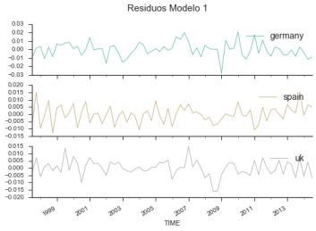
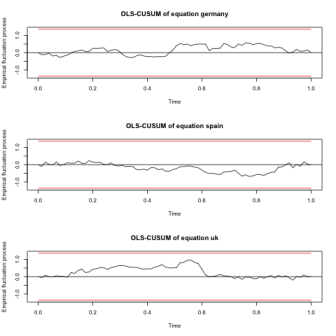
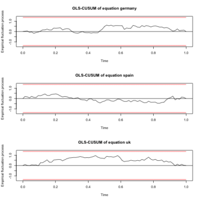

![][image-1]

# MAXIMILIANO GRECO - GRUPO 5A

---

<!--BREAK-->

<!--TOC max3-->

# CASO 2.1A.

#### Estimación de una función de consumo con datos de corte transversal.

_En este ejercicio vamos a analizar la relación entre el consumo y la renta para un conjunto de familias, tratando de evaluar la función de consumo keynesiana. Los datos se refieren a los gastos en consumo y la renta de 50 familias, que se muestran en la siguiente tabla_: 

|     |CONSUMO|RENTA||CONSUMO|RENTA|
|:---|:--------:|:------:|:---|:--------:|:------:|
|Familia 1| 1080,5| 1000|Familia 13| 3033,8| 3400|
|Familia 26| 5782,6| 6051|Familia 38| 6808,6| 8407|
|Familia 2| 1239,8| 1020|Familia 14| 3310,4| 3990|
|Familia 27| 4201,4| 6200|Familia 39| 7089,8| 8900|
|Familia 3| 1540,7| 1200|Familia 15| 4077,2| 4000|
|Familia 28| 6058,7| 6406|Familia 40| 6236,6| 9000|
|Familia 4| 1773,8| 1500|Familia 16| 2987,6| 4010|
|Familia 29| 4946,0| 6802|Familia 41| 6623,3| 9072|
|Familia 5| 1896,5| 1990|Familia 17| 3812,0| 4100|
|Familia 30| 5690,3| 7000|Familia 42| 7009,1| 9300|
|Familia 6| 1691,0| 2000|Familia 18| 3921,8| 4400|
|Familia 31| 5956,6| 7043|Familia 43| 8645,6| 9700|
|Familia 7| 1979,6| 2010|Familia 19| 4122,2| 4800|
|Familia 32| 4556,6| 7100|Familia 44| 9578,0| 9990|
|Familia 8| 1940,0| 2020|Familia 20| 4530,8| 5000|
|Familia 33| 6069,5| 7600|Familia 45| 7355,0| 10000|
|Familia 9| 2502,5| 2900|Familia 21| 4042,2| 5025|
|Familia 34| 7763,9| 7992|Familia 46| 7276,4| 10030|
|Familia 10| 2909,6| 3000|Familia 22| 3741,6| 5103|
|Familia 35| 6254,0| 8000|Familia 47| 9506,6| 10100|
|Familia 11| 2644,7| 3032|Familia 23| 4720,4| 5500|
|Familia 36| 5755,7| 8056|Familia 48| 8293,7| 10506|
|Familia 12| 2813,0| 3200|Familia 24| 5235,5| 5920|
|Familia 37| 6506,8| 8201|Familia 49| 7443,6| 10709|
|Familia 25| 5281,7| 6000|

_Lo primero que vamos a hacer es un gráfico de dispersión entre las dos variables, para, a continuación hacer la regresión entre ambas. Una vez hecha la regresión y habiendo comentado los resultados desde el punto de vista económico, vamos a tratar de detectar la posible presencia de heterocedasticidad por diversos métodos_.

## TEORÍA

La función de consumo fué definida por primera vez por John Maynard Keynes (5 de junio de 1883 – 21 de abril de 1946)[^1] en su libro _La Teoría General del Empleo, el Interés y el Dinero_ (1936). El objetivo de esta función es calcular la cantidad de consumo en una economía, para ello se define una función C, que es igual a un consumo autónomo ($c_a$) necesario para subsistir que no depende de la renta corriente y de consumo inducido que sí depende el nivel de renta de la economía.

$$C = c_a + c_y(Y-T)$$

donde:
- C = Consumo total
- $c_a$ = Consumo autónomo ($c_a > 0$)
- $c_y$ = Propensión marginal a consumir ($0 < c_b < 1$)
- Y-T = Renta disponible

La propensión marginal a consumir, es la proporción de renta que no se ahorra (se destina al consumo). Es importante notar que Keynes asume que el incremento en la renta es menor que el incremento en consumo, de ahí que la propensión marginal a consumir esté entre 0 y 1.

Las teorías mas importantes desarrolladas a partir de la función de consumo de Keynes son la del Gasto en Consumo Relativo de Duesenberry (1949), la de la Renta del Ciclo Vital de Modigliani y Brumberg's (1954) y la de la Renta Permanente de Friedman (1957).[^2]

## APARTADO A

### PRIMERAS LÍNEAS DE LOS DATOS

<table border="1" class="dataframe">  <thead>    <tr style="text-align: right;">      <th></th>      <th>consumo</th>      <th>renta</th>    </tr>    <tr>      <th>obs</th>      <th></th>      <th></th>    </tr>  </thead>  <tbody>    <tr>      <th>1</th>      <td>1080.5</td>      <td>1000</td>    </tr>    <tr>      <th>2</th>      <td>1239.8</td>      <td>1020</td>    </tr>    <tr>      <th>3</th>      <td>1540.7</td>      <td>1200</td>    </tr>    <tr>      <th>4</th>      <td>1773.8</td>      <td>1500</td>    </tr>    <tr>      <th>5</th>      <td>1896.5</td>      <td>1990</td>    </tr>  </tbody></table>

### DESCRIPCIÓN

<table border="1" class="dataframe">  <thead>    <tr style="text-align: right;">      <th></th>      <th>consumo</th>      <th>renta</th>    </tr>  </thead>  <tbody>    <tr>      <th>count</th>      <td>49.000000</td>      <td>49.000000</td>    </tr>    <tr>      <th>mean</th>      <td>4861.985714</td>      <td>5883.367347</td>    </tr>    <tr>      <th>std</th>      <td>2254.407716</td>      <td>2920.202417</td>    </tr>    <tr>      <th>min</th>      <td>1080.500000</td>      <td>1000.000000</td>    </tr>    <tr>      <th>25%</th>      <td>2987.600000</td>      <td>3400.000000</td>    </tr>    <tr>      <th>50%</th>      <td>4720.400000</td>      <td>6000.000000</td>    </tr>    <tr>      <th>75%</th>      <td>6506.800000</td>      <td>8201.000000</td>    </tr>    <tr>      <th>max</th>      <td>9578.000000</td>      <td>10709.000000</td>    </tr>  </tbody></table>

### MÉTODO GRÁFICO

_Se trata de hacer un gráfico de los __residuos__ para ver si su varianza permanece constante. Además, se puede hacer otro gráfico de dispersión de la __serie del cuadrado de los residuos__ frente a la variable __Renta al cuadrado__ para analizar si existe algún grado de dependencia._

#### GRÁFICOS DE LAS VARIABLES

![][image-2]

El gráfico de las variables consumo y renta, muestra que la variable consumo tiene mayores fluctuaciones que la serie renta, y además de tener un tendencia determinista creciente, es superior al consumo para casi todas las observaciones.

![][image-3]

En este gráfico se puede ver la relación entre el consumo y la renta, se ajusta muy bien linealmente y tienen una relación positiva.

![][image-4]

En este gráfico se puede apreciar que si aplicamos logaritmos naturales a ambas variables se puede ver que el ajuste mejora. Sin embargo se usa las variables originales en la regresión.

	                            OLS Regression Results                            
	==============================================================================
	Dep. Variable:                consumo   R-squared:                       0.930
	Model:                            OLS   Adj. R-squared:                  0.928
	Method:                 Least Squares   F-statistic:                     623.3
	Date:                Mon, 04 Jan 2016   Prob (F-statistic):           9.03e-29
	Time:                        17:29:04   Log-Likelihood:                -382.22
	No. Observations:                  49   AIC:                             768.4
	Df Residuals:                      47   BIC:                             772.2
	Df Model:                           1                                         
	Covariance Type:            nonrobust                                         
	==============================================================================
	                 coef    std err          t      P>|t|      [0.025      0.975]
	------------------------------------------------------------------------------
	Intercept    482.1375    195.461      2.467      0.017      88.921     875.354
	renta          0.7444      0.030     24.966      0.000       0.684       0.804
	==============================================================================
	Omnibus:                        6.210   Durbin-Watson:                   2.158
	Prob(Omnibus):                  0.045   Jarque-Bera (JB):                5.116
	Skew:                           0.648   Prob(JB):                       0.0775
	Kurtosis:                       3.908   Cond. No.                     1.49e+04
	==============================================================================
	
	Warnings:
	[1] Standard Errors assume that the covariance matrix of the errors is correctly specified.
	[2] The condition number is large, 1.49e+04. This might indicate that there are
	strong multicollinearity or other numerical problems.

![][image-5]

En este gráfico muestra el ajuste entre consumo y su estimación. Se puede ver como en la segunda mitad de las observaciones el residuo es mayor.

* $\hat{c}_a = 482.138 (195.461)$
* $\hat{c}_y = 0.744 (0.030)$

![][image-6]

El resultado de la estimación ${c} = {c}_a + {c}_y·y + {u}$, nos da como resultado unos parámetros de posición que son acordes con la teoría económica: un consumo autónomo mayor que cero pero con un error estándar muy grande y una propensión marginal al consumo entre 0 y 1, ambos parámetros significativos.
En este modelo, tenemos un consumo autónomo de 482.14€, podría interpretarse como la mínima renta de subsistencia. Y una propensión marginal a consumir del 74.4%, esto es, por cada 100 euros que se incrementa la renta, los individuos gastan 74.4€ y el resto lo ahorran.

### HETEROCEDASTICIDAD

![][image-7]

El gráfico de los residuos muestra una que la varianza no es constante.

![][image-8]

En el caso de los residuos y renta al cuadrado, vemos que hay una relación, se puede ver como aumenta la dispersión de los residuos al cuadrado cuando aumenta la renta al cuadrado. Esto nos indica que hay un problema de heterocedasticidad.

## APARTADO B

### CONTRASTE DE WHITE

_Lo obtiene Gretl de forma automática haciendo una regresión auxiliar del cuadrado de los residuos sobre la variable exógena y su cuadrado, calculando para esta regresión el producto de T·R2, el cual se distribuye según una Chi-cuadrado con p grados de libertad, siendo p el número de regresores de esta regresión auxiliar._

Contraste de White:
$${c}_i = {c}_a + {c}_y·y + {u}_i$$

Se obtiene $\hat{u}_i$ y se plantea la regresión auxiliar:
$$\hat{u}_i = \alpha_0 + \alpha_1 · y_i^2 + v_i$$

#### EL ESTADÍSTICO DE WHITE

$W = 49·R_{ra}^2 \sim \chi^2(1)$

$H_0: \text{Homocedasticidad}, \alpha_1=0$

$H_a: \text{Heterocedasticidad}, \alpha_1\ne0$

White: 13.3226 (0.0013)

$\chi_{\text{value}}^2(1) = 3.84145882069$

> Para este caso, se rechaza la hipótesis nula de homocedasticidad para un nivel de significación del 5 y 1%.

## APARTADO C
### CONTRASTE DE BREUSCH-PAGAN

1. Estimar el residuo del modelo original:
$$\hat{c} = \hat{c}_a + \hat{c}_y·y + \hat{u}$$

2. Estimar el residuo de la regresión auxiliar:
$$\frac{\hat{u}}{\widetilde{\sigma}_{\hat{c}}} = \hat{\gamma}_1 + \hat{\gamma}_2·y + \hat{\epsilon}$$

3. El estimador BP:
$$BP = \frac{SE_{ra}}{2} \sim \chi^2(1)$$

$H_0$: Homocedasticidad, $\gamma_2 = 0$

$H_a$: Heterocedasticidad, $\gamma_2 \ne 0$

	anova
	          df        sum_sq       mean_sq           F        PR(>F)
	renta      1  2.268472e+08  2.268472e+08  623.285017  9.034474e-29
	Residual  47  1.710584e+07  3.639541e+05         NaN           NaN

BP = 17.832&nbsp;&nbsp;&nbsp;&nbsp;$\chi^2(1) = 5.024$

$\chi_{\text{value}}^2(1) = 3.84145882069$

>Como en el anterior apartado, se rechaza la homocedasticidad, para un nivel de significación del 5% la $\chi^2$ de tablas es menor que la obtenida para el BP. 

## APARTADO D

### TRATAMIENTO DE LA HETEROCEDASTICIDAD
_Vamos a tratar la posible presencia de heterocedasticidad de la variable renta suponiendo dos tipos de estructuras heterocedásticas_

- (1)  $V(u_i) = \alpha + \beta· renta_i^2$

- (2)  $log V(u_i) = \alpha + \beta · log(renta_i)$  $\longrightarrow$  heterocedasticidad multiplicativa

_Para determinar cuál de las dos estructuras es la más adecuada, habrá que hacer las regresiones que corresponda según el supuesto adoptado_:

- si (1): $\hat{u}^2 = \alpha + \beta · renta_i^2 + v_i$

- si (2): $log (\hat{u}^2) = \alpha + \beta · log(renta_i) + v_i$

_Se aceptará que existe un determinado __tipo de heterocedasticidad__ u otro si en el modelo estimado la variable __log renta es significativa__, en ese caso, nos quedaremos con el modelo en que el __t-ratio sea mayor__._

_En caso de que se aceptara el primer tipo de heterocedasticidad, para estimar el modelo de forma adecuada debemos aplicar Mínimos Cuadrados Generalizados Factibles, lo cual implica ponderar todas las variables del modelo por la desviación típica de la varianza, es decir, __dividir por la variable Renta__, tanto la variable endógena, como la constante y la variable exógena._ 

_Una vez construidas las nuevas variables, se estima el nuevo modelo por MCO y los nuevos coeficientes estimados ya están libres de problemas de heterocedasticidad. En caso de aceptar __heterocedasticidad multiplicativa__, para corregir el modelo original habría que ponderarlo por_:

$\sqrt{e^{[\alpha + \beta · log (renta)]}}$

_De este nuevo modelo se pueden __analizar los residuos__ para ver si su varianza ya es constante. Hacer el __gráfico__ de los __residuos__ frente a la variable __Renta__ y hacer también el contraste de __White__. __Valorar__ también el __cambio__ producido en los __parámetros__ estimados respecto al modelo inicial._

	                            OLS Regression Results                            
	==============================================================================
	Dep. Variable:                  uhat2   R-squared:                       0.271
	Model:                            OLS   Adj. R-squared:                  0.255
	Method:                 Least Squares   F-statistic:                     17.45
	Date:                Mon, 04 Jan 2016   Prob (F-statistic):           0.000127
	Time:                        17:29:06   Log-Likelihood:                -713.34
	No. Observations:                  49   AIC:                             1431.
	Df Residuals:                      47   BIC:                             1434.
	Df Model:                           1                                         
	Covariance Type:            nonrobust                                         
	======================================================================================
	                         coef    std err          t      P>|t|      [0.025      0.975]
	--------------------------------------------------------------------------------------
	Intercept          -3.618e+04   1.18e+05     -0.306      0.761   -2.74e+05    2.02e+05
	np.power(renta, 2     0.0090      0.002      4.177      0.000       0.005       0.013
	==============================================================================
	Omnibus:                       26.233   Durbin-Watson:                   2.544
	Prob(Omnibus):                  0.000   Jarque-Bera (JB):               48.780
	Skew:                           1.608   Prob(JB):                     2.56e-11
	Kurtosis:                       6.681   Cond. No.                     8.80e+07
	==============================================================================
	
	Warnings:
	[1] Standard Errors assume that the covariance matrix of the errors is correctly specified.
	[2] The condition number is large, 8.8e+07. This might indicate that there are
	strong multicollinearity or other numerical problems.
	
	
	                            OLS Regression Results                            
	==============================================================================
	Dep. Variable:          np.log(uhat2)   R-squared:                       0.185
	Model:                            OLS   Adj. R-squared:                  0.168
	Method:                 Least Squares   F-statistic:                     10.70
	Date:                Mon, 04 Jan 2016   Prob (F-statistic):            0.00201
	Time:                        17:29:06   Log-Likelihood:                -123.86
	No. Observations:                  49   AIC:                             251.7
	Df Residuals:                      47   BIC:                             255.5
	Df Model:                           1                                         
	Covariance Type:            nonrobust                                         
	=================================================================================
	                    coef    std err          t      P>|t|      [0.025      0.975]
	---------------------------------------------------------------------------------
	Intercept        -8.7203      5.869     -1.486      0.144     -20.527       3.087
	np.log(renta)     2.2495      0.688      3.272      0.002       0.866       3.633
	==============================================================================
	Omnibus:                       17.278   Durbin-Watson:                   2.227
	Prob(Omnibus):                  0.000   Jarque-Bera (JB):               20.284
	Skew:                          -1.420   Prob(JB):                     3.94e-05
	Kurtosis:                       4.369   Cond. No.                         115.
	==============================================================================
	
	Warnings:
	[1] Standard Errors assume that the covariance matrix of the errors is correctly specified.

A la vista de los modelos, __la estructura (1)__ es más significativa que la (2), por tanto planteamos el modelo lineal generalizado, siguiendo dicha estructura.

$\hat{u}^2 = \alpha + \beta · \text{renta}_i^2 + v_i$ __(1)__

$\hat{u} = \sqrt{\hat{\alpha} + \hat{\beta} · \text{renta}_i^2 + v_i}$

### ESTIMAR ESTRUCTURA HETEROCEDÁSTICA

$$\frac{\text{consumo}}{\text{renta}} = {c_a} · \frac{1}{\text{renta}} + {c_y} + \epsilon_i$$

En este caso los coeficientes tiene la interpretación inversa que en el modelo inicial, de forma que el que acompaña a la renta es el consumo autónomo y la propensión marginal a consumir es el término independiente ya que la endógena es la proporción entre consumo y renta.

	                            OLS Regression Results                            
	==============================================================================
	Dep. Variable:       consumo_by_renta   R-squared:                       0.576
	Model:                            OLS   Adj. R-squared:                  0.567
	Method:                 Least Squares   F-statistic:                     63.96
	Date:                Mon, 04 Jan 2016   Prob (F-statistic):           2.57e-10
	Time:                        17:29:06   Log-Likelihood:                 49.920
	No. Observations:                  49   AIC:                            -95.84
	Df Residuals:                      47   BIC:                            -92.06
	Df Model:                           1                                         
	Covariance Type:            nonrobust                                         
	==============================================================================
	                 coef    std err          t      P>|t|      [0.025      0.975]
	------------------------------------------------------------------------------
	Intercept      0.7473      0.020     37.917      0.000       0.708       0.787
	by_renta     468.8997     58.629      7.998      0.000     350.953     586.846
	==============================================================================
	Omnibus:                        1.483   Durbin-Watson:                   2.204
	Prob(Omnibus):                  0.476   Jarque-Bera (JB):                1.236
	Skew:                           0.199   Prob(JB):                        0.539
	Kurtosis:                       2.331   Cond. No.                     4.60e+03
	==============================================================================
	
	Warnings:
	[1] Standard Errors assume that the covariance matrix of the errors is correctly specified.
	[2] The condition number is large, 4.6e+03. This might indicate that there are
	strong multicollinearity or other numerical problems.

![][image-9]

+ $\hat{c}_y = 0.747 (0.020)$
+ $\hat{c}_a = 468.900 (58.629)$

El modelo transformado puede escribirse como, $\frac{c_i}{y_i} = c_y · \frac{1}{y_i} + c_a + u$, e interpretarse como la proporción de renta que se destina a consumo depende del consumo autónomo, y de la propensión marginal al consumo (porcentaje de consumo) ponderado por la renta.

De esta forma la interpretación no varía, y los parámetros estimados tienen la misma concordancia con la teoría económica (ambos parámetros positivos, y con una propensión marginal al consumo entre 0 y 1 con el añadido que ya no hay problemas de heterocedasticidad.

En este modelo, tenemos un consumo autónomo de 468.9€, es decir, que aunque la renta fuera 0, los individuos gastan esa cantidad. La propensión marginal al consumo, es de 0.747 ligeramente superior a la estimada con anterioridad. Nos dice que si aumenta la renta en un euro el consumo aumenta en 0.747 euros y el resto lo ahorran.

+ __White:__ 1.73408097966
+ __pvalue:__ 0.420193277165
+ __F:__ 0.843818619397
+ __pvalue:__ 0.436612947563

El contraste de white ahora nos arroja evidencia en contra de la hipótesis alternativa, por tanto no podemos rechazar la existencia de homocedasticidad para un nivel de significatividad del 5%, pvalue > 0.05.

![][image-10]

Si vemos el gráfico de los residuos, vemos que se distribuyen homogéneamente entre los valores del residuo, y no se aprecia a simple vista relación entre los residuos y la nueva variable de renta.

![][image-11]

El gráfico muestra los valores reales de la nueva variable endógena, y su estimación, se puede ver el correcto ajuste y unos errores homogéneos.

|parametros|modelo1|modelo2|
|:---:|:---:|:---:|
|$\hat{c}_a$ | 482.138 (195.461)| 468.900 (0.030)|
|$\hat{c}_y$ | 0.744 (0.030)| 0.747 (195.461)|
|$R^2$|0.928|0.567|
|JB |5.116 (0.077)|1.236 (0.539)|
|White|13.323 (0.001)|1.734 (0.420)|

> Si comparamos los modelos, vamos que cambian los parámetros ligeramente. En el modelo 2 se estima con mayor precisión el consumo autónomo, mientras que en el modelo 1 el mas preciso el la propensión marginal al consumo. Sin embargo el modelo 1 presenta problemas de heterocedasticidad mientras que el modelo 2 sigue los supuestos del MLG.
> 
> Sin embargo, con el cambio de modelo, se pierde gran parte del poder explicativo, pasando de un $R^2 = 0.928$ con el modelo 1 a un $R^2 = 0.567$ con el modelo 2.
> 
> Como alternativa se podría estimar el modelo 1 con estimaciones robustas.

# CASO 2.2.

_Influencia de la prohibición de fumar en el trabajo sobre los fumadores en EE.UU._
_En este ejercicio se va a estudiar el efecto que tiene sobre el hábito de fumar, el hecho de que las empresas prohiban fumar en el puesto de trabajo. Utilizaremos los datos contenidos en el fichero Smoking.xls que tiene datos de corte transversal de una muestra de 10.000 trabajadores de EE.UU desde 1991 a 1993. El conjunto de datos contiene información sobre si las personas estaban o no estaban sujetas a una prohibición de fumar en el trabajo, si las personas fumaban, y otras características individuales. Las variables y su descripción es la siguiente_:

Definiciones de las variables

|Variable| Definición|
|-:|:-|
|__smoker__ |=1 si el sujeto fuma, =0 si no fuma|
|__smkban__ |=1 si no se puede fumar en el trabajo, =0 en otro caso|
|__age__|edad del sujeto en años|
|__hsdrop__ |=1 si abandonó sus estudios, =0 en otro caso|
|__hsgrad__ |=1 si tiene estudios de secundaria, =0 en otro caso|
|__colsome__ |=1 si tiene educación de bachillerato, =0 en otro caso|
|__colgrad__ |=1 si tiene licenciatura universitaria, =0 en otro caso|
|__black__ |=1 si es negro, =0 en otro caso|
|__hispanic__ |=1 si es hispano =0 en otro caso|
|__female__ |=1 si es mujer, =0 en otro caso|

_Nota: El indicador binario de educación indica el máximo grado alcanzado en los estudios, estas variables son excluyentes, por ejemplo, una persona que tenga un título de doctorado universitario tendrá valores 0 en las variables hsdrop, hsgrad, colsome, y colgrad._

## APARTADO A

Para conocer un poco las __características de los datos__:

- Primero haremos un estudio de la __distribución de frecuencias__ de las variables y el __histograma__ de la variable __age (edad)__. 
- Después __estimaremos__ un __modelo de Probabilidad Lineal__ entre la variable __smoker y smkban__ y partir del mismo calcularemos: 
	- (i) La probabilidad de __fumar para todos__ los trabajadores, 
	- (ii) La probabilidad de __fumar para__ los trabajadores __afectados por la prohibición__ de fumar en el trabajo, - 
	- (iii) La probabilidad de __fumar para__ los trabajadores que pueden fumar en su __puesto de trabajo__.

_Asimismo, a partir de la estimación anterior_

- _¿cuál es la diferencia en la probabilidad de fumar entre los trabajadores afectados por la prohibición de fumar en el trabajo y los que no están afectados por dicha prohibición?_

- _¿Es estadísticamente significativa esa diferencia?_

<table border="1" class="dataframe">  <thead>    <tr style="text-align: right;">      <th></th>      <th>smoker</th>      <th>smkban</th>      <th>age</th>      <th>hsdrop</th>      <th>hsgrad</th>      <th>colsome</th>      <th>colgrad</th>      <th>black</th>      <th>hispanic</th>      <th>female</th>    </tr>  </thead>  <tbody>    <tr>      <th>0</th>      <td>1</td>      <td>1</td>      <td>41</td>      <td>0</td>      <td>1</td>      <td>0</td>      <td>0</td>      <td>0</td>      <td>0</td>      <td>1</td>    </tr>    <tr>      <th>1</th>      <td>1</td>      <td>1</td>      <td>44</td>      <td>0</td>      <td>0</td>      <td>1</td>      <td>0</td>      <td>0</td>      <td>0</td>      <td>1</td>    </tr>    <tr>      <th>2</th>      <td>0</td>      <td>0</td>      <td>19</td>      <td>0</td>      <td>0</td>      <td>1</td>      <td>0</td>      <td>0</td>      <td>0</td>      <td>1</td>    </tr>    <tr>      <th>3</th>      <td>1</td>      <td>0</td>      <td>29</td>      <td>0</td>      <td>1</td>      <td>0</td>      <td>0</td>      <td>0</td>      <td>0</td>      <td>1</td>    </tr>    <tr>      <th>4</th>      <td>0</td>      <td>1</td>      <td>28</td>      <td>0</td>      <td>0</td>      <td>1</td>      <td>0</td>      <td>0</td>      <td>0</td>      <td>1</td>    </tr>  </tbody></table>

<table border="1" class="dataframe">  <thead>    <tr style="text-align: right;">      <th></th>      <th>count</th>      <th>mean</th>      <th>std</th>      <th>min</th>      <th>25%</th>      <th>50%</th>      <th>75%</th>      <th>max</th>    </tr>  </thead>  <tbody>    <tr>      <th>smoker</th>      <td>10000</td>      <td>0.2423</td>      <td>0.428496</td>      <td>0</td>      <td>0</td>      <td>0</td>      <td>0</td>      <td>1</td>    </tr>    <tr>      <th>smkban</th>      <td>10000</td>      <td>0.6098</td>      <td>0.487819</td>      <td>0</td>      <td>0</td>      <td>1</td>      <td>1</td>      <td>1</td>    </tr>    <tr>      <th>age</th>      <td>10000</td>      <td>38.6932</td>      <td>12.113783</td>      <td>18</td>      <td>29</td>      <td>37</td>      <td>47</td>      <td>88</td>    </tr>    <tr>      <th>hsdrop</th>      <td>10000</td>      <td>0.0912</td>      <td>0.287908</td>      <td>0</td>      <td>0</td>      <td>0</td>      <td>0</td>      <td>1</td>    </tr>    <tr>      <th>hsgrad</th>      <td>10000</td>      <td>0.3266</td>      <td>0.468993</td>      <td>0</td>      <td>0</td>      <td>0</td>      <td>1</td>      <td>1</td>    </tr>    <tr>      <th>colsome</th>      <td>10000</td>      <td>0.2802</td>      <td>0.449119</td>      <td>0</td>      <td>0</td>      <td>0</td>      <td>1</td>      <td>1</td>    </tr>    <tr>      <th>colgrad</th>      <td>10000</td>      <td>0.1972</td>      <td>0.397905</td>      <td>0</td>      <td>0</td>      <td>0</td>      <td>0</td>      <td>1</td>    </tr>    <tr>      <th>black</th>      <td>10000</td>      <td>0.0769</td>      <td>0.266446</td>      <td>0</td>      <td>0</td>      <td>0</td>      <td>0</td>      <td>1</td>    </tr>    <tr>      <th>hispanic</th>      <td>10000</td>      <td>0.1134</td>      <td>0.317097</td>      <td>0</td>      <td>0</td>      <td>0</td>      <td>0</td>      <td>1</td>    </tr>    <tr>      <th>female</th>      <td>10000</td>      <td>0.5637</td>      <td>0.495951</td>      <td>0</td>      <td>0</td>      <td>1</td>      <td>1</td>      <td>1</td>    </tr>  </tbody></table>

$P_{0.25} = 29.000$ $P_{0.50} = 37.000$ $P_{0.75} = 47.000$ Moda = 34.000

### HISTOGRAMA

![][image-12]

El histograma nos informan de la distribución que sigue la variable edad. Se puede ver que se aproxima muy bien a una distribución normal. Presente una asimetría hacia la izquierda. El valor mas frecuente es 34 años, el 25% de los individuos no superan los 29 años, el 50% de los individuos tienen más de 37 años, y el 25% de los individuos que más años tienen superan los 47 años de edad.

### DISTRIBUCIÓN DE FRECUENCIAS

![][image-13]

El gráfico muestra la probabilidad de que cada variable sea 1 independientemente del resto.

	                            OLS Regression Results                            
	==============================================================================
	Dep. Variable:                 smoker   R-squared:                       0.008
	Model:                            OLS   Adj. R-squared:                  0.008
	Method:                 Least Squares   F-statistic:                     75.06
	Date:                Tue, 05 Jan 2016   Prob (F-statistic):           5.27e-18
	Time:                        11:00:50   Log-Likelihood:                -5675.0
	No. Observations:               10000   AIC:                         1.135e+04
	Df Residuals:                    9998   BIC:                         1.137e+04
	Df Model:                           1                                         
	Covariance Type:                  HC1                                         
	==============================================================================
	                 coef    std err          t      P>|t|      [0.025      0.975]
	------------------------------------------------------------------------------
	Intercept      0.2896      0.007     39.879      0.000       0.275       0.304
	smkban        -0.0776      0.009     -8.664      0.000      -0.095      -0.060
	==============================================================================
	Omnibus:                     1765.260   Durbin-Watson:                   1.851
	Prob(Omnibus):                  0.000   Jarque-Bera (JB):             2479.745
	Skew:                           1.189   Prob(JB):                         0.00
	Kurtosis:                       2.458   Cond. No.                         2.96
	==============================================================================
	
	Warnings:
	[1] Standard Errors are heteroscedasticity robust (HC1)

<table class="simpletable"><tr>      <td></td>         <th>coef</th>     <th>std err</th>      <th>t</th>      <th>P>|t|</th>  <th>[0.025</th>    <th>0.975]</th>  </tr><tr>  <th>Intercept</th> <td>    0.2896</td> <td>    0.007</td> <td>   39.879</td> <td> 0.000</td> <td>    0.275</td> <td>    0.304</td></tr><tr>  <th>smkban</th>    <td>   -0.0776</td> <td>    0.009</td> <td>   -8.664</td> <td> 0.000</td> <td>   -0.095</td> <td>   -0.060</td></tr></table>

En este caso el término independiente es la probabilidad de la variable endógena y el parámetro que acompaña a la exógena es el incremento de probabilidad cuando dicha variable toma el valor 1.

Por tanto la probabilidad de fumar para todos los individuos es de 0.29.
La probabilidad de fumar para individuos que tienen prohibido fumar en el puesto de trabajo se reduce en 0.078.

Ambos parámetros significativos.

#### (i) La probabilidad de __fumar para todos__ los trabajadores:

$\hat{\beta}_0 = 0.29$
$\hat{\sigma}_{\hat{\beta}_0} = 0.007$

#### (ii) La probabilidad de __fumar para__ los trabajadores __afectados por la prohibición__ de fumar en el trabajo:

$\hat{\beta}_0 + \hat{\beta}_1 = 0.212$

#### (iii) La probabilidad de __fumar para__ los trabajadores que pueden fumar en su __puesto de trabajo__:

$1- \hat{\beta}_1 = 1.078$ 

#### ¿cuál es la diferencia en la probabilidad de fumar entre los trabajadores afectados por la prohibición de fumar en el trabajo y los que no están afectados por dicha prohibición?

Dicha diferencia viene dada por el parámetro estimado:

$\hat{\beta}_1 = -0.078$

#### ¿Es estadísticamente significativa esa diferencia?

La significancia nos la proporciona el t-ratio y el pvalue = 0.000, por tanto sí es significativa.

## APARTADO B
En segundo lugar, vamos a __estimar__ un Modelo de __Probabilidad Lineal__ entre la variable __smoker__ y las explicativas siguientes: __smkban, age, age2, hsdrop, hsgrad, colsome, colgrad, black, hispanic y female__. 

	                            OLS Regression Results                            
	==============================================================================
	Dep. Variable:                 smoker   R-squared:                       0.057
	Model:                            OLS   Adj. R-squared:                  0.056
	Method:                 Least Squares   F-statistic:                     68.75
	Date:                Tue, 05 Jan 2016   Prob (F-statistic):          1.92e-136
	Time:                        11:00:50   Log-Likelihood:                -5420.7
	No. Observations:               10000   AIC:                         1.086e+04
	Df Residuals:                    9989   BIC:                         1.094e+04
	Df Model:                          10                                         
	Covariance Type:                  HC1                                         
	====================================================================================
	                       coef    std err          t      P>|t|      [0.025      0.975]
	------------------------------------------------------------------------------------
	Intercept           -0.0141      0.041     -0.341      0.733      -0.095       0.067
	smkban              -0.0472      0.009     -5.269      0.000      -0.065      -0.030
	age                  0.0097      0.002      5.104      0.000       0.006       0.013
	np.power(age, 2    -0.0001   2.19e-05     -6.017      0.000      -0.000   -8.89e-05
	hsdrop               0.3227      0.019     16.559      0.000       0.285       0.361
	hsgrad               0.2327      0.013     18.483      0.000       0.208       0.257
	colsome              0.1643      0.013     13.014      0.000       0.140       0.189
	colgrad              0.0448      0.012      3.720      0.000       0.021       0.068
	black               -0.0276      0.016     -1.714      0.086      -0.059       0.004
	hispanic            -0.1048      0.014     -7.500      0.000      -0.132      -0.077
	female              -0.0333      0.009     -3.881      0.000      -0.050      -0.016
	==============================================================================
	Omnibus:                     1557.853   Durbin-Watson:                   1.875
	Prob(Omnibus):                  0.000   Jarque-Bera (JB):             2100.981
	Skew:                           1.093   Prob(JB):                         0.00
	Kurtosis:                       2.486   Cond. No.                     2.11e+04
	==============================================================================
	
	Warnings:
	[1] Standard Errors are heteroscedasticity robust (HC1)
	[2] The condition number is large, 2.11e+04. This might indicate that there are
	strong multicollinearity or other numerical problems.

<table class="simpletable"><tr>          <td></td>            <th>coef</th>     <th>std err</th>      <th>t</th>      <th>P>|t|</th>  <th>[0.025</th>    <th>0.975]</th>  </tr><tr>  <th>Intercept</th>        <td>   -0.0141</td> <td>    0.041</td> <td>   -0.341</td> <td> 0.733</td> <td>   -0.095</td> <td>    0.067</td></tr><tr>  <th>smkban</th>           <td>   -0.0472</td> <td>    0.009</td> <td>   -5.269</td> <td> 0.000</td> <td>   -0.065</td> <td>   -0.030</td></tr><tr>  <th>age</th>              <td>    0.0097</td> <td>    0.002</td> <td>    5.104</td> <td> 0.000</td> <td>    0.006</td> <td>    0.013</td></tr><tr>  <th>np.power(age, 2</th> <td>   -0.0001</td> <td> 2.19e-05</td> <td>   -6.017</td> <td> 0.000</td> <td>   -0.000</td> <td>-8.89e-05</td></tr><tr>  <th>hsdrop</th>           <td>    0.3227</td> <td>    0.019</td> <td>   16.559</td> <td> 0.000</td> <td>    0.285</td> <td>    0.361</td></tr><tr>  <th>hsgrad</th>           <td>    0.2327</td> <td>    0.013</td> <td>   18.483</td> <td> 0.000</td> <td>    0.208</td> <td>    0.257</td></tr><tr>  <th>colsome</th>          <td>    0.1643</td> <td>    0.013</td> <td>   13.014</td> <td> 0.000</td> <td>    0.140</td> <td>    0.189</td></tr><tr>  <th>colgrad</th>          <td>    0.0448</td> <td>    0.012</td> <td>    3.720</td> <td> 0.000</td> <td>    0.021</td> <td>    0.068</td></tr><tr>  <th>black</th>            <td>   -0.0276</td> <td>    0.016</td> <td>   -1.714</td> <td> 0.086</td> <td>   -0.059</td> <td>    0.004</td></tr><tr>  <th>hispanic</th>         <td>   -0.1048</td> <td>    0.014</td> <td>   -7.500</td> <td> 0.000</td> <td>   -0.132</td> <td>   -0.077</td></tr><tr>  <th>female</th>           <td>   -0.0333</td> <td>    0.009</td> <td>   -3.881</td> <td> 0.000</td> <td>   -0.050</td> <td>   -0.016</td></tr></table>

#### DEFINO UN INDIVIDUO DE CARÁCTERÍSTICAS:

	smoker       0
	smkban       0
	age         33
	hsdrop       0
	hsgrad       0
	colsome      1
	colgrad      0
	black        0
	hispanic     0
	female       1
	Name: 10, dtype: int64
	
	array([ 0.293])

### PREGUNTAS

#### ¿Qué tipo de __preguntas__ pueden formularse con esta nueva __especificación__?
_Formular tres preguntas y tratar de responderlas a partir del modelo estimado._

_Pueden formularse dos tipos de preguntas una es por el efecto marginal de una variable o por el efecto total para el que hay que definir el estado de todas las variables involucradas._

#### ¿Cuál es la probabilidad de fumar para una mujer de 33 años, con bachillerato, que no tiene prohibido fumar en el trabajo, no es hispana y no es negra?:

$$P\{\text{smoker}=1\ |\ \text{age}=33, \text{female} = 1, \text{colsome} = 1\} = \hat{\beta}_0 + \hat{\beta}_2  · \text{age}+ \hat{\beta}_3 · \text{age}^2 +\hat{\beta}_6 + \hat{\beta}_{10} = 0.293$$

	sum(array([-0.014,  0.319, -0.144,  0.164, -0.033])) = 0.292

La __probabilidad__ de fumar para esta mujer blanca de 33 años, es de 29.27%

#### ¿Cuál es la probabilidad de fumar para una mujer de 32 años, con bachillerato, que no tiene prohibido fumar en el trabajo, no es hispana, no es negra?:

La __probabilidad__ de fumar para esta mujer blanca de 33 años, es de 29.15%

#### ¿Cuál es la diferencia en la probabilidad de fumar entre esas mujeres?

La diferencia en la __probabilidad__ de fumar en estas mujeres (efecto marginal de la edad) es de 0.11%.
Esto significa que el efecto marginal de la edad es de 0.11%.

#### Además, podemos preguntarnos si la __probabilidad de fumar depende__ o no del nivel de __educación__, para ello podemos hacer un contraste de significatividad conjunta de las variables educativas. ¿La probabilidad de fumar aumenta o disminuye con el nivel educativo?

#### F Test
$H_0$: Parámetros( hsdrop = hsgrad = colsome = colgrad = 0 )

F: 140.090 (1.0846809960258138e-116)

No podemos aceptar la hipótesis nula de significatividad conjunta. Hay evidencia por tanto para pensar que la probabilidad de fumar es independiente del nivel educativo.

#### ¿Cuál sería la __probabilidad de que fumara un niño de 1 año__, independientemente del resto de variables consideradas?

$$P\{y=1|\text{age}=1\} = \hat{\beta}_0 + \hat{\beta}_2·\text{age} + \hat{\beta}_3 · \text{age}^2$$

La probabilidad de fumar para un niño de 1 año es -0.46%, lo cual no tiene sentido dado que no existen probabilidades negativas.

Sin embargo la edad esta fuera del rango estimado en las variables por lo que no es correcta la estimación.

## APARTADO C

_Estimar un modelo __Probit y otro Logit__ con las variables del apartado a, __comentar las diferencias__ observadas con la estimación del Modelo de Probabilidad Lineal._ 

_Calcular en cada caso la __probabilidad de fumar según si los trabajadores tienen prohibido fumar en el trabajo.___

_Notar que cuando Gretl estima un modelo Probit, en la ventana de resultados aparece una columna que llama z, ese valor que pone Gretl es el equivalente al t-ratio habitual y no debe confundirse con el “valor-z” de la distribución Normal acumulada, que es el que hay que calcular para obtener la probabilidad de que ocurra el suceso de la variable endógena._

#### 'smoker \~ smkban'

	Optimization terminated successfully.
	         Current function value: 0.549867
	         Iterations 5

#### PROBIT

	                          Probit Regression Results                           
	==============================================================================
	Dep. Variable:                 smoker   No. Observations:                10000
	Model:                         Probit   Df Residuals:                     9998
	Method:                           MLE   Df Model:                            1
	Date:                Tue, 05 Jan 2016   Pseudo R-squ.:                0.006953
	Time:                        11:00:50   Log-Likelihood:                -5498.7
	converged:                       True   LL-Null:                       -5537.2
	                                        LLR p-value:                 1.711e-18
	==============================================================================
	                 coef    std err          z      P>|z|      [0.025      0.975]
	------------------------------------------------------------------------------
	Intercept     -0.5546      0.021    -26.126      0.000      -0.596      -0.513
	smkban        -0.2448      0.028     -8.784      0.000      -0.299      -0.190
	==============================================================================

#### LOGIT

	Optimization terminated successfully.
	         Current function value: 0.549867
	         Iterations 5
	                           Logit Regression Results                           
	==============================================================================
	Dep. Variable:                 smoker   No. Observations:                10000
	Model:                          Logit   Df Residuals:                     9998
	Method:                           MLE   Df Model:                            1
	Date:                Tue, 05 Jan 2016   Pseudo R-squ.:                0.006953
	Time:                        11:00:50   Log-Likelihood:                -5498.7
	converged:                       True   LL-Null:                       -5537.2
	                                        LLR p-value:                 1.711e-18
	==============================================================================
	                 coef    std err          z      P>|z|      [0.025      0.975]
	------------------------------------------------------------------------------
	Intercept     -0.8974      0.035    -25.425      0.000      -0.967      -0.828
	smkban        -0.4153      0.047     -8.801      0.000      -0.508      -0.323
	==============================================================================

### PREDICCIÓN

||MLP|LOGIT|PROBIT|
|:--:|:--:|:--:|:--:|
|__P{y=1 / smkban=1}__|0.21204|0.21204|0.21204|
|__P{y=1 / smkban=0}__|0.28960|0.28960|0.28960|

Los tres modelos predicen la misma probabilidad para los mismos escenarios dada la misma relación.

#### RESÚMEN DE LOS MODELOS

|PARAMETROS|LOGIT|PROBIT|MLP|
|:--:|:--:|:--:|:--:|
|$\hat{\beta}_0$|-0.897|-0.555|0.290|
|$\hat{\beta}_1$|-0.415|-0.245|-0.078|
|$sbic$|11015.754|11015.754|11368.460|

## APARTADO D

_Usando un modelo Probit, responder a las 3 mismas preguntas que os formulasteis en el apartado b y calcular también la probabilidad de que fume un niño de 1 año, independientemente del resto de variables consideradas y ver cómo cambia la respuesta usando el modelo Probit._

	Optimization terminated successfully.
	         Current function value: 0.523587
	         Iterations 6
	
	                          Probit Regression Results                           
	==============================================================================
	Dep. Variable:                 smoker   No. Observations:                10000
	Model:                         Probit   Df Residuals:                     9989
	Method:                           MLE   Df Model:                           10
	Date:                Tue, 05 Jan 2016   Pseudo R-squ.:                 0.05441
	Time:                        11:00:50   Log-Likelihood:                -5235.9
	converged:                       True   LL-Null:                       -5537.2
	                                        LLR p-value:                4.891e-123
	====================================================================================
	                       coef    std err          z      P>|z|      [0.025      0.975]
	------------------------------------------------------------------------------------
	Intercept           -1.7349      0.153    -11.370      0.000      -2.034      -1.436
	smkban              -0.1586      0.029     -5.471      0.000      -0.215      -0.102
	age                  0.0345      0.007      4.976      0.000       0.021       0.048
	np.power(age, 2    -0.0005   8.28e-05     -5.645      0.000      -0.001      -0.000
	hsdrop               1.1416      0.072     15.846      0.000       1.000       1.283
	hsgrad               0.8827      0.060     14.766      0.000       0.766       1.000
	colsome              0.6771      0.061     11.112      0.000       0.558       0.797
	colgrad              0.2347      0.065      3.607      0.000       0.107       0.362
	black               -0.0843      0.053     -1.601      0.109      -0.187       0.019
	hispanic            -0.3383      0.048     -7.084      0.000      -0.432      -0.245
	female              -0.1117      0.029     -3.877      0.000      -0.168      -0.055
	====================================================================================
	
	
	
	       Probit Marginal Effects       
	=====================================
	Dep. Variable:                 smoker
	Method:                          dydx
	At:                           overall
	===============================================================================
	                      dy/dx    std err          z      P>|z| [95.0% Conf. Int.]
	-------------------------------------------------------------------------------
	smkban              -0.0468      0.009     -5.493      0.000             -0.064
	age                  0.0102      0.002      4.990      0.000              0.006
	np.power(age, 2    -0.0001   2.44e-05     -5.666      0.000             -0.000
	hsdrop               0.3370      0.021     16.302      0.000              0.296
	hsgrad               0.2606      0.017     15.108      0.000              0.227
	colsome              0.1999      0.018     11.244      0.000              0.165
	colgrad              0.0693      0.019      3.611      0.000              0.032
	black               -0.0249      0.016     -1.601      0.109             -0.055
	hispanic            -0.0999      0.014     -7.124      0.000             -0.127
	female              -0.0330      0.008     -3.884      0.000             -0.050
	===============================================================================

|Parametros|MLP (B)| Probit (D)|
|:--:|:--:|:--:|
|$\hat{\beta}_{0}$ | -0.014 |-0.154|
|$\hat{\beta}_{1}$ | -0.047 |-0.011|
|$\hat{\beta}_{2}$ | 0.010 |0.003|
|$\hat{\beta}_{3}$ | -0.000 |-0.000|
|$\hat{\beta}_{4}$ | 0.323 |0.382|
|$\hat{\beta}_{5}$ | 0.233 |0.245|
|$\hat{\beta}_{6}$ | 0.164 |0.154|
|$\hat{\beta}_{7}$ | 0.045 |0.030|
|$\hat{\beta}_{8}$ | -0.028 |-0.006|
|$\hat{\beta}_{9}$ | -0.105 |-0.016|
|$\hat{\beta}_{10}$ | -0.033 |-0.008|

	smoker       0
	smkban       0
	age         33
	hsdrop       0
	hsgrad       0
	colsome      1
	colgrad      0
	black        0
	hispanic     0
	female       1
	Name: 10, dtype: int64

### PREGUNTAS

#### ¿Cuál es la probabilidad de fumar para una mujer de 33 años, con bachillerato, que no tiene prohibido fumar en el trabajo, no es hispana, no es negra?:

$$P\{\text{smoker}=1\ |\ \text{age}=33, \text{female} = 1, , \text{colsome} = 1\} = F(\hat{\beta}_0 + \hat{\beta}_2  · \text{age}+ \hat{\beta}_3 · \text{age}^2 +\hat{\beta}_6 + \hat{\beta}_{10})=0.294662589107$$

La __probabilidad__ de fumar para esta mujer blanca de 33 años, es de 29.47%

#### ¿Cuál es la probabilidad de fumar para una mujer de 32 años, con bachillerato, que no tiene prohibido fumar en el trabajo, no es hispana, no es negra?:

$$P\{\text{smoker}=1\ |\ \text{age}=32, \text{female} = 1, , \text{colsome} = 1\} = F(\hat{\beta}_0 + \hat{\beta}_2  · \text{age}+ \hat{\beta}_3 · \text{age}^2 +\hat{\beta}_6 + \hat{\beta}_{10})= 0.293$$

La __probabilidad__ de fumar para esta mujer blanca de 32 años, es de 29.32%

#### ¿Cuál es la diferencia en la probabilidad de fumar entre esas mujeres? ¿y que interpretación tiene?

Es el efecto marginal de la edad para una mujer con esas características, y tiene un valor de 0.1%.

La diferencia en la __probabilidad__ de fumar en estas mujeres (efecto marginal de la edad) es de 0.14%.
Esto significa que el efecto marginal de la edad es de 0.14%.

#### Además, podemos preguntarnos si la __probabilidad de fumar depende__ o no del nivel de __educación__, para ello podemos hacer un contraste de significatividad conjunta de las variables educativas. ¿La probabilidad de fumar aumenta o disminuye con el nivel educativo?

	<F test: F=array([[ 116.226]]), p=4.732213059208521e-97, df_denom=9989, df_num=4>

#### F Test
$H_0$: $\beta_4 = \beta_5 = \beta_6 = \beta_7 = 0$

F: 116.226 (4.732213059208521e-97)

No se acepta la hipótesis nula, las variables educativas no son significativas conjuntamente. Por tanto la probabilidad de fumar es independiente del nivel educativo.

#### ¿Cuál sería la __probabilidad de que fumara un niño de 1 año__, independientemente del resto de variables consideradas?

$$P\{y=1\ |\ \text{age}=1\} = F(\hat{\beta}_0 + \hat{\beta}_2·\text{age} + \hat{\beta}_3 · \text{age}^2)= 0.044$$

La probabilidad de fumar para un niño de 1 año es 4.45%, se puede ver como el modelo probit nos proporciona un resultado cuyo valor tiene sentido con la realidad y la teoría.

# CASO 2.3.

_Estudio de las __relaciones__ entre los __PIB__ de varios países entre sí. Identificación de países dominantes y países seguidores._

_En este ejercicio se trata de estimar un __modelo multiecuacional__ en el que se analizan las relaciones entre el __crecimiento del PIB__ de tres países cualquiera extraídos de alguna base de datos (Ministerio de Economía, Banco de España, INE, etc.)._

_Una vez tengamos los datos __(preferiblemente trimestrales)__ del PIB a __precios constantes__, tendremos que calcular la __tasa de crecimiento anual__ para cada país y luego estimaremos un __modelo VAR sin restricciones__, Se trata de ver si algún país de los seleccionados actúa como líder y si el resto de países actúan como seguidores._

### DATOS

Descripción de los datos, y fuente de recogida.

- Nombre: ÍNDICE ENCADENADO PIB REAL (millones de euros)
- Fuente: EUROSTAT
- Enlace: http://ec.europa.eu/eurostat/web/national-accounts/data/database

### VALORES PERDIDOS

Los datos presentan valores perdidos, por tanto se ha requido un tratamiento de limpieza, esto reduce el rango del periodo de la muestra considerablemente, pasando de más de 100 observaciones a 83, el cual es número crítico para poder ser consistentes y sacar conclusiones sobre la muestra.

<table border="1" class="dataframe">  <thead>    <tr style="text-align: right;">      <th></th>      <th>germany</th>      <th>spain</th>      <th>uk</th>    </tr>    <tr>      <th>TIME</th>      <th></th>      <th></th>      <th></th>    </tr>  </thead>  <tbody>    <tr>      <th>1975-01-01</th>      <td>NaN</td>      <td>NaN</td>      <td>206 522.0</td>    </tr>    <tr>      <th>1975-04-01</th>      <td>NaN</td>      <td>NaN</td>      <td>202 980.6</td>    </tr>    <tr>      <th>1975-07-01</th>      <td>NaN</td>      <td>NaN</td>      <td>202 336.9</td>    </tr>    <tr>      <th>1975-10-01</th>      <td>NaN</td>      <td>NaN</td>      <td>204 823.2</td>    </tr>    <tr>      <th>1976-01-01</th>      <td>NaN</td>      <td>NaN</td>      <td>208 175.8</td>    </tr>  </tbody></table>

<table border="1" class="dataframe">  <thead>    <tr style="text-align: right;">      <th></th>      <th>germany</th>      <th>spain</th>      <th>uk</th>    </tr>    <tr>      <th>TIME</th>      <th></th>      <th></th>      <th></th>    </tr>  </thead>  <tbody>    <tr>      <th>1995-01-01</th>      <td>532282.4</td>      <td>175965</td>      <td>327356.5</td>    </tr>    <tr>      <th>1995-04-01</th>      <td>536668.6</td>      <td>177181</td>      <td>328610.3</td>    </tr>    <tr>      <th>1995-07-01</th>      <td>538410.2</td>      <td>178027</td>      <td>332094.4</td>    </tr>    <tr>      <th>1995-10-01</th>      <td>538152.2</td>      <td>179278</td>      <td>333514.5</td>    </tr>    <tr>      <th>1996-01-01</th>      <td>533089.0</td>      <td>180436</td>      <td>337196.3</td>    </tr>  </tbody></table>

<table border="1" class="dataframe">  <thead>    <tr style="text-align: right;">      <th></th>      <th>germany</th>      <th>spain</th>      <th>uk</th>    </tr>    <tr>      <th>TIME</th>      <th></th>      <th></th>      <th></th>    </tr>  </thead>  <tbody>    <tr>      <th>2014-07-01</th>      <td>684570.6</td>      <td>260281</td>      <td>493645.2</td>    </tr>    <tr>      <th>2014-10-01</th>      <td>688763.3</td>      <td>262050</td>      <td>497349.5</td>    </tr>    <tr>      <th>2015-01-01</th>      <td>691149.9</td>      <td>264331</td>      <td>499176.3</td>    </tr>    <tr>      <th>2015-04-01</th>      <td>694181.5</td>      <td>266942</td>      <td>502436.8</td>    </tr>    <tr>      <th>2015-07-01</th>      <td>696374.6</td>      <td>269039</td>      <td>504777.1</td>    </tr>  </tbody></table>

__Número de Observaciones 83__

## ANÁLISIS UNIVARIANTE

Antes de comenzar con el ejercicio de estimación del modelo VAR, se requiere un análisis univariante para comprobar las caracterísitcas de las series.

![][image-14]

### Número de diferenciaciones para I(0)

|Estadístico|Alemania|España|Inglaterra|
|:---:|:---:|:---:|:---:|
|KPSS|1|2|1|
|ADF|0|2|2|
|Phillips-Perron|1|2|1|

### TENDENCIA

![][image-15]

- No estacionarias.
- Tendencia determinista.
- Posible presencia de tendencia estocástica.
- Posible presencia de ruptura estructural.

Del gráfico podemos ver que las series __no son estacionarias__, puesto que tienen tendencia __determinista__ y probablemente __ruptura estructural__ en 2008 (comprobar con el test de chow).

La series sabemos que tienen tendencia dado que lo único que hemos hecho es una transformación monótona creciente al aplicar logaritmos. Si tiene tendencia determinista una transformación de este tipo también la tendrá.

Sin embargo faltaría comprobar si las series tienen tendencia estocástica, mediante el correlograma y el contraste de Dickey-Fuller.

![][image-16]

El correlograma de la serie nos da pistas sobre la tendencia estocástica, vemos que hay un aplanamiento de la función de autocorrelación propio de las series con tendencia estocástica pero lo comprobamos con la prueba de raíz unitaria.

### CONTRASTE DICKEY FULLER
#### SERIE: Log-PIB CON CONSTANTE Y TENDENCIA
$H_0$: $y_{it} \sim I(1)$

$H_a$: $y_{it} \sim I(0)$

|Pais|ADF|pvalue|
|:---:|:---:|:---:|
|GERMANY|-3.177 |0.089
|SPAIN|-2.232 |0.472
|UK|-1.968 |0.619

El contraste de Dickey Fuller no rechaza que las series sean integradas de orden 1 para un nivel de significación del 5%, por tanto las series son al menos I(1). El siguiente paso es diferencia las variables una vez y volver a aplicar el contraste.

#### PRIMERA DIFERENCIA DEL Log-PIB (Interanual, 1 periodo)

![][image-17]

![][image-18]

En este caso, las funciones de autocorrelación de las primeras diferencias muestran que para el caso de Alemania y Reino Unido, un correlograma parecido a una caminata aleatoria. Sin embargo para el caso de España, aun persiste ese lento aplanamiento de la FAC, que comentábamos antes, por lo que parece que para este último caso aún no es I(0).

#### CONTRASTE DICKEY FULLER
#### SERIE: dLog-PIB CON CONSTANTE
$H_0$: $\Delta y_{it} \sim I(1)$

$H_a$: $\Delta y_{it} \sim I(0)$

|Pais|ADF|pvalue|
|:---:|:---:|:---:|
|GERMANY|-4.117 |0.001
|SPAIN|-1.362 |0.600
|UK|-4.423 |0.000

El contraste de raíz unitaria nos da evidencia __en contra__ de la hipótesis nula para Alemania y Reino Unido, en cambio no se rechaza para España, por tanto las series en primeras diferencias son I(0) excepto para España que es al menos I(2).

Por tanto a modo de resumen, las series originales no son estacionarias, tienen tendencia determinista y estocástica. Existe sospecha de ruptura estructural que habrá que comprobar para un correcto análisis. Dado que las series para el caso de Alemania y Reino Unido tienen el mismo orden de integración cabe la posibilidad de que estén cointegradas y esto requiere un tratamiento distinto del propuesto en este ejercicio, por tanto dado que el caso de España no se puede dar cointegración continuamos sin hacer el análisis apropiado.

Dado que para estimar el modelo VAR es necesario que las series sean integradas, necesitamos hallar el orden de integración de la serie para España.

![][image-19]

![][image-20]

El correlograma de las segundas diferencias no muestra nada claro, pare que puede haber una disminución lenta de la función de autocorrelación que indica presencia de raíz unitaria. Lo comprobamos con el contraste de Dickey-Fuller.

#### CONTRASTE DICKEY FULLER
#### SERIE: PIB

$H_0$: $\Delta^2y_{it} \sim I(1)$

$H_a$: $\Delta^2y_{it} \sim I(0)$

|Pais|ADF|pvalue|
|:---:|:---:|:---:|
|SPAIN|-2.215 |0.026

Para segundas diferencias del PIB de España, la serie es I(0), lo que implica que la serie original para España es I(2).

#### RESÚMEN
$Log(PIB_{it}) = y_{it}$

|Pais (i)|Orden de Integración|T. Determinista|
|:--:|:---:|:---:|
|GERMANY|$y_{1t} \sim I(1)$|SI|
|SPAIN|$y_{2t} \sim I(2)$|SI|
|UK|$y_{3t} \sim I(1)$|SI|

## APARTADO A
_Antes de estimar un VAR, tenemos que __seleccionar el número óptimo de retardos del VAR__, para ello hay que ir a la opción __Modelo-Series temporales-Selección del orden del VAR__, donde le indicamos nuestro conjunto de variables endógenas, exógenas (si las hubiera) y el máximo número de retardos del VAR. Acortaremos el periodo de manera que __dejaremos las 4 últimas observaciones para predecir__. _

<table border="1" class="dataframe">  <thead>    <tr style="text-align: right;">      <th></th>      <th>germany</th>      <th>spain</th>      <th>uk</th>    </tr>    <tr>      <th>TIME</th>      <th></th>      <th></th>      <th></th>    </tr>  </thead>  <tbody>    <tr>      <th>1997-01-01</th>      <td>0.019560</td>      <td>0.005951</td>      <td>0.021179</td>    </tr>    <tr>      <th>1997-04-01</th>      <td>0.019769</td>      <td>0.009848</td>      <td>0.029468</td>    </tr>    <tr>      <th>1997-07-01</th>      <td>0.017315</td>      <td>0.004996</td>      <td>0.031761</td>    </tr>    <tr>      <th>1997-10-01</th>      <td>0.018849</td>      <td>0.018385</td>      <td>0.039459</td>    </tr>    <tr>      <th>1998-01-01</th>      <td>0.032912</td>      <td>0.012328</td>      <td>0.037315</td>    </tr>  </tbody></table>

<table border="1" class="dataframe">  <thead>    <tr style="text-align: right;">      <th></th>      <th>germany</th>      <th>spain</th>      <th>uk</th>    </tr>    <tr>      <th>TIME</th>      <th></th>      <th></th>      <th></th>    </tr>  </thead>  <tbody>    <tr>      <th>2013-07-01</th>      <td>0.005161</td>      <td>0.012231</td>      <td>0.021154</td>    </tr>    <tr>      <th>2013-10-01</th>      <td>0.013296</td>      <td>0.028614</td>      <td>0.028065</td>    </tr>    <tr>      <th>2014-01-01</th>      <td>0.023121</td>      <td>0.031464</td>      <td>0.027602</td>    </tr>    <tr>      <th>2014-04-01</th>      <td>0.013519</td>      <td>0.033305</td>      <td>0.030974</td>    </tr>    <tr>      <th>2014-07-01</th>      <td>0.011681</td>      <td>0.032141</td>      <td>0.028106</td>    </tr>  </tbody></table>

_Tras decirle a Gretl que estime hasta con __un máximo de 12 retardos__, se nos presentará una pantalla resumen de resultados donde se nos muestran para cada orden del VAR los estadísticos AIC, SBIC y Hannan-Quinn, seleccionaremos el número de retardos mayor que cero que __minimice esos criterios__._

	                 VAR Order Selection                  
	======================================================
	            aic          bic          fpe         hqic
	------------------------------------------------------
	0        -24.05       -23.95    3.574e-11       -24.01
	1        -28.51       -28.09    4.155e-13       -28.35
	2        -29.84      -29.10*    1.107e-13       -29.55
	3        -29.79       -28.73    1.166e-13       -29.38
	4        -29.88       -28.51    1.076e-13       -29.35
	5        -30.63       -28.94    5.203e-14       -29.97
	6        -30.68       -28.67    5.106e-14       -29.89
	7        -30.97       -28.65    3.974e-14       -30.06
	8        -31.05       -28.41    3.894e-14       -30.02
	9        -31.85       -28.90   1.880e-14*      -30.70*
	10       -31.93       -28.66    1.925e-14       -30.65
	11       -31.76       -28.17    2.605e-14       -30.36
	12      -32.09*       -28.18    2.233e-14       -30.56
	======================================================
	* Minimum
	
	{'aic': 12, 'bic': 2, 'fpe': 9, 'hqic': 9}

_Ahora que ya hemos seleccionado el número de retardos, volvemos a estimar el sistema en el menú Modelo-Series temporales-Autorregresión vectorial (VAR), donde tras indicar las opciones adecuadas, se nos mostrarán los resultados de la estimación de cada una de las ecuaciones del sistema, tres en nuestro caso. Analizaremos si existe algún __problema residual__ en alguna ecuación mirando los test de autocorrelación __LM(1), ARCH(1) y normalidad__, analizando además los __gráficos residuales__._

### MODELO 1

	VAR Estimation Results:
	========================= 
	Endogenous variables: germany, spain, uk 
	Deterministic variables: const 
	Sample size: 75 
	Log Likelihood: 814.46 
	Roots of the characteristic polynomial:
	0.872 0.872 0.851 0.6855 0.6855 0.2392
	Call:
	VAR(y = endog, p = lags)
	
	Estimation results for equation germany: 
	======================================== 
	germany = germany.l1 + spain.l1 + uk.l1 + germany.l2 + spain.l2 + uk.l2 + const 
	
	            Estimate Std. Error t value Pr(>|t|)    
	germany.l1  0.774398   0.117946   6.566 8.52e-09 ***
	spain.l1    0.422524   0.142251   2.970 0.004109 ** 
	uk.l1       0.644915   0.183308   3.518 0.000779 ***
	germany.l2 -0.006473   0.115514  -0.056 0.955476    
	spain.l2   -0.259471   0.146753  -1.768 0.081533 .  
	uk.l2      -0.648651   0.183722  -3.531 0.000749 ***
	const       0.003083   0.001977   1.560 0.123414    
	---
	Signif. codes:  0 ‘***’ 0.001 ‘**’ 0.01 ‘*’ 0.05 ‘.’ 0.1 ‘ ’ 1
	
	Residual standard error: 0.008927 on 68 degrees of freedom
	Multiple R-Squared: 0.8619, Adjusted R-squared: 0.8497 
	F-statistic: 70.73 on 6 and 68 DF,  p-value: < 2.2e-16 
	
	Estimation results for equation spain: 
	====================================== 
	spain = germany.l1 + spain.l1 + uk.l1 + germany.l2 + spain.l2 + uk.l2 + const 
	
	             Estimate Std. Error t value Pr(>|t|)    
	germany.l1  0.1175199  0.0917925   1.280  0.20480    
	spain.l1    0.9427998  0.1107083   8.516 2.53e-12 ***
	uk.l1       0.4779410  0.1426612   3.350  0.00132 ** 
	germany.l2 -0.2651894  0.0898996  -2.950  0.00436 ** 
	spain.l2   -0.1701440  0.1142120  -1.490  0.14092    
	uk.l2      -0.4077363  0.1429832  -2.852  0.00575 ** 
	const       0.0002402  0.0015383   0.156  0.87639    
	---
	Signif. codes:  0 ‘***’ 0.001 ‘**’ 0.01 ‘*’ 0.05 ‘.’ 0.1 ‘ ’ 1
	
	Residual standard error: 0.006947 on 68 degrees of freedom
	Multiple R-Squared: 0.8877, Adjusted R-squared: 0.8778 
	F-statistic: 89.56 on 6 and 68 DF,  p-value: < 2.2e-16 
	
	Estimation results for equation uk: 
	=================================== 
	uk = germany.l1 + spain.l1 + uk.l1 + germany.l2 + spain.l2 + uk.l2 + const 
	
	            Estimate Std. Error t value Pr(>|t|)    
	germany.l1 -0.110761   0.077405  -1.431  0.15703    
	spain.l1   -0.058732   0.093356  -0.629  0.53138    
	uk.l1       1.634689   0.120301  13.588  < 2e-16 ***
	germany.l2  0.010741   0.075809   0.142  0.88775    
	spain.l2    0.127775   0.096311   1.327  0.18905    
	uk.l2      -0.755622   0.120573  -6.267 2.89e-08 ***
	const       0.003858   0.001297   2.974  0.00406 ** 
	---
	Signif. codes:  0 ‘***’ 0.001 ‘**’ 0.01 ‘*’ 0.05 ‘.’ 0.1 ‘ ’ 1
	
	Residual standard error: 0.005858 on 68 degrees of freedom
	Multiple R-Squared: 0.9218, Adjusted R-squared: 0.9149 
	F-statistic: 133.7 on 6 and 68 DF,  p-value: < 2.2e-16 
	
	
	Covariance matrix of residuals:
	          germany     spain        uk
	germany 7.969e-05 5.844e-06 1.594e-05
	spain   5.844e-06 4.827e-05 1.668e-05
	uk      1.594e-05 1.668e-05 3.432e-05
	
	Correlation matrix of residuals:
	        germany   spain     uk
	germany 1.00000 0.09424 0.3048
	spain   0.09424 1.00000 0.4099
	uk      0.30481 0.40987 1.0000

#### CONTRASTES

##### Homocedasticidad

$H_0$: Homocedasticidad

No hay evidencia para rechazar la hipótesis nula de homocedasticidad.

        ARCH (multivariate)

    data:  Residuals of VAR object x
    Chi-squared = 209.22, df = 180, p-value = 0.06702

###### Autocorrelación

$H_0$: No Autocorrelación

Hay evidencia en contra de la hipótesis nula, se rechaza la hipótesis de no autocorrelación.

        Breusch-Godfrey LM test

    data:  Residuals of VAR object x
    Chi-squared = 86.03, df = 45, p-value = 0.000223

##### Normalidad

$H_0$: La muestra proviene de una distribución normal

Según el JB, no se puede rechazar la hipótesis nula.

    $JB

        JB-Test (multivariate)

    data:  Residuals of VAR object x
    Chi-squared = 7.9662, df = 6, p-value = 0.2406

    $Skewness

        Skewness only (multivariate)

    data:  Residuals of VAR object x
    Chi-squared = 2.6354, df = 3, p-value = 0.4513

    $Kurtosis

        Kurtosis only (multivariate)

    data:  Residuals of VAR object x
    Chi-squared = 5.3307, df = 3, p-value = 0.1491

##### Estabilidad
$H_0$: Estabilidad

Dado que la serie se mantiene entre las bandas no se puede rechazar la hipótesis nula de estabilidad de los parámetros.

_Es posible que encontremos algún problema, por ejemplo, es posible que sea necesario incorporar una __variable ficticia__ que dé cuenta de la __crisis del precio del petróleo__ ocurrida en los años 70; a esta nueva variable la podemos llamar __D74__ y tomará valor 1 durante los cuatro trimestres de 1974 y valor 0 el resto. _

### MODELO 2

Es el modelo 1 con D08 como variable exógena.

Dado que la crisis del petróleo no entra en el período, y el objetivo es capturar un comportamiento atípico, vamos a introducir una variable ficticia que recoja el efecto de la crisis actual, que llamaremos D08 que tomará valor 1 entre 2008-2011.

#### ESTIMAR NÚMERO DE RETARDOS

_Incorporamos esta nueva variable explicativa a nuestro modelo, le indicamos el periodo de estimación, el número de retardos y para ver si resulta __conjuntamente significativa o no__ debemos ir al menú de contraste de hipótesis del VAR y seleccionar la opción que nos hace un contraste sobre la __exogeneidad de las variables__. Tras indicarle que queremos analizar la exogeneidad de D74 nos calculará un contraste __LR de la razón de verosimilitudes__, si el valor del p-valor de este contraste es menor que 0,05, aceptamos que mantenemos dicha variable al nivel de significación del 5%. __Comprobar cómo cambian los resultados de las tres ecuaciones__ estimadas del VAR con esta nueva variable y decidir con base en esos resultados si la mantenemos o no._

$H_0$: Modelo 1 (Restringido)

$H_a$: Modelo 2 (Con Ficticia)

El contraste LR nos da evidencia en contra de la hipótesis alternativa (variable ficticia no significativa), por tanto, rechazamos el modelo 1 sin ficticia y trabajaremos en adelante con el modelo 2.

#### RESÚMEN MODELO 2

Resulta interesante que el modelo estimado tiene problemas de normalidad, y para el caso de Alemania, tiene sólo dos variable significativas.

Los contrastes de causalidad en sentido de granger:

##### Alemania:
- España e Inglaterra causa en sentido de granger.

#####  España:
- Inglaterra y Alemania causan en sentido granger.

##### Inglaterra:
- España y Alemania no causan en sentido de granger.

		Contraste sobre el VAR original:
		
		  Hipótesis nula: los parámetros de regresión son cero para las variables
		    d08
		  Contraste LR (razón de verosimilitudes): Chi-cuadrado(3) = 41,2448, con valor p = 5,80231e-09
		
		Sistema VAR, orden del retardo 3
		estimaciones de MCO, observaciones 1997:4-2014:3 (T = 68)
		Log-verosimilitud = 753,17963
		Determinante de la matriz de covarianzas = 4,807696e-14
		AIC = -21,2700
		BIC = -20,2908
		HQC = -20,8820
		Contraste Portmanteau: LB(17) = 203,195, gl = 126 [0,0000]
		
		Ecuación 1: germany
		
		              Coeficiente   Desv. Típica   Estadístico t   Valor p 
		  -----------------------------------------------------------------
		  const        0,00327783    0,00235137       1,394        0,1686  
		  germany_1    0,840602      0,134378         6,256        5,15e-08 ***
		  germany_2   −0,0486518     0,176294        −0,2760       0,7836  
		  germany_3   −0,00771409    0,137423        −0,05613      0,9554  
		  spain_1      0,596470      0,195455         3,052        0,0034   ***
		  spain_2     −0,635130      0,264789        −2,399        0,0197   **
		  spain_3      0,243166      0,184474         1,318        0,1926  
		  uk_1         0,672601      0,221678         3,034        0,0036   ***
		  uk_2        −0,748377      0,382582        −1,956        0,0553   *
		  uk_3         0,0636203     0,250850         0,2536       0,8007  
		
		Media de la vble. dep.  0,012848   D.T. de la vble. dep.   0,024031
		Suma de cuad. residuos  0,004734   D.T. de la regresión    0,009035
		R-cuadrado              0,877638   R-cuadrado corregido    0,858651
		F(9, 58)                46,22275   Valor p (de F          3,28e-23
		rho                    −0,023140   Durbin-Watson           2,019450
		
		Contrastes F de restricciones cero:
		
		Todos los retardos de germany      F(3, 58) =   32,832 [0,0000]
		Todos los retardos de spain        F(3, 58) =   3,2071 [0,0296]
		Todos los retardos de uk           F(3, 58) =   4,1124 [0,0103]
		Todas las variables, retardo 3     F(3, 58) =  0,71711 [0,5458]
		
		Ecuación 2: spain
		
		             Coeficiente   Desv. Típica  Estadístico t  Valor p 
		  --------------------------------------------------------------
		  const       0,00121224    0,00153768      0,7884      0,4337  
		  germany_1  −0,0196898     0,0878763      −0,2241      0,8235  
		  germany_2  −0,0332798     0,115287       −0,2887      0,7739  
		  germany_3  −0,148135      0,0898674      −1,648       0,1047  
		  spain_1     0,871071      0,127817        6,815       5,99e-09 ***
		  spain_2    −0,120276      0,173159       −0,6946      0,4901  
		  spain_3    −0,000566028   0,120637       −0,004692    0,9963  
		  uk_1        0,377382      0,144966        2,603       0,0117   **
		  uk_2       −0,0152370     0,250189       −0,06090     0,9516  
		  uk_3       −0,299781      0,164043       −1,827       0,0728   *
		
		Media de la vble. dep. −0,001423   D.T. de la vble. dep.   0,020576
		Suma de cuad. residuos  0,002025   D.T. de la regresión    0,005908
		R-cuadrado              0,928627   R-cuadrado corregido    0,917552
		F(9, 58)                83,84777   Valor p (de F          6,45e-30
		rho                     0,099362   Durbin-Watson           1,707778
		
		Contrastes F de restricciones cero:
		
		Todos los retardos de germany      F(3, 58) =   4,0820 [0,0107]
		Todos los retardos de spain        F(3, 58) =   44,642 [0,0000]
		Todos los retardos de uk           F(3, 58) =   6,6470 [0,0006]
		Todas las variables, retardo 3     F(3, 58) =   3,5139 [0,0206]
		
		Ecuación 3: uk
		
		              Coeficiente   Desv. Típica   Estadístico t   Valor p 
		  -----------------------------------------------------------------
		  const        0,00414163    0,00152504       2,716        0,0087   ***
		  germany_1   −0,109889      0,0871540       −1,261        0,2124  
		  germany_2   −0,0161926     0,114340        −0,1416       0,8879  
		  germany_3    0,0413171     0,0891287        0,4636       0,6447  
		  spain_1      0,138002      0,126767         1,089        0,2808  
		  spain_2     −0,154176      0,171735        −0,8978       0,3730  
		  spain_3      0,139691      0,119645         1,168        0,2478  
		  uk_1         1,61335       0,143775        11,22         3,65e-16 ***
		  uk_2        −0,756154      0,248133        −3,047        0,0035   ***
		  uk_3         0,00252780    0,162695         0,01554      0,9877  
		
		Media de la vble. dep.  0,020217   D.T. de la vble. dep.   0,020722
		Suma de cuad. residuos  0,001992   D.T. de la regresión    0,005860
		R-cuadrado              0,930777   R-cuadrado corregido    0,920035
		F(9, 58)                86,65188   Valor p (de F          2,68e-30
		rho                    −0,030340   Durbin-Watson           1,999696
		
		Contrastes F de restricciones cero:
		
		Todos los retardos de germany      F(3, 58) =   1,2323 [0,3062]
		Todos los retardos de spain        F(3, 58) =   1,0029 [0,3981]
		Todos los retardos de uk           F(3, 58) =   105,47 [0,0000]
		Todas las variables, retardo 3     F(3, 58) =  0,68411 [0,5654]
		
		Para el sistema en conjunto:
		
		  Hipótesis nula: el retardo más largo es 2
		  Hipótesis alternativa: el retardo más largo es 3
		  Contraste de razón de verosimilitudes: Chi-cuadrado(9) = 19,2769 [0,0229]
		
		  Comparación de criterios de información:
		  Orden de retardos 3: AIC = -21,2700, BIC = -20,2908, HQC = -20,8820
		  Orden de retardos 2: AIC = -21,2512, BIC = -20,5658, HQC = -20,9796

#### CONTRASTES

##### RESIDUOS MODELO 2

![][image-21]

##### Homocedasticidad

$H_0$: Homocedasticidad

No hay evidencia para rechazar la hipótesis nula de homocedasticidad.

        ARCH (multivariate)

    data:  Residuals of VAR object x
    Chi-squared = 176.72, df = 180, p-value = 0.5551

##### Autocorreleación

$H_0$: No Autocorrelación

Hay evidencia en contra de la hipótesis nula, se rechaza la hipótesis de no autocorrelación.

        Breusch-Godfrey LM test

    data:  Residuals of VAR object x
    Chi-squared = 78.679, df = 45, p-value = 0.001402

###### Normalidad

$H_0$: La muestra proviene de una distribución normal

Según el JB, no se puede rechazar la hipótesis nula.

    $JB

        JB-Test (multivariate)

    data:  Residuals of VAR object m2
    Chi-squared = 7.0553, df = 6, p-value = 0.3158

    $Skewness

        Skewness only (multivariate)

    data:  Residuals of VAR object m2
    Chi-squared = 2.0722, df = 3, p-value = 0.5576

    $Kurtosis

        Kurtosis only (multivariate)

    data:  Residuals of VAR object m2
    Chi-squared = 4.9831, df = 3, p-value = 0.173

##### Estabilidad
$H_0$: Estabilidad

Dado que la serie se mantiene entre las bandas no se puede rechazar la hipótesis nula de estabilidad de los parámetros.

### RESÚMEN

|           |modelo 1| modelo 2|
|:---------:|:------:|:-------:|
|ARCH       |     ✔ |  ✔      |
|BP         |   ✘    |    ✘    |
|JB         |    ✔  |  ✔     |
|OLS-CUSUM  |    ✔  |  ✔     |
|$\bar{R}^2_{Ale}$| 0.8497   |  0,858651  |
|$\bar{R}^2_{Esp}$| 0.8778  |    0,917552|
|$\bar{R}^2_{Ing}$| 0.9149  | 0,920035   |

## APARTADO B
_Una vez determinado el modelo más adecuado, realizaremos __predicciones dinámicas__ para cada una de las variables endógenas. Para ello, tras indicarle que deje los últimos 20 valores para representar antes del periodo de predicción. Gretl nos ofrecerá una tabla con los valores reales y predichos, los errores y algunas medidas para evaluar y comparar las predicciones. La mejor __medida para comparar__ suele ser el __“porcentaje de error absoluto medio” (EAPM)__, con el que podemos comparar el error medio que comete cada una de las tres ecuaciones._

###  PORCENTAJE DE ERROR ABSOLUTO MEDIO

|País|EAPM|
|:--:|:--:|
|Alemania |36,4|
|España | 24,78|
|Reino Unido|32,18|

	 Para intervalos de confianza 95%, t(58, .0,025) = 2,002
	
	              germany    predicción  Desv. Típica     Intervalo de confianza 95% 
	
	  2009:4     -0,029973    -0,030079
	  2010:1      0,023375     0,001228
	  2010:2      0,042704     0,049795
	  2010:3      0,044752     0,051770
	  2010:4      0,043569     0,043293
	  2011:1      0,054253     0,039076
	  2011:2      0,035935     0,042612
	  2011:3      0,032098     0,024112
	  2011:4      0,023977     0,028345
	  2012:1      0,009383     0,016342
	  2012:2      0,008216     0,004336
	  2012:3      0,005790     0,003488
	  2012:4      0,001180     0,005925
	  2013:1     -0,005392    -0,000658
	  2013:2      0,003067     0,003721
	  2013:3      0,005161     0,012866
	  2013:4      0,013296     0,010016
	  2014:1      0,023121     0,028767
	  2014:2      0,013519     0,024502
	  2014:3      0,011681     0,022216
	  2014:4      0,014551     0,015410     0,008344    -0,001293 - 0,032112
	  2015:1      0,010885     0,017560     0,013030    -0,008522 - 0,043643
	  2015:2      0,015828     0,021189     0,016334    -0,011508 - 0,053885
	  2015:3      0,017096     0,024705     0,018710    -0,012747 - 0,062156
	
	  Estadísticos de evaluación de la predicción
	
	  Error medio                          -0,0051258
	  Error cuadrático medio                3,2981e-05
	  Raíz del Error cuadrático medio       0,0057429
	  Error absoluto medio                  0,0051258
	  Porcentaje de error medio            -36,4
	  Porcentaje de error absoluto medio    36,4
	  U de Theil                            1,5741
	  Proporción de sesgo, UM               0,79665
	  Proporción de regresión, UR           0,11631
	  Proporción de perturbación, UD        0,087041
	
	
	 Para intervalos de confianza 95%, t(58, .0,025) = 2,002
	
	                spain    predicción  Desv. Típica     Intervalo de confianza 95% 
	
	  2009:4     -0,016921    -0,011787
	  2010:1      0,022809     0,017665
	  2010:2      0,044701     0,046842
	  2010:3      0,043761     0,050298
	  2010:4      0,034866     0,033493
	  2011:1      0,008750     0,018900
	  2011:2     -0,009596    -0,002795
	  2011:3     -0,017054    -0,016471
	  2011:4     -0,022960    -0,021514
	  2012:1     -0,020190    -0,021201
	  2012:2     -0,016699    -0,019875
	  2012:3     -0,015057    -0,017499
	  2012:4     -0,014117    -0,011847
	  2013:1     -0,005319    -0,010143
	  2013:2      0,003484    -0,000865
	  2013:3      0,012231     0,009943
	  2013:4      0,028614     0,015429
	  2014:1      0,031464     0,027470
	  2014:2      0,033305     0,027156
	  2014:3      0,032141     0,026273
	  2014:4      0,024368     0,022941     0,005457     0,012018 - 0,033864
	  2015:1      0,021968     0,015953     0,007980    -0,000021 - 0,031928
	  2015:2      0,019515     0,012853     0,010649    -0,008463 - 0,034169
	  2015:3      0,016182     0,011045     0,012847    -0,014671 - 0,036761
	
	  Estadísticos de evaluación de la predicción
	
	  Error medio                           0,0048102
	  Error cuadrático medio                2,7247e-05
	  Raíz del Error cuadrático medio       0,0052199
	  Error absoluto medio                  0,0048102
	  Porcentaje de error medio             24,78
	  Porcentaje de error absoluto medio    24,78
	  U de Theil                            2,0804
	  Proporción de sesgo, UM               0,84921
	  Proporción de regresión, UR           0,1071
	  Proporción de perturbación, UD        0,043691
	
	
	 Para intervalos de confianza 95%, t(58, .0,025) = 2,002
	
	                   uk    predicción  Desv. Típica     Intervalo de confianza 95% 
	
	  2009:4     -0,012798    -0,015855
	  2010:1      0,006710     0,009863
	  2010:2      0,016763     0,019470
	  2010:3      0,020095     0,020060
	  2010:4      0,017516     0,021593
	  2011:1      0,021272     0,017809
	  2011:2      0,016668     0,022394
	  2011:3      0,019808     0,014162
	  2011:4      0,020382     0,022031
	  2012:1      0,015142     0,018539
	  2012:2      0,009963     0,011487
	  2012:3      0,011937     0,006354
	  2012:4      0,009864     0,013200
	  2013:1      0,014227     0,009211
	  2013:2      0,021934     0,019818
	  2013:3      0,021154     0,027924
	  2013:4      0,028065     0,021289
	  2014:1      0,027602     0,034612
	  2014:2      0,030974     0,026601
	  2014:3      0,028106     0,035745
	  2014:4      0,029223     0,029283     0,005412     0,018451 - 0,040116
	  2015:1      0,026784     0,031751     0,010371     0,010990 - 0,052512
	  2015:2      0,023991     0,034753     0,014263     0,006203 - 0,063304
	  2015:3      0,022300     0,036819     0,016873     0,003045 - 0,070593
	
	  Estadísticos de evaluación de la predicción
	
	  Error medio                          -0,0075772
	  Error cuadrático medio                8,7826e-05
	  Raíz del Error cuadrático medio       0,0093716
	  Error absoluto medio                  0,0075772
	  Porcentaje de error medio            -32,18
	  Porcentaje de error absoluto medio    32,18
	  U de Theil                            4,9399
	  Proporción de sesgo, UM               0,65372
	  Proporción de regresión, UR           0,34618
	  Proporción de perturbación, UD        0,00010315

## APARTADO C
_Por último, realizaremos un estudio __“impulso-respuesta”__ con el VAR estimado, esto es, cómo responden las variables endógenas ante un shock en alguna de ellas; para ello se __descompone la varianza de los errores__ de predicción de las variables a lo largo de diferentes periodos. Una vez que tenemos modelo VAR con las variables que hayamos seleccionado, iremos a la opción __Gráficos-Respuestas al impulso (todas)__ y nos dibujará los efectos impulso-respuesta para un shock de cada variable sobre las demás._

_Algo a tener en cuenta es que cuando se calculan los impulso-respuesta ortogonalizados se “normalizan” respecto de la primera variable que seleccionemos, la cual debe ser la que pensemos ejerce mayor influencia sobre las demás, es decir, tenemos que ordenarlas de mayor a menor exogeneidad según creamos. ¿Qué país produce mayores respuestas de los demás ante un shock inicial?_

### IMPULSO RESPUESTA

#### ORDEN ELEGIDO

1. Alemania
2. España
3. Inglaterra

En el gráfico se puede ver, que la respuesta del PIB de España en Alemania es mayor que la de Alemania en España.

El efecto de Inglaterra en Alemania es similar al de Alemania sobre Inglaterra pero este último menos intenso.

El efecto de España en Inglaterra es menor que la inversa.

### CONCLUSIÓN
Para el caso elegido no parece haber un país que produzca mayores respuestas en los demás.

![][image-22]

[^1]:	https://es.wikipedia.org/wiki/John_Maynard_Keynes
[^2]:	https://es.wikipedia.org/wiki/Funci%C3%B3n_de_consumo

[image-1]:	http://i.imgur.com/7FF9A5Bl.jpg
[image-2]:	output_15_0.png
[image-3]:	output_17_1.png
[image-4]:	output_19_1.png
[image-5]:	output_22_0.png
[image-6]:	output_26_1.png
[image-7]:	output_29_1.png
[image-8]:	output_31_1.png
[image-9]:	output_53_0.png
[image-10]:	output_58_1.png
[image-11]:	output_60_0.png
[image-12]:	output_12_0.png
[image-13]:	output_16_0.png
[image-14]:	output_28_0.png
[image-15]:	output_37_0.png
[image-16]:	output_40_0.png
[image-17]:	output_46_0.png
[image-18]:	output_47_0.png
[image-19]:	output_53_1.png
[image-20]:	output_54_0.png
[image-21]:	res2.png
[image-22]:	irp.png