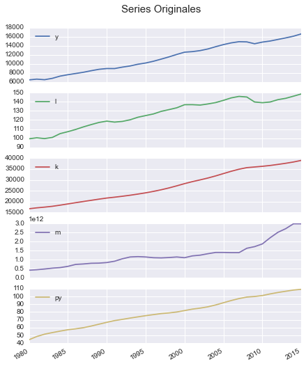
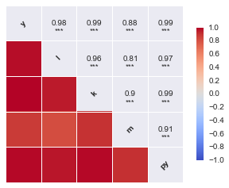
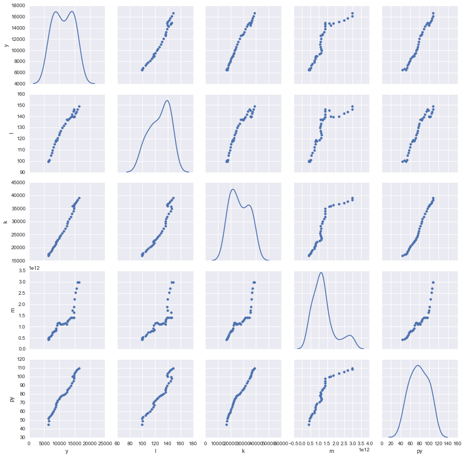

# Caso 1.2.
## Estimación del impacto del dinero en una función Cobb-Douglas.

Hong V. Nguyen, en un artículo de 1986 en el Journal of Money, Credit and Banking titulado "Money in the aggregate Production Function: Reexamination and Further Evidence" evalúa el papel jugado por el dinero en la función agregada de producción. La idea de incluir el dinero como un input en la función agregada de producción fue inicialmente contrastada por Sinai y Stokes en 1972. Su conclusión básica para los Estados Unidos, usando datos anuales de 1929 a 1967, fue que la variable de tendencia clásica usada para medir cambios tecnológicos era de hecho una aproximación al dinero en la función de producción. Más argumentos para incluir el dinero como un input productivo en la función agregada de producción están basados en el hecho de que el dinero facilita los cambios, hace los mercados más eficientes y por lo tanto permite un mayor nivel de output. Para llevar a cabo su análisis, Nguyen especifica una función de producción Cobb- Douglas para la economía de USA (ec.1).

> $$Y = A · L^α · K^β · M^g · e^{θ·t} · μ \ (1)$$

donde:

Y = Output interior privado

L = Servicios de trabajo

K = Servicios de capital

M = M1 ó M2 real

t = la tendencia en el tiempo

μ = término de error

En esta especificación, el dinero es tratado como un input regular y la tendencia es utilizada para capturar cambios tecnológicos.

TIPO DE DATOS: Serie temporal; 49 observaciones, 1930-1978. Fichero DINPROD.XLS.

## VARIABLES:

L = Servicios de trabajo en billones de dólares de 1972

K = Servicios de capital en billones de dólares de 1972

M1 = M1 oferta monetaria en billones de dólares corrientes

M2 = M2 oferta monetaria en billones de dólares corrientes

Y = Output real en billones de dólares de 1972

PY = Índice de precios implícitos de Y, 1972=100

>Alternativamente, los grupos pueden tomar los datos de la Base de datos AMECO de la Comisión Europea (periodicidad anual 1960-2016) y estimar alguna función de producción para algún país europeo. En este caso las cuestiones del ejercicio habría que hacerlas con la variable temporal, sin tener en cuenta la variable de oferta monetaria y añadiendo (voluntariamente) la variable educación.

> - L = Employment, persons: all domestic industries (National accounts) (NETD)
>
> - K = Net capital stock at 2010 prices: total economy (OKND)
>
> - Y = Gross domestic product at 2010 reference levels (OVGD)
>
> - EDU = A partir de la variable de consumo: Actual Individual Final Consumption of Households, 2010 constant prices (OCTH), euros. Para calcular de forma aproximada lo que se destina a educación, tomando como referencia un estudio del INE que calculó en 2008 que aproximadamente el 1’3% de los gastos de consumo familiares españoles se destinaba a educación, vamos a redondear al 2% para todos los países europeos. Calcular el 2% de estos valores en Excel antes de importarlos a Gretl. En esta variable hay observaciones ausentes al principio de la muestra para varios países.

> Los grupos pueden seleccionar los datos para alguno de los siguientes países: Bélgica, Dinamarca, Alemania (hay datos para Alemania del Este separados), Irlanda, Grecia, España, Francia, Italia, Luxemburgo, Holanda, Austria, Portugal, Finlandia, Suecia, Reino Unido, Noruega, Suiza, Estados Unidos y Japón.

# CUESTIONES:

## METODOLOGÍA

País Elegido: __Estados Unidos__

Datos con __frecuencia anual__

Datos obtenidos de Quandl.com (AMECO, ODA, FRED)

__VARIABLES:__
- Empleo (Millones de personas) [enlace](https://www.quandl.com/data/ODA/USA_LE)
- Stock de capital (Mil millones de dólares) [enlace](https://www.quandl.com/data/AMECO/USA_1_0_0_0_OKND)
- PIB (Billones de dólares) [enlace](https://www.quandl.com/data/ODA/USA_NGDP_R)
- Deflactor del PIB (Indice %) [enlace](https://www.quandl.com/data/ODA/USA_NGDP_D)
- M1 (Dólares no ajustados por efecto estacional) [enlace](https://www.quandl.com/data/FRED/MYAGM1USM052N)

                       y        l         k             m      py
    1980-12-31  6450.400   99.303  16734.02  4.200000e+11  44.377
    1981-12-31  6617.750  100.400  17156.18  4.470000e+11  48.520
    1982-12-31  6491.275   99.529  17485.36  4.860000e+11  51.531
    1983-12-31  6792.000  100.822  17864.91  5.330000e+11  53.565
    1984-12-31  7285.025  105.003  18387.23  5.650000e+11  55.466

Gráfico de las series, en los que se puede ver la evolución de cada variable en el tiempo.

En este Gráfico se representan las correlaciones entre las variables, se ve que todas las variables exógenas estan fuertemente correlacionadas con la endógena, pero además lo están entre sí, lo que puede indicar problemas de multicolinealidad.

En el mismo sentido que el anterior gráfico, este gráfico muestra el comportamiento de las variables entre sí y su función de distribución. Todas en mayor o menor medida parecen seguir una distribución normal.

# APARTADO A

Para estimar la ecuación 1 usando la muestra de período 1930 a 1978, la ecuación tiene que ser transformada en un modelo que sea lineal en los parámetros. Este modelo transformado viene dado en la ecuación 2.

> $$log(Y_t) = λ + α· log( L_t) + β· log( K_t ) + g· log(m_t) + θ_t + u_t\ (2)$$

donde:

Y, L, y K han sido definidas

m= dinero real, siendo igual a M1/PY o M2/PY

$u_t = log(μ_t)$.

Los grupos tipo A usarán M1 y los grupos B usarán M2.

                       y        l         k             m      py  t
    1980-12-31  6450.400   99.303  16734.02  4.200000e+11  44.377  1
    1981-12-31  6617.750  100.400  17156.18  4.470000e+11  48.520  2
    1982-12-31  6491.275   99.529  17485.36  4.860000e+11  51.531  3
    1983-12-31  6792.000  100.822  17864.91  5.330000e+11  53.565  4
    1984-12-31  7285.025  105.003  18387.23  5.650000e+11  55.466  5

## APARTADO A1

Utilizando los datos suministrados y la definición M1 (o M2) de dinero real, estimar la ecuación 2 por Mínimos Cuadrados Ordinarios (MCO). A lo largo de este ejercicio hay que interpretar económicamente cada modelo que se estime, respecto de los contrastes residuales, hay que hacerlos y tenerlos guardados para la tabla-resumen final, pero no hay que poner los contrastes después de cada modelo.

                                OLS Regression Results                            
    ==============================================================================
    Dep. Variable:              np.log(y)   R-squared:                       0.999
    Model:                            OLS   Adj. R-squared:                  0.999
    Method:                 Least Squares   F-statistic:                 1.107e+04
    Date:                Tue, 03 Nov 2015   Prob (F-statistic):           2.06e-48
    Time:                        17:47:31   Log-Likelihood:                 116.13
    No. Observations:                  36   AIC:                            -222.3
    Df Residuals:                      31   BIC:                            -214.3
    Df Model:                           4                                         
    Covariance Type:                  HC1                                         
    ==================================================================================
                         coef    std err          t      P>|t|      [95.0% Conf. Int.]
    ----------------------------------------------------------------------------------
    Intercept          1.3503      1.803      0.749      0.459        -2.326     5.027
    np.log(l)          1.1166      0.060     18.516      0.000         0.994     1.240
    np.log(k)          0.3009      0.150      2.002      0.054        -0.006     0.608
    np.log(m / py)    -0.0285      0.022     -1.323      0.196        -0.072     0.015
    t                  0.0080      0.004      2.008      0.053        -0.000     0.016
    ==============================================================================
    Omnibus:                        1.605   Durbin-Watson:                   0.900
    Prob(Omnibus):                  0.448   Jarque-Bera (JB):                1.512
    Skew:                          -0.454   Prob(JB):                        0.470
    Kurtosis:                       2.570   Cond. No.                     3.70e+04
    ==============================================================================

    Warnings:
    [1] Standard Errors are heteroscedasticity robust (HC1)
    [2] The condition number is large, 3.7e+04. This might indicate that there are
    strong multicollinearity or other numerical problems.

### INTERPRETACIÓN

$\lambda$ = 1.350 (1.803), Haciendo una tranformación,  $y = e^{\lambda} = 3.8585·10^{9}\$$, Es el valor del PIB cuando las variables son 0, ceteris paribus.

$\alpha$ = 1.117 (0.060), Es el cambio porcentual en y, ante un aumento del 1% en el número de empleados.

$\beta$ = 0.301 (0.150), Es el aumento porcentual que sufriría el PIB ante un aumento del 1% en el stock de capital.

$g$ = -0.029 (0.022), Es la disminución porcentual que sufriría el PIB ante un aumento del 1% en el deflactor de precios (%).

$\theta$ = 0.008 (0.004), Es el crecimiento medio interanual de la economía.

Todos los parámetros estimados tienen sentido económico, y concuerda con lo que dice la teoría.

## APARTADO A2
Contrastar la significatividad individual y conjunta de las variables independientes mediante los respectivos tests t-Student y F de Snedecor.

### pvalues
$\lambda$: 0.459491817285
$\alpha$: 2.56907184673e-18 ***
$\beta_2$: 0.0541210563084
$g$: 0.195625840903
$\theta$: 0.0533817612494

    F: 11067.378293	pvalue: 2.060482280472647e-48

## APARTADO A3

Contrastar a un nivel de significación del 5% la hipótesis nula:

$g = θ = 0$

    F: 1.25924751951	pvalue: 0.27041036115242006

# APARTADO B
Algunos economistas argumentan que si se ha especificado la función de producción correctamente y se han incluido todos los inputs relevantes, entonces debe mostrar rendimientos constantes de escala. Supongamos que el dinero real es de hecho un input en la función agregada de producción y que la tendencia no entra en la función de producción (ec. 3).

>$$log(Y_t) = λ + α · log( L_t) + β · log( K_t ) + g · log(m_t)  + u_t \ (3)$$

Para que la función de producción exhiba rendimientos constantes de escala, debe cumplirse que

$$α + β + g = 1$$

Imponiendo esta condición sobre el modelo de la ecuación 3 nos da el modelo restringido de la ecuación 4 (demostrar cómo se llega a esta ecuación).

>$$log(Y_t / K_t ) = λ + α ·log(L_t / K_t ) + g ·log(m_t / K_t) + u_t \ (4)$$

## APARTADO B1
Estimar las ecuaciones 3 y 4 usando los datos desde 1930 hasta 1978 y la definición de M1 (o M2) de dinero real. Contrastar la hipótesis de rendimientos constantes de escala a partir de las sumas de cuadrados de los residuos (SR) obtenidas en los dos modelos. Usar el contraste de Wald:

$F=\frac{\left(\frac{SR_R - SR}{m}\right)}{\left(\frac{SR}{n - k}\right)} \ ;\ (K = 4, m = 1)$

__Donde:__

- $RSS_0$ se refiere al coeficiente de determinación del modelo sin restringir $(R^2)$
- $RSS_1$ se refiere al coeficiente de determinación del modelo restringido $(R^2)$
- $m$ se refiere al número de restricciones impuestas a los coeficientes estimados (coficientes restringidos).
- $k$ se refiere al número de coeficientes estimados en el modelo sin restricciones.
- $n$ se refiere al número de observaciones del modelo.

$H_0$: Se Cumple la resticción

                                OLS Regression Results                            
    ==============================================================================
    Dep. Variable:              np.log(y)   R-squared:                       0.999
    Model:                            OLS   Adj. R-squared:                  0.999
    Method:                 Least Squares   F-statistic:                 1.225e+04
    Date:                Tue, 03 Nov 2015   Prob (F-statistic):           4.97e-49
    Time:                        18:35:41   Log-Likelihood:                 114.21
    No. Observations:                  36   AIC:                            -220.4
    Df Residuals:                      32   BIC:                            -214.1
    Df Model:                           3                                         
    Covariance Type:                  HC1                                         
    ==================================================================================
                         coef    std err          t      P>|t|      [95.0% Conf. Int.]
    ----------------------------------------------------------------------------------
    Intercept         -2.2798      0.157    -14.485      0.000        -2.600    -1.959
    np.log(l)          1.0905      0.061     17.986      0.000         0.967     1.214
    np.log(k)          0.5849      0.034     17.224      0.000         0.516     0.654
    np.log(m / py)     0.0149      0.012      1.245      0.222        -0.009     0.039
    ==============================================================================
    Omnibus:                        2.284   Durbin-Watson:                   0.803
    Prob(Omnibus):                  0.319   Jarque-Bera (JB):                1.937
    Skew:                          -0.558   Prob(JB):                        0.380
    Kurtosis:                       2.781   Cond. No.                     2.99e+03
    ==============================================================================

    Warnings:
    [1] Standard Errors are heteroscedasticity robust (HC1)
    [2] The condition number is large, 2.99e+03. This might indicate that there are
    strong multicollinearity or other numerical problems.

$\lambda$ = -2.280 (0.157), $y = e^{\lambda} = 0.1023$
$\alpha$ = 1.091 (0.061), Es el efecto en % del aumento en un 1% empleo sobre el PIB.
$\beta$ = 0.585 (0.034), Es el efecto en % del aumento en un 1% stock de capital sobre el PIB.
$g$ = 0.015 (0.012), Es el efecto en % del aumento en un 1% en la oferta real sobre el PIB.

                                OLS Regression Results                            
    ==============================================================================
    Dep. Variable:          np.log(y / k)   R-squared:                       0.205
    Model:                            OLS   Adj. R-squared:                  0.157
    Method:                 Least Squares   F-statistic:                     5.040
    Date:                Tue, 03 Nov 2015   Prob (F-statistic):             0.0123
    Time:                        18:38:11   Log-Likelihood:                 67.016
    No. Observations:                  36   AIC:                            -128.0
    Df Residuals:                      33   BIC:                            -123.3
    Df Model:                           2                                         
    Covariance Type:                  HC1                                         
    ========================================================================================
                               coef    std err          t      P>|t|      [95.0% Conf. Int.]
    ----------------------------------------------------------------------------------------
    Intercept               -0.9926      0.531     -1.869      0.071        -2.073     0.088
    np.log(l / k)           -0.1161      0.045     -2.586      0.014        -0.207    -0.025
    np.log(m / (py * k))    -0.0382      0.032     -1.209      0.235        -0.103     0.026
    ==============================================================================
    Omnibus:                        1.726   Durbin-Watson:                   0.197
    Prob(Omnibus):                  0.422   Jarque-Bera (JB):                1.507
    Skew:                          -0.482   Prob(JB):                        0.471
    Kurtosis:                       2.724   Cond. No.                     1.55e+03
    ==============================================================================

    Warnings:
    [1] Standard Errors are heteroscedasticity robust (HC1)
    [2] The condition number is large, 1.55e+03. This might indicate that there are
    strong multicollinearity or other numerical problems.

$\lambda$ = -0.993 (0.531), $y = e^{\lambda} = 0.3706$
$\alpha$ = -0.116 (0.045), Es el efecto en % del aumento en un 1% numero de empleados por unidades de stock de capital sobre el PIB.
$g$ = -0.038 (0.032), Es el efecto en % del aumento en un 1% Oferta real por unidad de capital sobre el PIB.

F: 410.893568712	pvalue: 7.996093625280387e-20

SRR = 0.00369928539575
SR = 0.0509215980115
n = 36
k = 4
r = 3
F-test = 408.488084061
F-score = 4.1490974457
$\sqrt{F-test}$ = 20.211088146

Para demostrar como pasar de la ecuación 3:

>$$log(Y_t) = λ + α · log( L_t) + β · log( K_t ) + g · log(m_t)  + u_t \ (3)$$

a la ecuación 4:

>$$log(Y_t / K_t ) = λ + α ·log(L_t / K_t ) + g ·log(m_t / K_t) + u_t \ (4)$$

Partimos de la restricción:

$\alpha + \beta + g = 1$

Despejamos $\beta$:

$\beta=1-\alpha-g$

Sustituimos $\beta$ en la ecuación 3:

$log(Y_t) = λ + α · log( L_t) + (1-\alpha-g) · log( K_t ) + g · log(m_t)  + u_t \ (3)$
$log(Y_t) = λ + α · log( L_t) + log( K_t ) - \alpha· log( K_t ) -g · log( K_t ) + g · log(m_t)  + u_t$
$log(Y_t) - log( K_t ) = λ + α · (log( L_t) - log( K_t )) + g · (log(m_t)-log( K_t ))  + u_t$
>$$log(Y_t / K_t ) = λ + α ·log(L_t / K_t ) + g ·log(m_t / K_t) + u_t \ (4)$$

## APARTADO B2
Bajo la hipótesis de rendimientos constantes a escala (modelo 4) se puede despejar una estimación del parámetro β. Encontrar tal estimación y construir un intervalo de confianza del 95% para el mismo.

Dada la restricción:

$$\alpha+\beta+g = 1$$
$$\hat{\alpha}+\hat{\beta}+\hat{g}=1$$
$$\hat{\beta}=1-\hat{\alpha}-\hat{g}$$

Sustituyendo las estimaciónes de $\alpha$ y $g$ tendremos la estimación de $\beta$.
$\hat{\beta} = 2.0307$

Para calcular el intervalo de confianza al 95%, necesitamos la varianza de $\hat{\beta}$:

$$V(\hat{\beta})=V(1-\hat{\alpha}-\hat{g})$$
$$V(\hat{\beta})=V(\hat{\alpha}) + V(\hat{g}) + 2Cov(\hat{\alpha}, \hat{g}))$$

    array([[ 0.2822,  0.0151, -0.0151],
           [ 0.0151,  0.002 , -0.0003],
           [-0.0151, -0.0003,  0.001 ]])

$$V(\hat{\beta}) = 0.562167$

Intervalo de Confianza:

$$IC(\hat{\beta})=\hat{\beta} \pm Z_{\alpha/2}\sqrt{\frac{V(\hat{\beta})}{N}} $$

    IC: 1.78586093942 2.27570700232

## APARTADO B3
Dado el intervalo de confianza construido en el apartado b2), ¿es la estimación de β económica y estadísticamente significativa?

Es fácil comprobar que no es estadísticamente significativa, ya que la estimación de $\beta$ no esta contenida en el intervalo hallado, con una confianza del 95%.

## APARTADO B4

Dado que los __rendimientos constantes__ a escala implican sólo una restricción lineal sobre el modelo, se podría haber realizado un __test t__ para contrastar tal hipótesis.

Usando las estimaciones de __α, β, y g__ de la __ecuación 3__, llevar a cabo tal test con un nivel de significación del 5%.

Dado que los rendimientos constantes a escala implican sólo una restricción lineal sobre el modelo, se podría haber realizado un test t para contrastar tal hipótesis.

Usando las estimaciones de α, β, y g de la ecuación 3 y definiendo un parámetro auxiliar $δ = α + β + g – 1$, llevar a cabo tal test sobre $δ$ con un nivel de significación del 5%.

Para ello necesitaremos calcular la estimación de $δ$ a partir de las estimaciones de $α$, $β$ y $g$, y después la varianza estimada de $δ$, que es:

$V(δ) = V({\alpha}) + V({β}) +  V({g}) + 2·Cov(α, β) + 2·Cov( α, g) + 2·Cov({β, g})$

Y ahora ya podemos calcular el estadístico de contraste, que vendrá dado por:

$t(δ) = \frac{\delta}{V(δ)}$

el cual se distribuye bajo la hipótesis nula según una t-Student con T-4 grados de libertad.

b4:

$F = t^2$

> $$log(Y_t) = λ + α· log( L_t) + β· log( K_t ) + g· log(m_t) + θ_t + u_t\ (2)$$

> $$log(Y_t) = λ + α · log( L_t) + β · log( K_t ) + g · log(m_t)  + u_t \ (3)$$

Parámetros:

    array([ 1.0905,  0.5849,  0.0149])

$\hat{\delta}$:

    0.69029524484438065

Matriz de Covarianzas:

    array([[ 0.0248, -0.0039,  0.0034, -0.0017],
           [-0.0039,  0.0037, -0.0019,  0.0002],
           [ 0.0034, -0.0019,  0.0012, -0.0003],
           [-0.0017,  0.0002, -0.0003,  0.0001]])

Varianzas:

    array([ 0.0037,  0.0012,  0.0001])

Suma de varianzas:

    0.0049725129019827351

Varianza $\hat{\delta}$:

    0.0011596860144315615

Por tanto:

    δ = 0.69029524484438065
    SE = 0.034054162953
    t-ratio = 20.2705098286

## APARTADO B5
¿Cuál es la relación entre el test F realizado en el apartado b1) y el test-t llevado a cabo en el apartado b4)?

El F-test es el el cuadrado del t-test.
Se cumple pues que $20.27 ^ 2 ≈ 408.48 (410.87)$

# APARTADO C
Nguyen, después de rechazar la idea de que el dinero era un input en la función de producción, propuso un papel alternativo para el dinero en el proceso productivo, y sugirió que era un "facilitador" del cambio tecnológico. Reformuló el modelo presentado en la ecuación 1 haciendo el coeficiente de tendencia, θ, una función de la tasa de crecimiento del dinero:

> $$\theta = \delta + \tau \frac{(M_t - M_{t-1})}{M_{t-1}}\ ,\ (5)$$

En esta formulación, la tasa de crecimiento de la productividad está descompuesta en dos partes: la que es debida al cambio técnico, medida a través del parámetro δ, y la que es debida a la interacción entre la tasa de crecimiento de saldos en efectivos reales, y el cambio técnico medido a través del parámetro τ.

Es decir, hizo la hipótesis de que θ, el coeficiente de tendencia en el modelo básico (ecuación 1), era una función de la tasa de crecimiento de dinero real (ver la ecuación 5). Sustituyendo la ecuación 5 en la ecuación 1 se obtiene la siguiente ecuación como modelo básico.

> $$log(Y_t) = λ + α ·log( L_t) + β ·log( K_t ) + g· log(m_t) + δ · t + w (t·m_t^*) + u_t\ , \ (6)$$

donde $m_t^*$ es la tasa de cambio de la oferta monetaria real.

## APARTADO c1
Usando la tasa de crecimiento de la oferta monetaria real (o su aproximación como $m_t^* = log(m_t) - log(m_{t-1})$, estimar la ecuación 6 por MCO.

                                OLS Regression Results                            
    ==============================================================================
    Dep. Variable:              np.log(y)   R-squared:                       0.999
    Model:                            OLS   Adj. R-squared:                  0.999
    Method:                 Least Squares   F-statistic:                     7212.
    Date:                Tue, 03 Nov 2015   Prob (F-statistic):           6.23e-44
    Time:                        18:39:03   Log-Likelihood:                 112.76
    No. Observations:                  35   AIC:                            -213.5
    Df Residuals:                      29   BIC:                            -204.2
    Df Model:                           5                                         
    Covariance Type:                  HC1                                         
    ======================================================================================
                             coef    std err          t      P>|t|      [95.0% Conf. Int.]
    --------------------------------------------------------------------------------------
    Intercept              1.3357      1.888      0.707      0.485        -2.526     5.198
    np.log(l)              1.1272      0.087     12.963      0.000         0.949     1.305
    np.log(k)              0.2955      0.163      1.815      0.080        -0.038     0.628
    np.log(m / py)        -0.0277      0.025     -1.111      0.276        -0.079     0.023
    t                      0.0081      0.004      1.975      0.058        -0.000     0.016
    np.multiply(t, dm)  7.778e-07      0.002      0.000      1.000        -0.005     0.005
    ==============================================================================
    Omnibus:                        1.291   Durbin-Watson:                   0.915
    Prob(Omnibus):                  0.524   Jarque-Bera (JB):                1.263
    Skew:                          -0.388   Prob(JB):                        0.532
    Kurtosis:                       2.486   Cond. No.                     4.09e+04
    ==============================================================================

    Warnings:
    [1] Standard Errors are heteroscedasticity robust (HC1)
    [2] The condition number is large, 4.09e+04. This might indicate that there are
    strong multicollinearity or other numerical problems.

$\lambda$ = 1.336 (1.888), $y = e^{\lambda} = 3.8026$
$\alpha$ = 1.127 (0.087), Es el aumento porcentual debido a un aumento del 1% en el número de trabajo.
$\beta$ = 0.295 (0.163), Es el aumento porcentual debido a un aumento del 1% en el stock de capital.
$g$ = -0.028 (0.025), Es el aumento porcentual debido a un aumento del 1% en la oferta monetaria real.
$\delta$ = 0.008 (0.004), Es el crecimiento medio de la economía.
$w$ = 0.000 (0.002), Es el efecto del cambio tecnológico en la economía.

## APARTADO c2

### Contrastar la significación conjunta de las variables a un nivel ε=0’01.

    6257.05302102 > 7212.01941491

F-score > F-test: Para un nivel de signifiación del 0.01 el valor de tablas es mayor que el estadístico por tanto estamos en la región crítica, evidencia en contra de la hipótesis nula. __Los parámetros son significativos.__

### ¿Qué opina sobre los resultados obtenidos de la regresión? Hacer una tabla-resumen de los modelos (2), (3) y (6) estimados en el ejercicio, en la que aparezcan los contrastes RESET de especificación, de normalidad, LM(1) y LM(2) de autocorrelación y ARCH(1), junto con el R2 corregido y el criterio de Schwarz (SBIC).

|EC2|VALOR| PVALOR |
|:---:|:---:|:---:|
|RESET|2.8851|0.072|
|JB|1.5116026400135225|0.469634136681|
|BG(1)|11.0958269869|0.00086522191773|
|BG(2)|15.316729434|0.000472078762301|
|ARCH(1)|1.64993311385|0.198968034899|
|$\overline{R}^2$|0.998800414861|
|SBIC|-214.347148848|

|EC3|VALOR| PVALOR |
|:---:|:---:|:---:|
|RESET|3.9049|0.0311|
|JB|1.9374243991569333|0.379571535876|
|BG(1)|13.030579074|0.000306445778705|
|BG(2)|15.8351216851|0.000364289803896|
|ARCH(1)|4.16173757148|0.0413469675068|
|$\overline{R}^2$|0.99870725479|
|SBIC|-214.095193754|

|EC6|VALOR| PVALOR |
|:---:|:---:|:---:|
|RESET|1.9552|0.1611|
|JB|1.2634019490395654|0.531686645965|
|BG(1)|10.8408803732|0.00099283517457|
|BG(2)|13.4518743501|0.00119939600864|
|ARCH(1)|2.01057490311|0.156206114599|
|$\overline{R}^2$|0.998658631435|
|SBIC|-204.190031517|

### ¿Qué modelo se escogería de entre los tres?

A la vista de los datos, el mejor modelo sin duda, es el definido por la ecuación 6, dado que sólo adolece de autocorrelación, frente al resto que adolecen de una correcta especifiación y heterocedasticidad.
