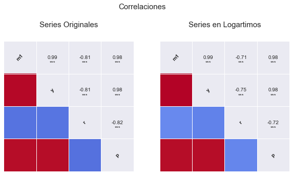
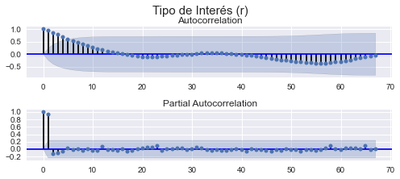
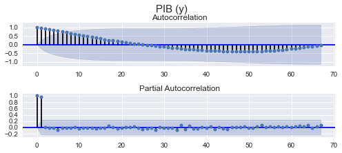
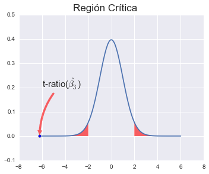
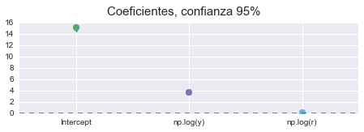
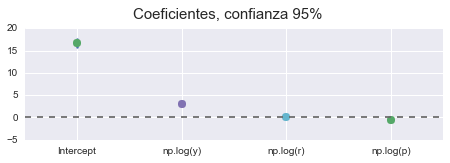

# CASO 1

### APLICACIONES ECONOMÉTRICAS

 
### AUTOR: Maximiliano Greco
 
 
### GRUPO 5A
 
- Caso 1.1: Estimación de una función de demanda de dinero con datos de Estados Unidos.
- Caso 1.2: Estimación del impacto del dinero en una función Cobb-Douglas.

# Caso 1.1.

### Se plantea estimar la siguiente función de demanda de dinero:

$$log (M1) = β_0 + β_1 log (y) + β_2 log (r) + β_3 log (ipc) + u$$

En el modelo se intenta explicar la demanda de dinero en función de la renta real, utilizándose el PIB, para estimar el efecto del motivo transacción. La segunda variable explicativa, el tipo de interés, recoge el comportamiento de la demanda de dinero especulativo, representando el coste de oportunidad de mantener dinero como forma de ahorro. La última variable, el índice de precios al consumo, se introduce como variable explicativa para valorar el efecto de la inflación sobre la demanda nominal de dinero.

- a)  Estimar el modelo de oferta monetaria, utilizando el tipo de interés a corto plazo para los grupos tipo A y el tipo a largo para los grupos tipo B. Comentar los resultados desde el punto de vista económico y econométrico.

- b)  Contrastar la restricción $β_3 = 1$, comentando sus implicaciones económicas. Hacer los cálculos paso a paso sin usar las opciones directas de Gretl.

- c)  Estimar el modelo asumiendo que la restricción es cierta.

- d)  Suponer que queremos estimar el modelo usando la variable M1 en términos reales, imponiendo para ello la restricción del apartado b), y a la vez seguir manteniendo el ipc como variable explicativa. Pensar cómo transformar el modelo para conseguir el doble objetivo anterior y calcular de forma razonada (con la ayuda de la estimación del apartado a) el valor del coeficiente que acompaña a la variable ipc.

- e)  Estimar al modelo del apartado d) comprobando si se cumple el resultado teórico.

Interpretar económicamente todos los modelos estimados y calcular en cada modelo los contrastes de especificación RESET, normalidad y autocorrelación LM de orden 1 y 2.

# MODELO:

$$log (M1) = β_0 + β_1 log (y) + β_2 log (r) + β_3 log (ipc) + u$$

### MODELO ORIGINAL (Cobb-Douglas):

$$M= e^{\beta_0}·y^{\beta_1}·r^{\beta_2}·ipc^{\beta_3}$$

$$\frac{M}{ipc^{\beta_3}}= e^{\beta_0}·y^{\beta_1}·r^{\beta_2}$$

### DATOS:

Las variables usadas han sido obtenidas en la base de [datos FMI](http://data.imf.org/?sk=7CB6619C-CF87-48DC-9443-2973E161ABEB&ss=1390023474041), todas tienen frecuencia trimestral.

### Metodología:

Dado que cada serie presenta datos para un rango distinto, he fitrado el rango común para poder realizar el análisis, lo que ha reducido mucho la muestra de la series a 68 observaciones, pero suficiente para poder aplicar el teorema central del límite y la ley de los grandes números. Todas las series son para España. El rango de datos resultante va desde el primer trimestre de 1982 hasta el último trimestre de 1998.

- __M1:__ Oferta monetaria M1 (Euros) [enlace](http://data.imf.org/?sk=b6ba51fd-6647-4ca2-8e8c-e680d2660ed5&dsId=DS_1438873160033)
- __ipc:__ Indice de Precios al Consumidor, ALL ITEMS (2010 = 100%) [enlace](http://data.imf.org/?sk=37214c4f-816c-4789-a0c6-d8a4dba96f1c&dsId=DS_1438873160033)
- __rc:__ Tipo de interés de los depósitos a la vista (%) [enlace](http://data.imf.org/?sk=8bb6d92d-843b-4a2c-a147-4e009850014c&dsId=DS_1438873160033)
- __y:__ PIB real, ajustado de efecto estacional, indice (2010 = 100%) [enlace](http://data.imf.org/?sk=c7fe04cd-fbbf-4f6b-b7d2-cd13a9fa5122&dsId=DS_1438873160033)

Los gráficos nos indican que las variables presentan tendencia determinista, excepto el caso del tipo de interés que no está muy claro. Para identificar mejor los componentes deberíamos hacer un contraste de dickey-fuller para todas y decidir a partir de la información recogida. A priori podemos decir que el tipo de interés tiene una tendencia mas volátil y decreciente, mientras que el resto son más estables y con tendencia creciente respecto del tiempo.

El anterior gráfico nos muestra las relaciones entre todas las variables y los histogramas de frecuencia en la diagonal. Destacar la alta correlación entre todas las variables, las correlaciones entre las exógenas puede indicar presencia de multicolinealidad.

                        m1          y         r          p
    Q1 1982  4363000000000  44.744559  0.119700  26.637351
    Q2 1982  4611700000000  44.912734  0.121233  27.584677
    Q3 1982  4684000000000  45.216270  0.122633  28.391079
    Q4 1982  5003400000000  45.375656  0.126733  29.040898
    Q1 1983  4821800000000  45.541487  0.122100  30.160465

                         m1          y         r          p
    Q4 1997  21834900000000  71.054916  0.036000  71.072951
    Q1 1998  21705700000000  69.937077  0.032467  71.310435
    Q2 1998  22567600000000  70.530850  0.030600  71.534871
    Q3 1998  22653200000000  71.158433  0.029167  72.004619
    Q4 1998  25270600000000  71.763124  0.024633  72.135105

## MODELO A

$$log(m1) = log(y) + log(r) + log(p)$$

    
                                OLS Regression Results                            
    ==============================================================================
    Dep. Variable:             np.log(m1)   R-squared:                       0.991
    Model:                            OLS   Adj. R-squared:                  0.990
    Method:                 Least Squares   F-statistic:                     2296.
    Date:                Sun, 01 Nov 2015   Prob (F-statistic):           4.57e-65
    Time:                        12:10:04   Log-Likelihood:                 107.11
    No. Observations:                  68   AIC:                            -206.2
    Df Residuals:                      64   BIC:                            -197.3
    Df Model:                           3                                         
    Covariance Type:                  HC1                                         
    ==============================================================================
                     coef    std err          t      P>|t|      [95.0% Conf. Int.]
    ------------------------------------------------------------------------------
    Intercept     16.7194      0.417     40.104      0.000        15.887    17.552
    np.log(y)      2.9630      0.191     15.515      0.000         2.581     3.344
    np.log(r)      0.0910      0.026      3.470      0.001         0.039     0.143
    np.log(p)      0.3982      0.097      4.107      0.000         0.205     0.592
    ==============================================================================
    Omnibus:                        3.352   Durbin-Watson:                   1.128
    Prob(Omnibus):                  0.187   Jarque-Bera (JB):                1.785
    Skew:                           0.021   Prob(JB):                        0.410
    Kurtosis:                       2.207   Cond. No.                         536.
    ==============================================================================
    
    Warnings:
    [1] Standard Errors are heteroscedasticity robust (HC1)

Estimando el mismo modelo pero con estimaciones robustas, no solucionamos los problemas de heterocedasticidad pero al menos nos aseguramos que los t-ratios y el estadístico F siguen sus correspondientes distribuciones. Por tanto, usaremos estos errores estandar para hacer los contrastes.

A partir de la información obtenida del modelo, analizamos el **Durbin-Watson** que contrasta la no autocorrelación, está entre 0 y 4, con un DW cerca de 0 correlación positiva y cerca de 4 correlación negativa. 

$H_0: \rho = 0$

A priori, parece haber autorcorrelación, pero **no está claro** con un DW de 1.128 > 1, $\hat{\rho} = 1 - \frac{1.128}{2} = 0.436$ con $-1< \rho < 1$ estaríamos indecisos solo con este contraste, por lo que necesitamos __más información__ al respecto. 

La prueba de **Jarque-Bera** nos da información sobre la normalidad de las perturbaciones, con un JB = 1.785 y p-value = 0.410, **no hay evidencia que sugiera rechazar** la hipótesis de normalidad de las perturbaciones. El contraste **Omnibus** también da evidencia a **favor de la normalidad.**

Nos faltaría información acerca de la correcta **especificación** y sobre la **heterocedasticidad** que calcularemos a continuación.

Tras este breve análisis, se puede concluir que el modelo es significativo conjuntamente, los parámetros lo son individualmente y además con un $R^2 = 0.991$ por lo que el modelo explica practicamente la totalidad del comportamiento de la variable endógena.

El estadístico Cond. No. es medida de multicolinealidad mayor que 60 indica problemas, como ya se vió anteriormente, cuando se analiza las relaciones entre las variables.

En el primero de los gráficos está representado la endógena real y la estimada, se ve como la estimación se ajusta muy bien a la realidad (endógena), aunque sabemos que presenta problemas.

El segundo es el gráfico de los residuos, a partir de 1989 parece presentar un comportamiento no estocástico, esto lo tendremos en cuentra para aplicar los contrastes.

## AUTOCORRELACIÓN

Los gráficos muestran para cada variable la función de autocorrelación y la función de autocorrelación parcial, puede verse como todas las variables siguen una estructura autorregresiva de orden 2, AR(2). Par el caso de los residuos la función de autocorrelación no nos dice nada casi nada. Habría que diferenciar y ver el posible orden de integración y aplicar constraste de Dickey-Fuller.

### Contraste de Aucorrelación de Breusch-Godfrey:
    BG(1): 11.9649	 p-value: 0.0005
    BG(2): 23.8191	 p-value: 0.0
    BG(3): 24.313	 p-value: 0.0
    BG(4): 28.2185	 p-value: 0.0

Contraste LM de Breusch-Godfrey, para LM(i) con i = 1,...,4, nos dice que hay evidencia a favor de la autocorrelación de los residuos para cada orden i.

### Contrsaste de Aucorrelación de LJung-Box
        lbvalue  pvalue
    0   11.2697  0.0008
    1   30.3604  0.0000
    2   33.2391  0.0000
    3   44.3385  0.0000
    4   44.4357  0.0000
    5   45.3130  0.0000
    6   48.8166  0.0000
    7   48.8758  0.0000
    8   55.9465  0.0000
    9   56.8175  0.0000
    10  67.5557  0.0000
    11  67.9257  0.0000
    12  76.6743  0.0000

El contraste de Ljung-Box contrasta conjuntamente la autocorrelación de orden i. La primera columna nos da el valor del LB y la segunda el p-value, que nos da evidencia en contra de la hipótesis de no autocorrelación.

Por tanto el modelo presenta problemas de autocorrelación, este problema es típico con datos de series temporales, y se puede corregir añadiendo retardos, diferenciando, conviertiendo las series en estacionarias o cambiando los datos por corte trasnversal.

## HETEROCEDASTICIDAD

    ## Contraste de Heterocedasticidad (Breusch-Pagan):
    BP: 8.049 	 p-value: 0.045

El contraste LM de Breusch-Pagan (BP) no informa de la presencia de homocedasticidad o ausencia de ella. Para un nivel de significación del 5% estrictamente no podemos aceptar la hipótesis nula de homocedasticidad pero al estar tan próximo de la región de aceptación, necesitamos más información.

El contraste de breush-pagan plantea la siguiente regresión auxiliar:

$\hat{u}^2 = \gamma_0 + \gamma_1 x + v$ y contrasta $\gamma_0 = \gamma_1 = 0$.

### Contraste de Heterocedasticidad (Goldfeld-Quandt):

    GQ ~ F : 0.747	pvalue: 0.785

Para buscar más información que nos permita arrojar luz sobre la homocedasticidad del modelo, nos fijamos en los resultados del contraste de Goldfeld-Quandt que nos dice que se acepta la hipótesis nula de homocedasticidad. Este test suele usarse cuando pensamos que la varianza de la perturbación tiene una relación proporcional al valor de una de la varianza de una de las variables explicativas.

    Contraste LM ARCH: 22.7763	pvalue: 0.019

Si la la varianza del error depende de la varianza del error en periodos anteriores, entonces este contraste lo recogería. La hipótesis nula es la ausencia de componentes ARCH frente a la alternativa de presencia.

    White: 14.7567	pvalue:0.0978

El contraste de white, es muy sensible a la mala especificación del modelo y a la precencia de componentes ARCH. Por lo que no es fiable.

$$y_t = a_0 + a_1 y_{t-1} + \cdots + a_q y_{t-q} + \epsilon_t = a_0 + \sum_{i=1}^q a_i y_{t-i} + \epsilon_t$$

Se obtiene el cuadrado del error: $\hat \epsilon^2$ y se hace la regresión:
$$\hat \epsilon_t^2 = \hat \alpha_0 + \sum_{i=1}^{q} \hat \alpha_i \hat \epsilon_{t-i}^2$$
donde q es la cantidad de retardos.

La hipótesis nula es que $\alpha_i = 0$ $\forall i=1,..,q$

En una muestra de T residuos bajo la hipótesis nula de ausencia de componentes ARCH en los errores, el estadístico $T'R^2 ~\chi^2_{q}$, donde T' es el número de ecuaciones en el modelo que ajustan el residuo contra los retardos. (T'=T-q).

## ESPECIFICACIÓN

    ## Contraste de RESET
    
    F-test: 15.1726	pvalue: 0.0

El test de RESET contrasta la correcta especificación o no del modelo, introduciendo en el modelo original la endógena al cuadrado y al cubo si el modelo esta correctamente especificado entonces los parámetros que acompañan a las endógenas al cuadrado y al cubo deberán ser cero. En este caso vemos que el contraste reset no da evidencia en contra de la hipótesis nula, por tanto hay evidencia a favor de que el modelo está mal especificado.

## SIGNIFICATIVIDAD Y CONTRASTES

### Contraste de $\beta_3 = 1$

                                 Test for Constraints                           
    ==============================================================================
                     coef    std err          t      P>|t|      [95.0% Conf. Int.]
    ------------------------------------------------------------------------------
    c0             0.3982      0.097     -6.208      0.000         0.205     0.592
    ==============================================================================

El contraste t-ratio para $\beta_3 = 1$ que se obtiene dividiendo el parámetro por su error estándar, sigue una t-student de N - k - 1 grado de libertad. Suponiendo que las muestras provienen de una población normal.

## RESÚMEN

### AUTOCORRELACIÓN

Para comprobar que las perturbaciones sean independientes, he aplicado los contrastes de Breusch-Godfrey y Ljun-Box, y ambos proporcionan evidencia en contra de la hipótesis nula, por tanto no aceptamos la hipótesis nula de no autocorrelación.

Por tanto el modelo evidencia __autocorrelación__.

### HOMOCEDASTICIDAD

Aplicamos los contrastes de Breusch-Pagan (BP) y Goldfeld-Quandt (GQ) y encontramos cierta contradicción entre los contrastes, pues el contraste BP nos da una evidencia muy debil en contra de la hipótesis nula, para un nivel de significación del 5% se obtiene un p-value = 4,5% lo que estrictamente lleva a rechazar $H_0$. 

Por otro lado el contraste Goldfeld-Quandt nos proporciona evidencia clara a favor la hipótesis nula.

Dado que el GQ da un p-value mucho más determinante, que el resto, parece razonable suponer que hay mayor evidencia a favor de $H_0$ que en contra.

Sin embargo el contrate ARCH, nos dice que puede haber evidencia para suponer que la varianza de los residuos depende del pasado de los propios residuos.

Por tanto modelo evidencia __homocedasticidad__ según GQ y White, pero __heterocedasticidad__ según ARCH, BP.

### ESPECIFICACIÓN

El contraste de RESET nos dá información acerca de la correcta especifiación del modelo, y obtenemos que hay evidencia a en contra de la hipótesis nula ($\gamma_0 = \gamma_1 = 0$), por tanto el modelo puede estar mal especificado. Hay que tener en cuenta que este problema pueda deberse a los problemas de autocorrelación.

Por tanto el modelo evidencia una __mala especificación__.

### NORMALIDAD

Para validar la normalidad en las perturbaciones, aplicamos el contraste de Jarque-Vera que nos dá evidencia a favor de la normalidad.

Por tanto el modelo evidencia __normalidad.__

### SIGNIFICATIVIDAD

Las variables son todas significativas, tanto individual como conjuntamente.

El modelo con un $R^2 = 0.991$ explica prácticamente todo el comportamiento de la variable endógena, el $\hat{R}^2 = 0.99$.

# APARTADO A

### El modelo planteado:

$$log(M1) = \beta_1 log(y) + \beta_2 log(r) + \beta_3 log(p) + u$$

Planteamos un modelo MCO para la regresión anterior y obtenemos los siguientes resultados:

### RESULTADOS

$\beta_0 = 16.7194 (0.4169)$
$\beta_1 = 2.963 (0.191)$
$\beta_2 = 0.091 (0.0262)$
$\beta_3 = 0.3982 (0.0969)$

Con todos los parámetros significativos y una vez comprobado que se cumplen los supuestos del modelo lineal general (recordar que en este modelo no se cumple dado que presenta problemas de especificación y autocorrelación), poddríamos interpretar el modelo en términos económicos.

Dado que en la estimación se ha utilizado matriz de varianzas y covarianzas robustas, podemos interpretar los coeficientes y estadísticos obtenidos. El modelo es __doblemente logarítmico__, por tanto la interpretación de los parámetros de posición es como __elasticidades__, esto es, el efecto del incremento de un punto porcentual en la variable exógena provoca un incremento de x puntos porcentuales en la endógena (oferta monetaria), exceptuando el caso del tipo de interés (r) cuyas unidades son porcentajes (%) lo que dificulta su interpretación.

### EL TÉRMINO INDEPENDIENTE ($\beta_0$)

Vemos por tanto que la interpretación del término __independiente ('Intercept')__ es que si no se producen cambios en la renta, precios y el tipo de interés la oferta monetaria tiene un valor que tenemos que hallar, este valor es:

$log(M1) = \beta_0$

$e^{log(M1)} = e^{\beta_0}$

$M1 = e^{\beta_0}$

$M1 = e^{16.7194} = 18244645.111$

### EL EFECTO DE LA RENTA (y) EN LA OFERTA MONETARIA ($\beta_1$)

El $\beta_1 = 2.9630$ nos dice que incrementos de un 1% en la renta, tiene un efecto de 2.9630% en la oferta monetaria, casi 3 veces más intenso relativamente. Esto tiene sentido ya que por teoría, sabemos que la demanda de dinero tiene efecto positivo en la demanda de dinero (demanda de dinero motivo transacción).

### EL EFECTO DEL TIPO DE INTERÉS (r) EN LA OFERTA MONETARIA ($\beta_2$)

El $\beta_2  = 0.0910$ nos dice que aumentos del 1% del tipo de interés(%), tiene un efecto del 0.0910% sobre la oferta de dinero. Teniendo en cuenta que para el modelo planteado la oferta monetaria es exógena, y el tipo de interés (r) es endógena, esto nos indica cómo debería cambiar la oferta monetaria para conseguir un cambio en el tipo de interés, así pues:

$\frac{d(M)}{M} = \beta_2 d(r)$

$\frac{1}{\beta_2} · \frac{d(M)}{M} = d(r)$

$\frac{1}{0.0910} · \frac{d(M)}{M} = d(r)$

$10.989011 \frac{d(M)}{M} = d(r)$

Es importante notar que el signo del $\beta_2$ es el mismo que el $m_r$, según la teoría nos dice que $m_r < 0$ por lo tanto tenemos una __contradicción__ con la realidad. Al ser de un 0.0910 muy pequeño nos podría indicar que la elasticidad de la oferta monetaria al tipo de interés está próxima a cero (inelástica). Esto podría interpretarses como una situación en la economía tenga una política monetaria inefectiva, en el modelo keynesiano a esto se le denomina trampa de la liquidez. Pero esta interpretación podría ser totalmente errada ya que tenemos que recordar que el modelo presenta problemas de autocorrelación, heterocedasticiadad y por tanto los coeficientes no tienen interpretación causal.

### EL EFECTO DEL PRECIO SOBRE LA OFERTA MONETARIA ($\beta_3$)

El $\beta_3 = 0.3982$ nos dice que si aumentan los precios en un 1%, la oferta monetaria lo hace en un 0.3982%, es decir, que si hay inflación la oferta monetaria aumenta relativamente menos de la mitad. Esto tiene sentido con lo que nos dice la Teoría Económica, ya que:

$\frac{M}{P} = m(r,y)$

$log(\frac{M}{P} = log[m(r,y)]$

$log(M) - log(P)  = log[m(r,y)]$

$log(M) = log[m(r,y)] + log(P)$

__DERIVANDO:__

$\frac{d(M)}{M} = \frac{m_r·d(r) + m_y · d(y)}{m(r,y)} + \frac{d(P)}{P}$ con dr, dy = 0

$\frac{d(M)}{M} = \frac{d(P)}{P}$

Por lo tanto aumentan en la misma dirección. Importante notar que en un esquema de modelo Keynesiano o Clásico, P es una variable endógena mientras que M es exógenas, para esta última, es importante notar que las autoridades monetarias deciden M y no r como es en la realidad.

# APARTADO B

Contrastar la restricción $β_3=1$, comentando sus implicaciones económicas. 
Hacer los cálculos paso a paso sin usar las opciones directas de Gretl.

### RESULTADO

    SE = 0.097

    β_3 = 0.398

    t-ratio = -6.208

### CÁLCULO

Para contrastar $\beta_3 = 1$, tenemos dos opciones, plantear un contraste F o t, dado que es más sencillo un contraste t-ratio, el procedimiento a seguir es:

### Hipótesis

$H_0: \beta_3 = 1$

$H_1: \beta_3 ≠ 1$

### Contraste

$t = \frac{\hat{\beta_3} - \beta_3}{\sigma_{\hat{\beta_3} / \sqrt{N}}}$

$t = \frac{0.39820 - 1}{0.097} = -6.208$

### Región Crítica

N = 68

n = 68 - 4 (En este caso la t tiende en distribucion a una normal)

gl = 63

α = 0.05

$t < t_{(n-1 , \alpha / 2)}$

$t < t_{(63 , 0.025)}$

$t_{(63 , 0.025)} = -1.9983$

$-6.208 < -1.9983 \rightarrow$ Nos indica que hay evidencia en contra de la hipótesis nula, por tanto rechazamos $H_0: \beta_3 = 1$

El gráfico muestra la representación gráfica de la prueba t-ratio para el caso de $\beta_3 = 1$

### P-VALUE

$P\{t < t_{contraste}\} < \alpha$

Notar que dado que se trata de un contraste bilateral, basta compara el valor que queremos contrastar con el intervalo de confianza de $\hat{\beta}_3$, si el intervalo contiene a dicho valor entonces no se rechaza $H_0$, de lo contrario rechazaríamos la hipótesis nula.

    $P-value = P\{ t < |t-ratio|\} = 4.7e-08$

Por tanto, los tres indicadores (P-Value, Punto Crítico, Intervalo de Confianza) nos dicen que hay evidencia suficiente para rechazar la hipótesis nula o equivalentemente existe evidencia para afirmar que $\beta_3 ≠ 1$.

Un $\beta_3 = 1$ implica que la oferta monetaria tiene una relación proporcional directa respecto de los precios.

# APARTADO C

Estimar asumiendo que $\beta_3 = 1$, para ello tenemos que hacer unos cambios en el modelo inicial.

Modelo Inicial: 

$$log (M1) = β_0 + β_1 log (y) + β_2 log (r) + β_3 log (ipc) + u$$

Sustituyendo $\beta_3 = 1$:

$$log (M1) = β_0 + β_1 log (y) + β_2 log (r) + log (ipc) + u$$

$$log (M1) - log (ipc) = β_0 + β_1 log (y) + β_2 log (r) + u$$

Esta última es la ecuación que vamos a estimar.

                                OLS Regression Results                            
    ==============================================================================
    Dep. Variable:             np.log(m1)   R-squared:                       0.989
    Model:                            OLS   Adj. R-squared:                  0.989
    Method:                 Least Squares   F-statistic:                     3242.
    Date:                Sun, 01 Nov 2015   Prob (F-statistic):           7.86e-66
    Time:                        11:47:04   Log-Likelihood:                 100.60
    No. Observations:                  68   AIC:                            -195.2
    Df Residuals:                      65   BIC:                            -188.6
    Df Model:                           2                                         
    Covariance Type:                  HC1                                         
    ==============================================================================
                     coef    std err          t      P>|t|      [95.0% Conf. Int.]
    ------------------------------------------------------------------------------
    Intercept     15.1432      0.225     67.451      0.000        14.695    15.592
    np.log(y)      3.7423      0.067     56.265      0.000         3.609     3.875
    np.log(r)      0.0983      0.025      3.872      0.000         0.048     0.149
    ==============================================================================
    Omnibus:                        4.430   Durbin-Watson:                   1.031
    Prob(Omnibus):                  0.109   Jarque-Bera (JB):                3.333
    Skew:                           0.407   Prob(JB):                        0.189
    Kurtosis:                       2.282   Cond. No.                         177.
    ==============================================================================
    
    Warnings:
    [1] Standard Errors are heteroscedasticity robust (HC1)

- El DW no nos dice nada sobre la presencia de autocorrelacón (próximo a 1).
- El JB nos informa que los residuos siguen una distribución normal.
- Los parámetros son significativos individualmente y conjuntamente.
- R^2 nos dice que el modelo explica el 93.9% del comportamiento de la endógena.
- $\beta_0 = 15.143$ Oferta real autónoma, $\frac{m}{p} = e^{\beta_0}$ = 3 771 562.765
- $\beta_1 = 3.7423$ % que aumenta m/p por aumentos en un 1% de y.
- $\beta_2 = 0.0983$ % que aumenta m/p por aumentos en un 1% de r(%).

#### CONTRASTE RESTRICCIONES

                                 Test for Constraints                             
    ==============================================================================
                     coef    std err          t      P>|t|      [95.0% Conf. Int.]
    ------------------------------------------------------------------------------
    c0             3.7423      0.067     56.265      0.000         3.609     3.875
    ==============================================================================

#### BREUSCH-GODFREY

    BG(1): 15.0057	pvalue: 0.0001
    BG(2): 24.6039	pvalue: 0.0
    BG(3): 25.0148	pvalue: 0.0
    BG(4): 27.0098	pvalue: 0.0
    BG(5): 30.7664	pvalue: 0.0
    BG(6): 30.9581	pvalue: 0.0
    BG(7): 32.2556	pvalue: 0.0
    BG(8): 32.4338	pvalue: 0.0001

#### LJUNG-BOX

    LJ(1): 14.895	pvalue: 0.0
    LJ(2): 35.63	pvalue: 0.0
    LJ(3): 40.933	pvalue: 0.0
    LJ(4): 52.394	pvalue: 0.0
    LJ(5): 52.6	pvalue: 0.0
    LJ(6): 53.79	pvalue: 0.0
    LJ(7): 55.67	pvalue: 0.0
    LJ(8): 55.67	pvalue: 0.0
    LJ(9): 63.051	pvalue: 0.0
    LJ(10): 66.265	pvalue: 0.0
    LJ(11): 81.978	pvalue: 0.0
    LJ(12): 85.522	pvalue: 0.0

#### HETEROCEDASTICIDAD

    ARCH: 17.7522	pvalue: 0.0875
    White: 8.6213	pvalue: 0.1252
    BP: 3.2876	pvalue: 0.1932
    GQ: 0.7327	pvalue: 0.8043

# APARTADO D

Suponer que queremos estimar el modelo usando la variable M1 en términos reales, imponiendo para ello la restricción del apartado b ($\beta_3 = 1$), y a la vez seguir manteniendo el ipc como variable explicativa. Pensar cómo transformar el modelo para conseguir el doble objetivo anterior y calcular de forma razonada (con la ayuda de la estimación del apartado a) el valor del coeficiente que acompaña a la variable ipc.

### RESTAR AL MODELO ORIGINAL $\log(ipc)$

Dado el modelo original:

$$\log(m) = \beta_0 + \beta_1 log(y) + \beta_2 log(r) + \beta_3 log(ipc)$$

Si restamos a ambos lados del modelo $\log(ipc)$ obtenemos:

$$\log(m) - log(ipc)= \beta_0 + \beta_1 log(y) + \beta_2 log(r) + \beta_3 log(ipc) - log(ipc)$$

Reordenando y sacando factor común:

$$\log(\frac{m}{ipc}) = \beta_0 + \beta_1 log(y) + \beta_2 log(r) + (\beta_3 - 1)log(ipc)$$

$$\log(\frac{m}{ipc}) = \beta_0 + \beta_1 log(y) + \beta_2 log(r) + \beta_3' log(ipc)$$

Por tanto con $\beta_3 = 0.398$, __Obtenemos:__

$$\beta_3' = 0.398 - 1 = -0.602$$

# APARTADO E

Estimar al modelo del apartado d comprobando si se cumple el resultado teórico.

                                OLS Regression Results                            
    ==============================================================================
    Dep. Variable:         np.log(m1 / p)   R-squared:                       0.959
    Model:                            OLS   Adj. R-squared:                  0.957
    Method:                 Least Squares   F-statistic:                     506.5
    Date:                Sun, 01 Nov 2015   Prob (F-statistic):           1.63e-44
    Time:                        11:49:06   Log-Likelihood:                 107.11
    No. Observations:                  68   AIC:                            -206.2
    Df Residuals:                      64   BIC:                            -197.3
    Df Model:                           3                                         
    Covariance Type:                  HC1                                         
    ==============================================================================
                     coef    std err          t      P>|t|      [95.0% Conf. Int.]
    ------------------------------------------------------------------------------
    Intercept     16.7194      0.417     40.104      0.000        15.887    17.552
    np.log(y)      2.9630      0.191     15.515      0.000         2.581     3.344
    np.log(r)      0.0910      0.026      3.470      0.001         0.039     0.143
    np.log(p)     -0.6018      0.097     -6.208      0.000        -0.795    -0.408
    ==============================================================================
    Omnibus:                        3.352   Durbin-Watson:                   1.128
    Prob(Omnibus):                  0.187   Jarque-Bera (JB):                1.785
    Skew:                           0.021   Prob(JB):                        0.410
    Kurtosis:                       2.207   Cond. No.                         536.
    ==============================================================================
    
    Warnings:
    [1] Standard Errors are heteroscedasticity robust (HC1)

### AUTOCORRELACIÓN 

#### Durbin-Watson

No nos da información clara ya que esta cerca de 1, por tanto no podemos sacar conclusiones.

#### Breusch-Godfrey

    LM(1): 11.9649139334	pvalue: 0.000542117130143
    LM(2): 23.8190547934	pvalue: 6.72601713742e-06
    LM(3): 24.3129525903	pvalue: 2.14901918751e-05
    LM(4): 28.2185035672	pvalue: 1.12634844818e-05

Igual que antes, el contraste de BG nos aporta evidencia en contra de la hipótesis nula, por tanto parece que hay autocorrelación.

#### Ljun-Box:

    LB(1): 11.2697	0.0008
    LB(2): 30.3604	0.0
    LB(3): 33.2391	0.0
    LB(4): 44.3385	0.0
    LB(5): 44.4357	0.0
    LB(6): 45.313	0.0
    LB(7): 48.8166	0.0
    LB(8): 48.8758	0.0
    LB(9): 55.9465	0.0
    LB(10): 56.8175	0.0
    LB(11): 67.5557	0.0
    LB(12): 67.9257	0.0
    LB(13): 76.6743	0.0

El contraste LJB también coincide con el BG, es decir, hay evidencia de presencia de autocorrelación.

### HETEROCEDASTICIDAD

#### Breush-Pagan

    -----------------------------  ---------
    Lagrange multiplier statistic  8.04884
    p-value                        0.0450131
    f-value                        2.86414
    f p-value                      0.043508
    -----------------------------  ---------

El contaste de BP no nos da una clara evidencia en contra de la hipótesis nula de heterocedasticidad, con un P-Value de 0.045 estamos muy próximos de aceptar la hipótesis nula con una confianza del 95%.

#### Golfeld-Quandt

    -----------  --------
    F statistic  0.747412
    p-value      0.785038
    -----------  --------

El contraste de GQ nos dice que no hay evidencia en contra de la hipótesis nula, por tanto parece que hay homocedasticidad.

#### ARCH

    Contraste LM ARCH (22.776322189330134, 0.019003517556924414)

EL contraste de ARCH tampoco es muy concluyente, para una significación del 5% no se puede aceptar que el modelo sea homocedástico, sin embargo para una significación del 1%, no rechazaríamos la hipótesis de homocedasticidad.

### NORMALIDAD

#### Jarque-Vera

El contraste de JB nos da un P-Value de 0.410 por lo tanto no rechazamos la hipótesis de normalidad.

### ESPECIFICACIÓN

#### RESET

    F 5.11121070558 pvalue: 0.00881675920409109

El contraste de RESET nos evidencia problemas de especificación, sin embargo no parece que sean muy acusados ya que con una confianza del 99% no podríamos rechazar la hipótesis nula (correcta especificación) concluyentemente.

### BONDAD DEL AJUSTE

#### R^2

Tenemos un $R^2 = 0.959$, lo que significa que los regresores explican el 96% del comportamiento de la oferta monetaria real, y un 4% son otros factores.

#### SIGNIFICATIVIDAD

En el supuesto de que el modelo no tuviera problemas de autocorrealción, heterocedasticidad y especificación, poddríamos estar seguros de que los parámetros, y los t-ratios y contraste F  siguen las distribuciones del modelo lineal general, pero no es el caso, este modelo es inútil.

Sin embargo para hacer el ejercicio de interpretación, si cumpliese las hipótesis nulas:
Los coeficientes estimados son todos significativos individualmente, esto nos lo dice los t-ratios con p-value ≈ 0. Conjuntamente también son significativos si nos fijamos en la F, con un p-value ≈ 0.

    $\beta_0 = 16.7194 (0.4169)$
    $\beta_1 = 2.963 (0.191)$
    $\beta_2 = 0.091 (0.0262)$
    $\beta_3 = -0.6018 (0.0969)$

### INTERPRETACIÓN

#### RESULTADOS

$\beta_0 = 16.7194 (0.4169)$

$\beta_1 = 2.963 (0.191)$

$\beta_2 = 0.091 (0.0262)$

$\beta_3 = -0.6018 (0.0969)$

Igual que antes, los pimeros tres coeficientes son idénticos, y el último nos dice que ante aumentos en el precio, la oferta monetaria real deciende un 60% por cada 1% del precio. Vemos que efectivamente este $\beta_3' = \beta_3 - 1$.

# Caso 1.2.
### Estimación del impacto del dinero en una función Cobb-Douglas.

Hong V. Nguyen, en un artículo de 1986 en el Journal of Money, Credit and Banking titulado "Money in the aggregate Production Function: Reexamination and Further Evidence" evalúa el papel jugado por el dinero en la función agregada de producción. La idea de incluir el dinero como un input en la función agregada de producción fue inicialmente contrastada por Sinai y Stokes en 1972. Su conclusión básica para los Estados Unidos, usando datos anuales de 1929 a 1967, fue que la variable de tendencia clásica usada para medir cambios tecnológicos era de hecho una aproximación al dinero en la función de producción. Más argumentos para incluir el dinero como un input productivo en la función agregada de producción están basados en el hecho de que el dinero facilita los cambios, hace los mercados más eficientes y por lo tanto permite un mayor nivel de output. Para llevar a cabo su análisis, Nguyen especifica una función de producción Cobb- Douglas para la economía de USA (ec.1).

> $$Y = A · L^α · K^β · M^g · e^{θ·t} · μ \ (1)$$

### VARIABLES:

- L = Servicios de trabajo en billones de dólares de 1972
- K = Servicios de capital en billones de dólares de 1972
- M1 = M1 oferta monetaria en billones de dólares corrientes
- M2 = M2 oferta monetaria en billones de dólares corrientes
- Y = Output real en billones de dólares de 1972
- PY = Índice de precios implícitos de Y, 1972=100

>Alternativamente, los grupos pueden tomar los datos de la Base de datos AMECO de la Comisión Europea (periodicidad anual 1960-2016) y estimar alguna función de producción para algún país europeo. En este caso las cuestiones del ejercicio habría que hacerlas con la variable temporal, sin tener en cuenta la variable de oferta monetaria y añadiendo (voluntariamente) la variable educación.

> - L = Employment, persons: all domestic industries (National accounts) (NETD)
> - K = Net capital stock at 2010 prices: total economy (OKND)
> - Y = Gross domestic product at 2010 reference levels (OVGD)
> - EDU = A partir de la variable de consumo: Actual Individual Final Consumption of Households, 2010 constant prices (OCTH), euros. Para calcular de forma aproximada lo que se destina a educación, tomando como referencia un estudio del INE que calculó en 2008 que aproximadamente el 1’3% de los gastos de consumo familiares españoles se destinaba a educación, vamos a redondear al 2% para todos los países europeos. Calcular el 2% de estos valores en Excel antes de importarlos a Gretl. En esta variable hay observaciones ausentes al principio de la muestra para varios países.
> Los grupos pueden seleccionar los datos para alguno de los siguientes países: Bélgica, Dinamarca, Alemania (hay datos para Alemania del Este separados), Irlanda, Grecia, España, Francia, Italia, Luxemburgo, Holanda, Austria, Portugal, Finlandia, Suecia, Reino Unido, Noruega, Suiza, Estados Unidos y Japón.

## METODOLOGÍA

- País Elegido: __Estados Unidos__
- Frecuencia de los Datos __anual__
- Datos obtenidos de Quandl.com (AMECO, ODA, FRED)

### VARIABLES

- Empleo (Millones de personas) [enlace](https://www.quandl.com/data/ODA/USA_LE)
- Stock de capital (Mil millones de dólares) [enlace](https://www.quandl.com/data/AMECO/USA_1_0_0_0_OKND)
- PIB (Billones de dólares) [enlace](https://www.quandl.com/data/ODA/USA_NGDP_R)
- Deflactor del PIB (Indice %) [enlace](https://www.quandl.com/data/ODA/USA_NGDP_D)
- M1 (Dólares no ajustados por efecto estacional) [enlace](https://www.quandl.com/data/FRED/MYAGM1USM052N)

Muestra:

                       y        l         k             m      py
    1980-12-31  6450.400   99.303  16734.02  4.200000e+11  44.377
    1981-12-31  6617.750  100.400  17156.18  4.470000e+11  48.520
    1982-12-31  6491.275   99.529  17485.36  4.860000e+11  51.531
    1983-12-31  6792.000  100.822  17864.91  5.330000e+11  53.565
    1984-12-31  7285.025  105.003  18387.23  5.650000e+11  55.466

Gráfico de las series, en los que se puede ver la evolución de cada variable en el tiempo.

En este Gráfico se representan las correlaciones entre las variables, se ve que todas las variables exógenas estan fuertemente correlacionadas con la endógena, pero además lo están entre sí, lo que puede indicar problemas de multicolinealidad.

En el mismo sentido que el anterior gráfico, este gráfico muestra el comportamiento de las variables entre sí y su función de distribución. Todas en mayor o menor medida parecen seguir una distribución normal.

# APARTADO A

Para estimar la ecuación 1 usando la muestra de período 1930 a 1978, la ecuación tiene que ser transformada en un modelo que sea lineal en los parámetros. Este modelo transformado viene dado en la ecuación 2.

> $$log(Y_t) = λ + α· log( L_t) + β· log( K_t ) + g· log(m_t) + θ_t + u_t\ (2)$$

donde:

Y, L, y K han sido definidas

m= dinero real, siendo igual a M1/PY o M2/PY

$u_t = log(μ_t)$.

Los grupos tipo A usarán M1 y los grupos B usarán M2.

                       y        l         k             m      py  t
    1980-12-31  6450.400   99.303  16734.02  4.200000e+11  44.377  1
    1981-12-31  6617.750  100.400  17156.18  4.470000e+11  48.520  2
    1982-12-31  6491.275   99.529  17485.36  4.860000e+11  51.531  3
    1983-12-31  6792.000  100.822  17864.91  5.330000e+11  53.565  4
    1984-12-31  7285.025  105.003  18387.23  5.650000e+11  55.466  5

## APARTADO A1

Utilizando los datos suministrados y la definición M1 (o M2) de dinero real, estimar la ecuación 2 por Mínimos Cuadrados Ordinarios (MCO). A lo largo de este ejercicio hay que interpretar económicamente cada modelo que se estime, respecto de los contrastes residuales, hay que hacerlos y tenerlos guardados para la tabla-resumen final, pero no hay que poner los contrastes después de cada modelo.

#### MODELO 2

                                OLS Regression Results                            
    ==============================================================================
    Dep. Variable:              np.log(y)   R-squared:                       0.999
    Model:                            OLS   Adj. R-squared:                  0.999
    Method:                 Least Squares   F-statistic:                 1.107e+04
    Date:                Tue, 03 Nov 2015   Prob (F-statistic):           2.06e-48
    Time:                        17:47:31   Log-Likelihood:                 116.13
    No. Observations:                  36   AIC:                            -222.3
    Df Residuals:                      31   BIC:                            -214.3
    Df Model:                           4                                         
    Covariance Type:                  HC1                                         
    ==================================================================================
                         coef    std err          t      P>|t|      [95.0% Conf. Int.]
    ----------------------------------------------------------------------------------
    Intercept          1.3503      1.803      0.749      0.459        -2.326     5.027
    np.log(l)          1.1166      0.060     18.516      0.000         0.994     1.240
    np.log(k)          0.3009      0.150      2.002      0.054        -0.006     0.608
    np.log(m / py)    -0.0285      0.022     -1.323      0.196        -0.072     0.015
    t                  0.0080      0.004      2.008      0.053        -0.000     0.016
    ==============================================================================
    Omnibus:                        1.605   Durbin-Watson:                   0.900
    Prob(Omnibus):                  0.448   Jarque-Bera (JB):                1.512
    Skew:                          -0.454   Prob(JB):                        0.470
    Kurtosis:                       2.570   Cond. No.                     3.70e+04
    ==============================================================================

    Warnings:
    [1] Standard Errors are heteroscedasticity robust (HC1)
    [2] The condition number is large, 3.7e+04. This might indicate that there are
    strong multicollinearity or other numerical problems.

### INTERPRETACIÓN

$\lambda$ = 1.350 (1.803), Haciendo una tranformación,  $y = e^{\lambda} = 3.8585·10^{9}$ $, Es el valor del PIB cuando las variables son 0, ceteris paribus.

$\alpha$ = 1.117 (0.060), Es el cambio porcentual en y, ante un aumento del 1% en el número de empleados.

$\beta$ = 0.301 (0.150), Es el aumento porcentual que sufriría el PIB ante un aumento del 1% en el stock de capital.

$g$ = -0.029 (0.022), Es la disminución porcentual que sufriría el PIB ante un aumento del 1% en el deflactor de precios (%).

$\theta$ = 0.008 (0.004), Es el crecimiento medio interanual de la economía.

Todos los parámetros estimados tienen sentido económico, y concuerda con lo que dice la teoría.

## APARTADO A2
### Contrastar la significatividad individual y conjunta de las variables independientes mediante los respectivos tests t-Student y F de Snedecor.

#### P-VALUES

    λ: 0.459491817285
    α: 2.56907184673e-18 ***
    β: 0.0541210563084
    g: 0.195625840903
    θ: 0.0533817612494

Sólo α es significativo individualmente.

    F-test: 11067.378293 pvalue: 2.060482280472647e-48

Sin embargo, conjuntamente son significativas las variables.

## APARTADO A3

### Contrastar a un nivel de significación del 5% la hipótesis nula:

$g = θ = 0$

    F: 1.259    pvalue: 0.270

No se puede rechazar la hipótesis nula.

# APARTADO B

Algunos economistas argumentan que si se ha especificado la función de producción correctamente y se han incluido todos los inputs relevantes, entonces debe mostrar rendimientos constantes de escala. Supongamos que el dinero real es de hecho un input en la función agregada de producción y que la tendencia no entra en la función de producción (ec. 3).

>$$log(Y_t) = λ + α · log( L_t) + β · log( K_t ) + g · log(m_t)  + u_t \ (3)$$

Para que la función de producción exhiba rendimientos constantes de escala, debe cumplirse que

$$α + β + g = 1$$

Imponiendo esta condición sobre el modelo de la ecuación 3 nos da el modelo restringido de la ecuación 4 (demostrar cómo se llega a esta ecuación).

>$$log(Y_t / K_t ) = λ + α ·log(L_t / K_t ) + g ·log(m_t / K_t) + u_t \ (4)$$

## APARTADO B1

Estimar las ecuaciones 3 y 4 usando los datos desde 1930 hasta 1978 y la definición de M1 (o M2) de dinero real. Contrastar la hipótesis de rendimientos constantes de escala a partir de las sumas de cuadrados de los residuos (SR) obtenidas en los dos modelos. 

Usar el contraste de Wald:

$$F=\frac{\left(\frac{SR_R - SR}{m}\right)}{\left(\frac{SR}{n - k}\right)} \ ;\ (K = 4, m = 1)$$

__Donde:__

- $RSS_0$ se refiere al coeficiente de determinación del modelo sin restringir $(R^2)$
- $RSS_1$ se refiere al coeficiente de determinación del modelo restringido $(R^2)$
- $m$ se refiere al número de restricciones impuestas a los coeficientes estimados (coficientes restringidos).
- $k$ se refiere al número de coeficientes estimados en el modelo sin restricciones.
- $n$ se refiere al número de observaciones del modelo.

$H_0$: Se Cumple la resticción

#### MODELO 3

                                OLS Regression Results                            
    ==============================================================================
    Dep. Variable:              np.log(y)   R-squared:                       0.999
    Model:                            OLS   Adj. R-squared:                  0.999
    Method:                 Least Squares   F-statistic:                 1.225e+04
    Date:                Tue, 03 Nov 2015   Prob (F-statistic):           4.97e-49
    Time:                        18:35:41   Log-Likelihood:                 114.21
    No. Observations:                  36   AIC:                            -220.4
    Df Residuals:                      32   BIC:                            -214.1
    Df Model:                           3                                         
    Covariance Type:                  HC1                                         
    ==================================================================================
                         coef    std err          t      P>|t|      [95.0% Conf. Int.]
    ----------------------------------------------------------------------------------
    Intercept         -2.2798      0.157    -14.485      0.000        -2.600    -1.959
    np.log(l)          1.0905      0.061     17.986      0.000         0.967     1.214
    np.log(k)          0.5849      0.034     17.224      0.000         0.516     0.654
    np.log(m / py)     0.0149      0.012      1.245      0.222        -0.009     0.039
    ==============================================================================
    Omnibus:                        2.284   Durbin-Watson:                   0.803
    Prob(Omnibus):                  0.319   Jarque-Bera (JB):                1.937
    Skew:                          -0.558   Prob(JB):                        0.380
    Kurtosis:                       2.781   Cond. No.                     2.99e+03
    ==============================================================================

    Warnings:
    [1] Standard Errors are heteroscedasticity robust (HC1)
    [2] The condition number is large, 2.99e+03. This might indicate that there are
    strong multicollinearity or other numerical problems.

$\lambda$ = -2.280 (0.157), $y = e^{\lambda} = 0.1023$
$\alpha$ = 1.091 (0.061), Es el efecto en % del aumento en un 1% empleo sobre el PIB.
$\beta$ = 0.585 (0.034), Es el efecto en % del aumento en un 1% stock de capital sobre el PIB.
$g$ = 0.015 (0.012), Es el efecto en % del aumento en un 1% en la oferta real sobre el PIB.

#### MODELO 4

                                OLS Regression Results                            
    ==============================================================================
    Dep. Variable:          np.log(y / k)   R-squared:                       0.205
    Model:                            OLS   Adj. R-squared:                  0.157
    Method:                 Least Squares   F-statistic:                     5.040
    Date:                Tue, 03 Nov 2015   Prob (F-statistic):             0.0123
    Time:                        18:38:11   Log-Likelihood:                 67.016
    No. Observations:                  36   AIC:                            -128.0
    Df Residuals:                      33   BIC:                            -123.3
    Df Model:                           2                                         
    Covariance Type:                  HC1                                         
    ========================================================================================
                               coef    std err          t      P>|t|      [95.0% Conf. Int.]
    ----------------------------------------------------------------------------------------
    Intercept               -0.9926      0.531     -1.869      0.071        -2.073     0.088
    np.log(l / k)           -0.1161      0.045     -2.586      0.014        -0.207    -0.025
    np.log(m / (py * k))    -0.0382      0.032     -1.209      0.235        -0.103     0.026
    ==============================================================================
    Omnibus:                        1.726   Durbin-Watson:                   0.197
    Prob(Omnibus):                  0.422   Jarque-Bera (JB):                1.507
    Skew:                          -0.482   Prob(JB):                        0.471
    Kurtosis:                       2.724   Cond. No.                     1.55e+03
    ==============================================================================

    Warnings:
    [1] Standard Errors are heteroscedasticity robust (HC1)
    [2] The condition number is large, 1.55e+03. This might indicate that there are
    strong multicollinearity or other numerical problems.

$\lambda$ = -0.993 (0.531), $y = e^{\lambda} = 0.3706$
$\alpha$ = -0.116 (0.045), Es el efecto en % del aumento en un 1% numero de empleados por unidades de stock de capital sobre el PIB.
$g$ = -0.038 (0.032), Es el efecto en % del aumento en un 1% Oferta real por unidad de capital sobre el PIB.

F: 410.89   pvalue: 7.996e-20

SRR = 0.003699
SR = 0.0509216
n = 36
k = 4
r = 3
F-test = 408.48808
F-score = 4.149
$\sqrt{F-test}$ = 20.2111

Para demostrar como pasar de la ecuación 3:

>$$log(Y_t) = λ + α · log( L_t) + β · log( K_t ) + g · log(m_t)  + u_t \ (3)$$

a la ecuación 4:

>$$log(Y_t / K_t ) = λ + α ·log(L_t / K_t ) + g ·log(m_t / K_t) + u_t \ (4)$$

Partimos de la restricción:

$\alpha + \beta + g = 1$

Despejamos $\beta$:

$\beta=1-\alpha-g$

Sustituimos $\beta$ en la ecuación 3:

$log(Y_t) = λ + α · log( L_t) + (1-\alpha-g) · log( K_t ) + g · log(m_t)  + u_t \ (3)$
$log(Y_t) = λ + α · log( L_t) + log( K_t ) - \alpha· log( K_t ) -g · log( K_t ) + g · log(m_t)  + u_t$
$log(Y_t) - log( K_t ) = λ + α · (log( L_t) - log( K_t )) + g · (log(m_t)-log( K_t ))  + u_t$
>$$log(Y_t / K_t ) = λ + α ·log(L_t / K_t ) + g ·log(m_t / K_t) + u_t \ (4)$$

## APARTADO B2
Bajo la hipótesis de rendimientos constantes a escala (modelo 4) se puede despejar una estimación del parámetro β. Encontrar tal estimación y construir un intervalo de confianza del 95% para el mismo.

Dada la restricción:

$$\alpha+\beta+g = 1$$
$$\hat{\alpha}+\hat{\beta}+\hat{g}=1$$
$$\hat{\beta}=1-\hat{\alpha}-\hat{g}$$

Sustituyendo las estimaciónes de $\alpha$ y $g$ tendremos la estimación de $\beta$.
$\hat{\beta} = 2.0307$

Para calcular el intervalo de confianza al 95%, necesitamos la varianza de $\hat{\beta}$:

$$V(\hat{\beta})=V(1-\hat{\alpha}-\hat{g})$$
$$V(\hat{\beta})=V(\hat{\alpha}) + V(\hat{g}) + 2Cov(\hat{\alpha}, \hat{g}))$$

    array([[ 0.2822,  0.0151, -0.0151],
           [ 0.0151,  0.002 , -0.0003],
           [-0.0151, -0.0003,  0.001 ]])

$$V(\hat{\beta}) = 0.562167$

Intervalo de Confianza:

$$IC(\hat{\beta})=\hat{\beta} \pm Z_{\alpha/2}\sqrt{\frac{V(\hat{\beta})}{N}}$$

    IC: 1.78586 2.2757

## APARTADO B3
Dado el intervalo de confianza construido en el apartado b2), ¿es la estimación de β económica y estadísticamente significativa?

Es fácil comprobar que no es estadísticamente significativa, ya que la estimación de $\beta$ no esta contenida en el intervalo hallado, con una confianza del 95%.

## APARTADO B4

Dado que los __rendimientos constantes__ a escala implican sólo una restricción lineal sobre el modelo, se podría haber realizado un __test t__ para contrastar tal hipótesis.

Usando las estimaciones de __α, β, y g__ de la __ecuación 3__, llevar a cabo tal test con un nivel de significación del 5%.

Dado que los rendimientos constantes a escala implican sólo una restricción lineal sobre el modelo, se podría haber realizado un test t para contrastar tal hipótesis.

Usando las estimaciones de α, β, y g de la ecuación 3 y definiendo un parámetro auxiliar $δ = α + β + g – 1$, llevar a cabo tal test sobre $δ$ con un nivel de significación del 5%.

Para ello necesitaremos calcular la estimación de $δ$ a partir de las estimaciones de $α$, $β$ y $g$, y después la varianza estimada de $δ$, que es:

$V(δ) = V({\alpha}) + V({β}) +  V({g}) + 2·Cov(α, β) + 2·Cov( α, g) + 2·Cov({β, g})$

Y ahora ya podemos calcular el estadístico de contraste, que vendrá dado por:

$t(δ) = \frac{\delta}{V(δ)}$

el cual se distribuye bajo la hipótesis nula según una t-Student con T-4 grados de libertad.

b4:

$F = t^2$

> $$log(Y_t) = λ + α· log( L_t) + β· log( K_t ) + g· log(m_t) + θ_t + u_t\ (2)$$

> $$log(Y_t) = λ + α · log( L_t) + β · log( K_t ) + g · log(m_t)  + u_t \ (3)$$

#### Parámetros:
             α         β        g
    array([ 1.0905,  0.5849,  0.0149])

$\hat{\delta}$:

    0.690295

#### Matriz de Covarianzas:

                λ        α        β        g
    array([[ 0.0248, -0.0039,  0.0034, -0.0017],
           [-0.0039,  0.0037, -0.0019,  0.0002],
           [ 0.0034, -0.0019,  0.0012, -0.0003],
           [-0.0017,  0.0002, -0.0003,  0.0001]])

#### Varianzas:

         α        β        g
    [ 0.0037,  0.0012,  0.0001]

#### Suma de varianzas:

    0.0049725

#### Varianza $\hat{\delta}$:

    0.0011597

#### Por tanto:

    δ = 0.690
    SE = 0.03405
    t-ratio = 20.27051

## APARTADO B5

¿Cuál es la relación entre el test F realizado en el apartado b1) y el test-t llevado a cabo en el apartado b4)?

El F-test es el el cuadrado del t-test.
Se cumple pues que $20.27 ^ 2 ≈ 408.48 (410.87)$, 

# APARTADO C

Nguyen, después de rechazar la idea de que el dinero era un input en la función de producción, propuso un papel alternativo para el dinero en el proceso productivo, y sugirió que era un "facilitador" del cambio tecnológico. Reformuló el modelo presentado en la ecuación 1 haciendo el coeficiente de tendencia, θ, una función de la tasa de crecimiento del dinero:

> $$\theta = \delta + \tau \frac{(M_t - M_{t-1})}{M_{t-1}}\ ,\ (5)$$

En esta formulación, la tasa de crecimiento de la productividad está descompuesta en dos partes: la que es debida al cambio técnico, medida a través del parámetro δ, y la que es debida a la interacción entre la tasa de crecimiento de saldos en efectivos reales, y el cambio técnico medido a través del parámetro τ.

Es decir, hizo la hipótesis de que θ, el coeficiente de tendencia en el modelo básico (ecuación 1), era una función de la tasa de crecimiento de dinero real (ver la ecuación 5). Sustituyendo la ecuación 5 en la ecuación 1 se obtiene la siguiente ecuación como modelo básico.

> $$log(Y_t) = λ + α ·log( L_t) + β ·log( K_t ) + g· log(m_t) + δ · t + w (t·m_t^*) + u_t\ , \ (6)$$

donde $m_t^*$ es la tasa de cambio de la oferta monetaria real.

## APARTADO C1
Usando la tasa de crecimiento de la oferta monetaria real (o su aproximación como $m_t^* = log(m_t) - log(m_{t-1})$, estimar la ecuación 6 por MCO.

#### MODELO 6

                                OLS Regression Results                            
    ==============================================================================
    Dep. Variable:              np.log(y)   R-squared:                       0.999
    Model:                            OLS   Adj. R-squared:                  0.999
    Method:                 Least Squares   F-statistic:                     7212.
    Date:                Tue, 03 Nov 2015   Prob (F-statistic):           6.23e-44
    Time:                        18:39:03   Log-Likelihood:                 112.76
    No. Observations:                  35   AIC:                            -213.5
    Df Residuals:                      29   BIC:                            -204.2
    Df Model:                           5                                         
    Covariance Type:                  HC1                                         
    ======================================================================================
                             coef    std err          t      P>|t|      [95.0% Conf. Int.]
    --------------------------------------------------------------------------------------
    Intercept              1.3357      1.888      0.707      0.485        -2.526     5.198
    np.log(l)              1.1272      0.087     12.963      0.000         0.949     1.305
    np.log(k)              0.2955      0.163      1.815      0.080        -0.038     0.628
    np.log(m / py)        -0.0277      0.025     -1.111      0.276        -0.079     0.023
    t                      0.0081      0.004      1.975      0.058        -0.000     0.016
    np.multiply(t, dm)  7.778e-07      0.002      0.000      1.000        -0.005     0.005
    ==============================================================================
    Omnibus:                        1.291   Durbin-Watson:                   0.915
    Prob(Omnibus):                  0.524   Jarque-Bera (JB):                1.263
    Skew:                          -0.388   Prob(JB):                        0.532
    Kurtosis:                       2.486   Cond. No.                     4.09e+04
    ==============================================================================

    Warnings:
    [1] Standard Errors are heteroscedasticity robust (HC1)
    [2] The condition number is large, 4.09e+04. This might indicate that there are
    strong multicollinearity or other numerical problems.

$\lambda$ = 1.336 (1.888), $y = e^{\lambda} = 3.8026$
$\alpha$ = 1.127 (0.087), Es el aumento porcentual debido a un aumento del 1% en el número de trabajo.
$\beta$ = 0.295 (0.163), Es el aumento porcentual debido a un aumento del 1% en el stock de capital.
$g$ = -0.028 (0.025), Es el aumento porcentual debido a un aumento del 1% en la oferta monetaria real.
$\delta$ = 0.008 (0.004), Es el crecimiento medio de la economía.
$w$ = 0.000 (0.002), Es el efecto del cambio tecnológico en la economía.

## APARTADO C2

### Contrastar la significación conjunta de las variables a un nivel ε=0’01.

    6257.053 > 7212.019

F-score > F-test: Para un nivel de signifiación del 0.01 el valor de tablas es mayor que el estadístico por tanto estamos en la región crítica, evidencia en contra de la hipótesis nula. __Los parámetros son significativos.__

### ¿Qué opina sobre los resultados obtenidos de la regresión? 
Hacer una tabla-resumen de los modelos (2), (3) y (6) estimados en el ejercicio, en la que aparezcan los contrastes RESET de especificación, de normalidad, LM(1) y LM(2) de autocorrelación y ARCH(1), junto con el R2 corregido y el criterio de Schwarz (SBIC).

Todos los modelos presentan problemas de significatividad individual de las variables, provocada por la presencia de multicolinealidad, entre entre las variables explicativas, sería necesario diferenciar el modelo y añadir retardos o eliminar variables para ver si mejoran las estimaciones. En general los modelos explican la totalidad del comportamiendo de la endógena, pero esto se debe en parte a que estamos ante series temporales, otro problema que se deriva de la series temporales es la recurrente presencia de autocorrelación, problema que requiere especial atención, y que se podría solucionar diferenciando y añadiendo retardos al modelo, o cambiando los datos por Cross-Section. No parece que el modelo presente término independiente ya que salvo en el modelo 3, para el resto no es significativo individualmente, sí lo son, en cambio, las variables trabajo y capital.

|EC2|VALOR| PVALOR |
|:---:|:---:|:---:|
|RESET|2.8851|0.072|
|JB|1.511603|0.4696|
|BG(1)|11.0958|0.000865|
|BG(2)|15.3167|0.00047|
|ARCH(1)|1.64993|0.19897|
|$\overline{R}^2$|0.99880|
|SBIC|-214.347148848|

|EC3|VALOR| PVALOR |
|:---:|:---:|:---:|
|RESET|3.9049|0.0311|
|JB|1.937424|0.3796|
|BG(1)|13.0306|0.00030645|
|BG(2)|15.83512|0.00036429|
|ARCH(1)|4.1617|0.041347|
|$\overline{R}^2$|0.9987|
|SBIC|-214.0952|

|EC6|VALOR| PVALOR |
|:---:|:---:|:---:|
|RESET|1.9552|0.1611|
|JB|1.26340|0.531687|
|BG(1)|10.84|0.00099|
|BG(2)|13.4518743501|0.0012|
|ARCH(1)|2.010575|0.156|
|$\overline{R}^2$|0.99866|
|SBIC|-204.190031517|

### ¿Qué modelo se escogería de entre los tres?

A la vista de los datos, el mejor modelo sin duda, es el definido por la ecuación 6, dado que sólo adolece de autocorrelación, frente al resto que adolecen de una correcta especifiación y heterocedasticidad.
