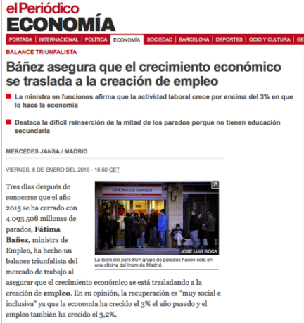

# TRABAJO VOLUNTARIO
## MAXIMILIANO GRECO

---

<!--BREAK -->

## TEMA
### Recorte de una noticia de prensa.

> ## "Báñez asegura que el crecimiento económico se traslada a la creación de empleo"
> * La ministra en funciones afirma que la actividad laboral crece por encima del 3% en que lo hace la economia
> * Destaca la difícil reinserción de la mitad de los parados porque no tienen educación secundaria

## PREGUNTA
### Pregunta acerca de una variable económica relacionada con la noticia.

>¿Cuánto tiene que crecer la economía española para generar empleo?
>¿Cuánto tiene que crecer la economía española para reducir el paro?

Para ampliar sobre el tema, seguiría tres vías, la primera una búsqueda en google y google scholar, como segunda vía buscar a traves de scopus, y la tercera preguntar profesores de la universidad correspondientes que puedan asesorarme.

## MARCO TEÓRICO
### Modelo teórico que analice la variable económica y sus determinantes.

En este caso, el modelo teórico a usar, es la ley de okun, bien conocida y de gran utilidad en política económica. Se analizará el paro en función del PIB y el empleo en función del PIB.

## MODELO
## Modelo econométrico que se podría estimar.

Para el desempleo:
$$du = \beta_0 + \beta_1·dy$$

Para el empleo:
$$dL = \alpha_0 + \alpha_1·dy$$

Donde:
- $du$: Diferencial de la tasa de paro
- $dL$: Diferencial del número de empleados
- $dy$: Diferencial del PIB.

Se espera que $\beta_1 < 0$ según la teoría económica, cuando aumenta el PIB se espera que se reduzca el número de personas en paro y por tanto su tasa. 

Por el mismo razonamiento que el anterior, se espera que $\alpha_1 > 0$.

## DATOS
### Fuentes de información sobre los datos que se usarían y breve análisis de las variables.

Las variables de paro, empleo y PIB estan disponibles para el caso de España a traveés de la página web del INE. Se trata de tres series temporales, con frecuencia trimestral, ya que para el PIB es la frecuencia más pequeña disponible. 

Es posible que los datos de paro y empleo estén disponibles solamente con frecuencia mensual y haya que pasarlos a trimestre, en ese caso se podrían agregar mediante la media aritmetica, o cogiendo el primero o el último valor de cada trimestre.

### Problemas econométricos que podemos esperar.

La series temporales tienen que ser estacionarias para asegurar el cumplimiento, sin embargo para interpretar los coeficientes necesitamos las variables en niveles, tal y como se expresa en la ecuación del apartado anterior. Al ser series temporales, es posible que encontremos problemas de autcorrealación en ambas ecuaciones, especialemente con la ecuación referida al empleo. Es posible que obtengamos problemas de especificación, que se podrían corregir introduciento antes de las diferencias logaritmos naturales.

Cabe la posibilidad de que las variables estén cointegradas por lo que su análisis será necesario.

Es posible haya presencia de outliers que haya que tratar, incluso la presencia de outliers podría deberse a ruptura estructural en el periodo entre 2008 y 2010. Si hay datos suficientes habría que tener en cuenta la crisis de petróleo.

Para responder a nuestra pregunta tendremos que hacer un cálculo para hayar el umbral de crecimiento para ambas ecuaciones. Es decir, $du = 0$ y $dL = 0$ y despejamos $dy$
$$dy = -\frac{\beta_0}{\beta_1}$$

$$dy = -\frac{\alpha_0}{\alpha_1}$$

donde estos $dy$ son los umbrales de crecimiento, nos dicen a cuánto debería crecer la economía para que aumente el empleo o se reduzca el paro.

## BIBLIOGRAFÍA
### Referencias bibliográficas.

Attfield, C. L. F., & Silverstone, B. (1998). Okun's law, cointegration and gap variables. Journal of Macroeconomics, 20(3), 625–637. http://doi.org/10.1016/S0164-0704(98)00076-7
Cuaresma, J. C. (2003). Okun's Law Revisited*. Oxford Bulletin of Economics and Statistics, 65(4), 439–451. http://doi.org/10.1111/1468-0084.t01-1-00056
Lee, J. (2000). The robustness of Okun's law: Evidence from OECD countries. Journal of Macroeconomics, 22(2), 331–356. http://doi.org/10.1016/S0164-0704(00)00135-X
Perman, R., Stephan, G., & Tavéra, C. (2015). Okun's Law—a Meta‐analysis. The Manchester School, 83(1), 101–126. http://doi.org/10.1111/manc.12057
Moosa, I. A. (1997). A Cross-Country Comparison of Okun's Coefficient. Journal of Comparative Economics, 24(3), 335–356. http://doi.org/10.1006/jcec.1997.1433